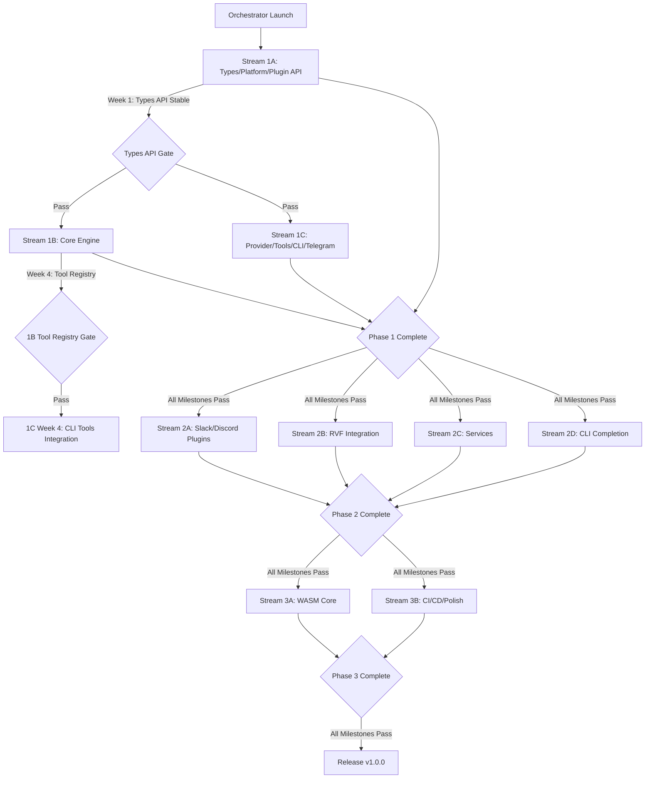

# SPARC Master Orchestration Plan: clawft Rust Rewrite

**Project**: clawft - Rust rewrite of nanobot Python AI assistant
**Created**: 2026-02-16
**Status**: Ready for execution
**Execution Model**: Single orchestrator spawns all agents via dependency graph

---

## 🎯 Executive Summary

This orchestration plan coordinates 9 concurrent development streams across 3 phases to rewrite nanobot from Python to Rust. The project follows a warp-weft-finish pattern:

- **Phase 1 (Warp)**: Foundation types, platform abstractions, plugin API, core engine, initial providers
- **Phase 2 (Weft)**: Channel plugins, intelligence layer, services, CLI completion
- **Phase 3 (Finish)**: WASM targets, CI/CD, binary optimization, release pipeline

**Critical Path**: Stream 1A (types/platform/plugin API) → Stream 1B (core) → Phase 2 (all parallel) → Phase 3 (all parallel)

**Timeline**: 12-14 weeks total (4 weeks Phase 1, 5-6 weeks Phase 2, 3-4 weeks Phase 3)

---

## 📊 Dependency Graph & Execution Flow



---

## 🚀 Phase Execution Strategy

### Phase 1: Warp (Weeks 1-4) - Foundation

**Objective**: Establish stable API contracts and core runtime

#### Stream 1A: Types/Platform/Plugin API (4 weeks, CRITICAL PATH)
- **Agent**: `foundation-architect`
- **Plan**: `1a-types-platform-plugin-api.md`
- **Branch**: `weft/types`
- **Blocking**: ALL other streams wait for week 1 completion
- **Deliverables**:
  - Week 1: `clawft-types` API stable (Message, Session, Config, Tool, Error types)
  - Week 2: `clawft-platform` traits stable (Platform, AsyncRuntime, Storage, Logger)
  - Week 2: `clawft-channels` host + trait stable (Channel, ChannelHost, ChannelFactory)
  - Week 3-4: Integration tests, documentation, API review

#### Stream 1B: Core Engine (4 weeks, starts after 1A week 1)
- **Agent**: `core-engineer`
- **Plan**: `1b-core-engine.md`
- **Branch**: `weft/core`
- **Depends On**: 1A week 1 (types API)
- **Provides**: Tool registry (week 4 → 1C week 4)
- **Deliverables**:
  - Agent loop with message bus
  - Context management (sliding window, memory consolidation)
  - Session persistence
  - Memory storage (markdown-based)
  - Tool registry and execution

#### Stream 1C: Provider/Tools/CLI/Telegram (4 weeks, starts after 1A week 1)
- **Agent**: `application-engineer`
- **Plan**: `1c-provider-tools-cli-telegram.md`
- **Branch**: `weft/provider-tools-cli`
- **Depends On**: 1A week 1 (types API), 1B week 4 (tool registry for CLI integration)
- **Deliverables**:
  - `clawft-llm` (provider abstraction, Anthropic/OpenRouter)
  - `clawft-tools` (file, shell, memory tools)
  - `clawft-cli` (basic commands: agent, gateway)
  - `clawft-channels/telegram` plugin

#### Phase 1 Integration Gate
**Criteria** (ALL must pass before Phase 2):
- [ ] `cargo build --release --workspace` produces single `weft` binary
- [x] Binary reads `~/.nanobot/config.json` and `~/.clawft/config.json`
- [ ] `weft agent -m "What is 2+2?"` returns LLM response
- [x] `weft gateway` starts Telegram bot via plugin architecture
- [ ] Telegram bot receives messages and responds with tool support
- [x] File tools (read, write, list) work
- [x] Shell exec works with safety checks
- [x] Sessions persist across gateway restarts
- [x] Memory consolidation runs when context window exceeded
- [x] Channel plugin API stable and documented
- [ ] All integration tests pass
- [x] Clippy clean, no warnings
- [ ] Code review complete

**Branch Strategy**:
```bash
weft/types ──┐
weft/core ───┼──> weft/phase-1 ──> main (after gate passes)
weft/provider-tools-cli ──┘
```

---

### Phase 2: Weft (Weeks 5-10) - Features

**Objective**: Expand channel support, add intelligence layer, build services

**Execution Model**: ALL 4 streams run in PARALLEL (no inter-stream dependencies)

#### Stream 2A: Channel Plugins (5-6 weeks)
- **Agent**: `channel-developer`
- **Plan**: `2a-channel-plugins.md`
- **Branch**: `weft/channels-slack-discord`
- **Depends On**: Phase 1 complete
- **Deliverables**:
  - `clawft-channels/slack` plugin (events API, slash commands, threads)
  - `clawft-channels/discord` plugin (gateway, slash commands, threads)
  - Integration tests for both channels
  - `weft channels status` command

#### Stream 2B: RVF Integration (5-6 weeks)
- **Agent**: `intelligence-engineer`
- **Plan**: `2b-rvf-integration.md`
- **Branch**: `weft/rvf`
- **Depends On**: Phase 1 complete
- **Deliverables**:
  - RVF-backed model routing (intelligent provider/model selection)
  - Vector memory search with ruvector
  - Intelligent context prioritization
  - Semantic session search
  - Integration with clawft-core memory system

#### Stream 2C: Services (5-6 weeks)
- **Agent**: `services-engineer`
- **Plan**: `2c-services.md`
- **Branch**: `weft/services`
- **Depends On**: Phase 1 complete
- **Deliverables**:
  - `clawft-services` crate
  - Cron scheduler (persistent jobs, time-based triggers)
  - Heartbeat service (30-minute interval, health checks)
  - MCP client (connect to MCP servers, expose tools)
  - Codex OAuth login flow
  - Service management commands

#### Stream 2D: CLI Completion (3-4 weeks)
- **Agent**: `cli-developer`
- **Plan**: `2d-cli-completion.md`
- **Branch**: `weft/cli-commands`
- **Depends On**: Phase 1 complete
- **Deliverables**:
  - Additional CLI commands (sessions, memory, cron, channels)
  - Shell completion (bash, zsh, fish)
  - Config management commands
  - Help system improvements

#### Phase 2 Integration Gate
**Criteria** (ALL must pass before Phase 3):
- [x] Telegram, Slack, Discord channels all work as plugins
- [ ] RVF-backed model routing selects optimal provider/model
- [x] RVF vector memory search returns relevant context
- [x] Cron jobs persist and execute on schedule
- [x] Heartbeat runs every 30 minutes
- [x] MCP servers connect and expose tools
- [x] `weft channels status` shows all plugin status
- [x] `weft cron list` shows scheduled jobs
- [ ] Codex OAuth login works
- [ ] All integration tests pass (including cross-channel)
- [ ] Performance benchmarks meet targets
- [x] Clippy clean, no warnings
- [ ] Code review complete

**Branch Strategy**:
```bash
weft/channels-slack-discord ──┐
weft/rvf ────────────────────┼──> weft/phase-2 ──> main (after gate passes)
weft/services ────────────────┤
weft/cli-commands ────────────┘
```

---

### Phase 3: Finish (Weeks 11-14) - Polish

**Objective**: WASM targets, production hardening, release pipeline

**Execution Model**: 2 streams run in PARALLEL

#### Stream 3A: WASM Core (3-4 weeks)
- **Agent**: `wasm-engineer`
- **Plan**: `3a-wasm-core.md`
- **Branch**: `weft/wasm`
- **Depends On**: Phase 2 complete
- **Deliverables**:
  - `clawft-wasm` crate (wasm32-wasip2 target)
  - Agent loop in WASM (message processing)
  - WASI filesystem integration for file tools
  - rvf-wasm microkernel (< 8 KB vector search)
  - Binary size optimization (< 300 KB uncompressed, < 120 KB gzipped)
  - Wasmtime integration tests
  - WAMR interpreter compatibility

#### Stream 3B: Polish & CI/CD (3-4 weeks)
- **Agent**: `devops-engineer`
- **Plan**: `3b-polish-cicd.md`
- **Branch**: `weft/cicd`
- **Depends On**: Phase 2 complete
- **Deliverables**:
  - GitHub Actions CI pipeline (test, build, lint, clippy)
  - Multi-platform builds (linux-x86_64, linux-aarch64, macos-arm64, windows-x86_64)
  - Binary size profiling with twiggy
  - Release workflow (GitHub Releases, binary uploads)
  - Performance profiling (flamegraph, allocation tracking)
  - Security audit (cargo audit, dependency review)
  - Documentation site generation

#### Phase 3 Integration Gate
**Criteria** (ALL must pass for v1.0.0 release):
- [ ] clawft-wasm compiles to wasm32-wasip2
- [ ] Agent loop processes messages in Wasmtime
- [ ] File tools work via WASI filesystem
- [ ] rvf-wasm microkernel provides vector search in WASM (< 8 KB)
- [ ] WASM binary < 300 KB uncompressed
- [ ] WASM binary < 120 KB gzipped
- [ ] Runs in WAMR interpreter mode
- [ ] CI builds for all 4 target platforms
- [ ] GitHub Releases workflow publishes binaries
- [ ] All documentation complete
- [ ] Security audit passes
- [ ] Performance benchmarks meet targets
- [ ] Final code review complete

**Branch Strategy**:
```bash
weft/wasm ──┐
weft/cicd ──┴──> weft/phase-3 ──> main ──> v1.0.0 release tag
```

---

## 🛠️ Interface Contracts (Must Be Agreed BEFORE Coding)

These contracts MUST be defined and frozen before dependent streams start:

### 1. Config JSON Format
**Owner**: Stream 1A
**Dependents**: All streams
**Deadline**: 1A Week 1
**Test Fixtures**: Must include real Python-generated `config.json` files

```rust
// clawft-types/src/config.rs
pub struct Config {
    pub channels: Vec<ChannelConfig>,
    pub llm: LlmConfig,
    pub tools: ToolsConfig,
    pub storage: StorageConfig,
}
```

### 2. Tool Trait Signatures
**Owner**: Stream 1A
**Dependents**: 1B, 1C
**Deadline**: 1A Week 1

```rust
// clawft-types/src/tool.rs
#[async_trait]
pub trait Tool: Send + Sync {
    fn name(&self) -> &str;
    fn description(&self) -> &str;
    fn parameters(&self) -> ToolParameters;
    async fn execute(&self, params: ToolParams) -> Result<ToolResult>;
}
```

### 3. Channel/ChannelHost/ChannelFactory Trait Signatures
**Owner**: Stream 1A
**Dependents**: 1C, 2A
**Deadline**: 1A Week 2

```rust
// clawft-channels/src/lib.rs
#[async_trait]
pub trait Channel: Send + Sync {
    async fn send_message(&self, msg: ChannelMessage) -> Result<MessageId>;
    async fn receive_messages(&self) -> Result<Vec<ChannelMessage>>;
    fn supports_threads(&self) -> bool;
    fn metadata(&self) -> ChannelMetadata;
}

#[async_trait]
pub trait ChannelHost: Send + Sync {
    fn platform(&self) -> &dyn Platform;
    async fn register_command(&self, cmd: Command) -> Result<()>;
}

pub trait ChannelFactory: Send + Sync {
    fn create(&self, config: ChannelConfig, host: Arc<dyn ChannelHost>) -> Result<Arc<dyn Channel>>;
}
```

### 4. Provider Trait Signatures
**Owner**: Stream 1C (clawft-llm)
**Dependents**: 1B
**Deadline**: 1C Week 1

```rust
// clawft-llm/src/provider.rs
#[async_trait]
pub trait LlmProvider: Send + Sync {
    fn name(&self) -> &str;
    fn models(&self) -> Vec<ModelInfo>;
    async fn complete(&self, request: CompletionRequest) -> Result<CompletionResponse>;
    async fn stream(&self, request: CompletionRequest) -> Result<CompletionStream>;
}
```

### 5. Platform Trait Signatures
**Owner**: Stream 1A
**Dependents**: 1B, 1C
**Deadline**: 1A Week 2

```rust
// clawft-platform/src/lib.rs
#[async_trait]
pub trait Platform: Send + Sync {
    fn runtime(&self) -> &dyn AsyncRuntime;
    fn storage(&self) -> &dyn Storage;
    fn logger(&self) -> &dyn Logger;
    fn config(&self) -> &Config;
}
```

### 6. MessageBus API
**Owner**: Stream 1B
**Dependents**: 1C
**Deadline**: 1B Week 2

```rust
// clawft-core/src/bus.rs
pub struct MessageBus {
    pub async fn publish(&self, event: Event) -> Result<()>;
    pub async fn subscribe(&self, topic: &str) -> Result<Receiver<Event>>;
}
```

### 7. Error Types (Recoverable vs Fatal)
**Owner**: Stream 1A
**Dependents**: All streams
**Deadline**: 1A Week 1

```rust
// clawft-types/src/error.rs
pub enum ClawftError {
    // Recoverable
    Retry { source: Box<dyn Error>, attempts: u32 },
    Timeout { operation: String },

    // Fatal
    ConfigInvalid { reason: String },
    PluginLoadFailed { plugin: String },
}
```

---

## 🔒 File Ownership Matrix (Prevents Merge Conflicts)

| Stream | Owned Crates | Owned Files |
|--------|-------------|-------------|
| **1A** | `clawft-types`, `clawft-platform`, `clawft-channels` (host only) | `Cargo.toml` (workspace), all type definitions, platform traits, channel traits |
| **1B** | `clawft-core` | Agent loop, message bus, context manager, session manager, memory manager, tool registry |
| **1C** | `clawft-llm`, `clawft-tools`, `clawft-cli`, `clawft-channels/telegram` | Provider implementations, tool implementations, CLI main, Telegram plugin |
| **2A** | `clawft-channels/slack`, `clawft-channels/discord` | Slack plugin, Discord plugin, channel status command |
| **2B** | `clawft-core` (integration only) | RVF integration in core (vector memory, routing), NO core trait changes |
| **2C** | `clawft-services` | Cron scheduler, heartbeat service, MCP client, OAuth handlers |
| **2D** | `clawft-cli` (commands only) | Additional CLI commands, shell completion, help system |
| **3A** | `clawft-wasm`, `rvf-wasm` | WASM entry point, WASI integration, WASM-compatible core subset |
| **3B** | `.github/workflows`, `scripts/`, `docs/` | CI/CD pipelines, build scripts, release automation, documentation |

**Conflict Resolution Protocol**:
- If Stream X needs to modify a file owned by Stream Y:
  1. Stream X creates an issue requesting the change
  2. Stream Y implements the change in their branch
  3. Stream X merges from Stream Y's branch
  4. Orchestrator tracks cross-stream dependencies

---

## 🧪 Testing Contracts (Required for Each Stream)

Every stream MUST provide before merge:

### 1. Unit Tests
- All public functions have unit tests
- Edge cases covered (empty input, malformed data, concurrent access)
- Error paths tested
- Target: 80%+ line coverage

### 2. Integration Tests
- Use mock Platform implementations
- Test full workflows (e.g., message → tool execution → response)
- Multi-component interactions

### 3. Plugin Tests (for channel streams)
- Use mock ChannelHost
- Test plugin lifecycle (create, start, stop, destroy)
- Test message sending and receiving
- Test error recovery

### 4. Fixture Files
Required fixtures in `tests/fixtures/`:
- `config.json` - Valid config (copy from Python nanobot)
- `config_invalid.json` - Invalid config for error testing
- `session.jsonl` - Sample session with messages
- `MEMORY.md` - Sample memory file
- `tools/*.json` - Tool parameter/result examples

### 5. CI Integration
- All tests run in CI (GitHub Actions)
- No flaky tests (retry or fix)
- Test execution time < 5 minutes per stream

---

## 🚨 Risk Mitigation Strategy

| Risk | Likelihood | Impact | Detection Method | Response Plan |
|------|------------|--------|------------------|---------------|
| **Types API changes after streams start** | Medium | High | Breaking `cargo build --workspace` | 1A architect immediately fixes types + broadcasts to all streams; Orchestrator pauses dependent streams until fix merged |
| **Plugin API too restrictive for Slack/Discord** | Medium | High | Integration test failure in 2A | 2A developer files extension request; 1A architect adds optional methods or metadata escape hatch; All channel plugins update |
| **RVF crate size too large for minimal builds** | Low | Medium | CI size check (binary > 5 MB) | 2B engineer ensures all RVF features are feature-gated; Provide `clawft-lite` build without RVF |
| **Provider HTTP format mismatch** | High | Medium | Integration test failure in 1C | Add provider-specific test fixtures; Mock HTTP responses; Add format validation layer |
| **Session format incompatibility with Python** | High | High | Load test with real Python session files | Fix serde annotations; Add migration tool; Version session format |
| **Binary size exceeds target** | Medium | Medium | CI size check (> 10 MB native, > 300 KB WASM) | Profile with `twiggy`; Remove unused deps; Enable LTO; Use `strip` |
| **WASM compilation failure** | Medium | High | CI WASM build fails | Feature-flag problematic deps (e.g., tokio → async-std); Use WASI-compatible alternatives |
| **Stream 1B/1C week 4 sync failure** | Low | Medium | 1C can't use tool registry | 1B publishes tool registry API early; 1C uses mock tool registry until real one ready |
| **Phase gate failure** | Low | Critical | Milestone checklist has failures | Orchestrator halts phase transitions; Assigns fix priority; May delay dependent phases |
| **Merge conflicts despite file ownership** | Low | Low | Git merge conflicts | Orchestrator mediates; Streams coordinate via shared Slack channel; Emergency sync meeting |

---

## ✅ Definition of Done (All Streams, All Phases)

Before ANY stream can merge to integration branch:

1. **Code Quality**
   - [x] `cargo build --release --workspace` passes
   - [x] `cargo clippy --all-targets --all-features` has ZERO warnings
   - [ ] `cargo fmt --check` passes
   - [x] No new `unsafe` blocks without justification comment

2. **Testing**
   - [x] `cargo test --workspace` passes
   - [ ] Integration tests pass
   - [ ] Code coverage ≥ 80% (use `cargo-tarpaulin`)

3. **Documentation**
   - [ ] All public items have doc comments (`cargo doc --no-deps`)
   - [ ] README updated if API changes
   - [ ] CHANGELOG entry added

4. **Security**
   - [x] No hardcoded secrets or API keys
   - [ ] No hardcoded file paths (use config or platform storage)
   - [x] Input validation at system boundaries
   - [x] Error messages don't leak sensitive data

5. **Configuration**
   - [x] Feature-gated code has appropriate `#[cfg(...)]` attributes
   - [x] Optional dependencies properly gated
   - [ ] Minimal build works (`cargo build --no-default-features`)

6. **Review**
   - [ ] Code review complete (peer or architect)
   - [ ] All review comments addressed
   - [ ] No "TODO" or "FIXME" comments without tracking issues

7. **Performance** (Phase 2+)
   - [ ] No performance regressions vs baseline
   - [ ] Memory usage profiled
   - [ ] No obvious inefficiencies (e.g., cloning large data)

8. **Size** (Phase 3 only)
   - [ ] Binary size regression checked
   - [ ] WASM binary meets size targets

---

## 🎬 Agent Spawning Execution Plan

This section is the **actionable orchestration script** for a single orchestrator agent.

### Pre-Flight Checks

Before spawning any agents:

```bash
# 1. Verify repository state
cd /home/aepod/dev/barni/repos/nanobot
git status  # Ensure clean working tree
git checkout main
git pull origin main

# 2. Create integration branches
git checkout -b weft/phase-1
git checkout -b weft/phase-2
git checkout -b weft/phase-3

# 3. Initialize coordination
npx @claude-flow/cli@latest swarm init --topology hierarchical-mesh --max-agents 15
npx @claude-flow/cli@latest memory store --key "project-root" --value "/home/aepod/dev/barni/repos/nanobot"

# 4. Verify all SPARC plans exist
ls -lh .planning/sparc/*.md
```

### Phase 1 Execution (Weeks 1-4)

#### Step 1: Launch Stream 1A (BLOCKING)

```javascript
// SINGLE MESSAGE: Launch 1A and wait
Task(
  "foundation-architect",
  `You are the Foundation Architect for the clawft Rust rewrite.

YOUR PLAN: /home/aepod/dev/barni/repos/nanobot/.planning/sparc/1a-types-platform-plugin-api.md

YOUR BRANCH: weft/types

YOUR MISSION:
- Week 1: Design and implement clawft-types (Message, Session, Config, Tool, Error)
- Week 2: Design and implement clawft-platform traits (Platform, AsyncRuntime, Storage, Logger)
- Week 2: Design and implement clawft-channels host + trait (Channel, ChannelHost, ChannelFactory)
- Week 3-4: Integration tests, documentation, API review

CRITICAL GATES:
- End of Week 1: Types API MUST be stable (BLOCKS all other streams)
- End of Week 2: Platform traits + Channel traits MUST be stable (BLOCKS 1B/1C coding)

COORDINATION PROTOCOL:
1. BEFORE starting: npx @claude-flow/cli@latest hooks pre-task --description "1A: Foundation types and traits"
2. AFTER each API stabilizes: npx @claude-flow/cli@latest memory store --key "api-stable-<name>" --value "version: <hash>"
3. WHEN Week 1 complete: npx @claude-flow/cli@latest hooks notify --message "1A Week 1 COMPLETE: Types API stable, unblocking 1B/1C"
4. AFTER Week 2: npx @claude-flow/cli@latest hooks notify --message "1A Week 2 COMPLETE: Platform + Channel traits stable"
5. WHEN stream complete: npx @claude-flow/cli@latest hooks post-task --task-id "stream-1a"

Follow TDD: Write tests first, implement to pass, refactor.
Batch all file operations in single messages.
Never commit to main.`,
  "foundation-architect",
  { run_in_background: true }
)

TodoWrite({
  todos: [
    { id: "1a-w1", content: "1A Week 1: clawft-types API stable", status: "in_progress", priority: "critical" },
    { id: "1a-w2", content: "1A Week 2: Platform + Channel traits stable", status: "pending", priority: "critical" },
    { id: "1a-w3-4", content: "1A Week 3-4: Integration tests + docs", status: "pending", priority: "high" },
    { id: "1a-gate", content: "1A: Pass all Phase 1 type checks", status: "pending", priority: "critical" }
  ]
})
```

**Orchestrator Action**: WAIT for `[TASK stream-1a COMPLETED]` notification with "1A Week 1 COMPLETE" before proceeding.

#### Step 2: Launch Streams 1B and 1C (PARALLEL, after 1A Week 1)

```javascript
// SINGLE MESSAGE: Launch 1B and 1C in parallel
[Parallel Agent Execution]:
  Task(
    "core-engineer",
    `You are the Core Engine Engineer for the clawft Rust rewrite.

YOUR PLAN: /home/aepod/dev/barni/repos/nanobot/.planning/sparc/1b-core-engine.md

YOUR BRANCH: weft/core

YOUR MISSION:
- Week 1-2: Agent loop + message bus
- Week 2-3: Context management (sliding window, memory consolidation)
- Week 3-4: Session persistence + memory storage
- Week 4: Tool registry (PROVIDES to 1C Week 4)

DEPENDENCIES:
- 1A Types API (already stable, check memory: api-stable-types)
- 1A Platform traits (stable by your Week 1, check memory: api-stable-platform)

PROVIDES TO 1C:
- Week 4: Tool registry API (CRITICAL for 1C CLI tools integration)

COORDINATION PROTOCOL:
1. BEFORE starting: npx @claude-flow/cli@latest hooks pre-task --description "1B: Core engine"
2. WHEN Week 4 tool registry ready: npx @claude-flow/cli@latest memory store --key "tool-registry-api" --value "<interface>"
3. WHEN Week 4 complete: npx @claude-flow/cli@latest hooks notify --message "1B Week 4 COMPLETE: Tool registry ready for 1C"
4. WHEN stream complete: npx @claude-flow/cli@latest hooks post-task --task-id "stream-1b"

Follow TDD. Batch operations. Never commit to main.`,
    "core-engineer",
    { run_in_background: true }
  )

  Task(
    "application-engineer",
    `You are the Application Engineer for the clawft Rust rewrite.

YOUR PLAN: /home/aepod/dev/barni/repos/nanobot/.planning/sparc/1c-provider-tools-cli-telegram.md

YOUR BRANCH: weft/provider-tools-cli

YOUR MISSION:
- Week 1-2: clawft-llm (provider abstraction, Anthropic, OpenRouter)
- Week 2-3: clawft-tools (file, shell, memory tools)
- Week 3-4: clawft-cli (agent, gateway commands) + clawft-channels/telegram plugin
- Week 4: SYNC with 1B tool registry for CLI tools integration

DEPENDENCIES:
- 1A Types API (already stable, check memory: api-stable-types)
- 1A Platform traits (stable by your Week 1, check memory: api-stable-platform)
- 1B Tool registry (Week 4, check memory: tool-registry-api)

COORDINATION PROTOCOL:
1. BEFORE starting: npx @claude-flow/cli@latest hooks pre-task --description "1C: Provider + tools + CLI + Telegram"
2. WHEN Week 4 starts: Check memory for "tool-registry-api", integrate with CLI
3. WHEN stream complete: npx @claude-flow/cli@latest hooks post-task --task-id "stream-1c"

Follow TDD. Batch operations. Never commit to main.`,
    "application-engineer",
    { run_in_background: true }
  )

  TodoWrite({
    todos: [
      { id: "1b-w1-2", content: "1B Week 1-2: Agent loop + message bus", status: "in_progress", priority: "high" },
      { id: "1b-w2-3", content: "1B Week 2-3: Context management", status: "pending", priority: "high" },
      { id: "1b-w3-4", content: "1B Week 3-4: Session + memory", status: "pending", priority: "high" },
      { id: "1b-w4-registry", content: "1B Week 4: Tool registry for 1C", status: "pending", priority: "critical" },
      { id: "1c-w1-2", content: "1C Week 1-2: clawft-llm providers", status: "in_progress", priority: "high" },
      { id: "1c-w2-3", content: "1C Week 2-3: clawft-tools", status: "pending", priority: "high" },
      { id: "1c-w3-4", content: "1C Week 3-4: CLI + Telegram plugin", status: "pending", priority: "high" },
      { id: "1c-w4-sync", content: "1C Week 4: Sync with 1B tool registry", status: "pending", priority: "critical" }
    ]
  })
```

**Orchestrator Action**: WAIT for BOTH `[TASK stream-1b COMPLETED]` AND `[TASK stream-1c COMPLETED]` before proceeding to Phase 1 gate.

#### Step 3: Phase 1 Integration Gate

```bash
# Orchestrator runs gate checks
cd /home/aepod/dev/barni/repos/nanobot

# Merge all streams to weft/phase-1
git checkout weft/phase-1
git merge weft/types
git merge weft/core
git merge weft/provider-tools-cli

# Run Phase 1 milestone checks
cargo build --release --workspace
cargo test --workspace
cargo clippy --all-targets --all-features

# Manual verification checklist (orchestrator prompts for confirmation)
# [ ] Binary reads ~/.nanobot/config.json
# [ ] weft agent -m "What is 2+2?" returns LLM response
# [ ] weft gateway starts Telegram bot
# [ ] Telegram bot receives and responds with tool support
# [ ] File tools work
# [ ] Shell exec works
# [ ] Sessions persist across restarts
# [ ] Memory consolidation runs
# [ ] Channel plugin API stable

# If ALL pass:
git checkout main
git merge weft/phase-1 --no-ff -m "Phase 1 (Warp) complete: Foundation ready"
git tag v0.1.0-phase1
git push origin main --tags
```

**Orchestrator Action**: If ANY check fails, create blocking issue, assign to responsible stream, HALT Phase 2 until fixed.

### Phase 2 Execution (Weeks 5-10)

#### Step 4: Launch ALL Phase 2 Streams (PARALLEL)

```javascript
// SINGLE MESSAGE: Launch all 4 Phase 2 streams in parallel
[Parallel Agent Execution]:
  Task(
    "channel-developer",
    `You are the Channel Developer for the clawft Rust rewrite.

YOUR PLAN: /home/aepod/dev/barni/repos/nanobot/.planning/sparc/2a-channel-plugins.md

YOUR BRANCH: weft/channels-slack-discord

YOUR MISSION:
- Implement clawft-channels/slack plugin (events API, slash commands, threads)
- Implement clawft-channels/discord plugin (gateway, slash commands, threads)
- Integration tests for both channels
- weft channels status command

DEPENDENCIES:
- Phase 1 complete (check git tag v0.1.0-phase1)
- Channel plugin API stable (from 1A)

COORDINATION PROTOCOL:
1. BEFORE starting: npx @claude-flow/cli@latest hooks pre-task --description "2A: Slack + Discord plugins"
2. WHEN complete: npx @claude-flow/cli@latest hooks post-task --task-id "stream-2a"

Follow TDD. Batch operations. Never commit to main.`,
    "channel-developer",
    { run_in_background: true }
  )

  Task(
    "intelligence-engineer",
    `You are the Intelligence Engineer for the clawft Rust rewrite.

YOUR PLAN: /home/aepod/dev/barni/repos/nanobot/.planning/sparc/2b-rvf-integration.md

YOUR BRANCH: weft/rvf

YOUR MISSION:
- RVF-backed model routing (intelligent provider/model selection)
- Vector memory search with ruvector
- Intelligent context prioritization
- Semantic session search
- Integration with clawft-core memory system (NO core trait changes)

DEPENDENCIES:
- Phase 1 complete (check git tag v0.1.0-phase1)
- clawft-core memory API stable (from 1B)

COORDINATION PROTOCOL:
1. BEFORE starting: npx @claude-flow/cli@latest hooks pre-task --description "2B: RVF intelligence layer"
2. WHEN complete: npx @claude-flow/cli@latest hooks post-task --task-id "stream-2b"

Follow TDD. Batch operations. Never commit to main. Feature-gate ALL RVF code.`,
    "intelligence-engineer",
    { run_in_background: true }
  )

  Task(
    "services-engineer",
    `You are the Services Engineer for the clawft Rust rewrite.

YOUR PLAN: /home/aepod/dev/barni/repos/nanobot/.planning/sparc/2c-services.md

YOUR BRANCH: weft/services

YOUR MISSION:
- Implement clawft-services crate
- Cron scheduler (persistent jobs, time-based triggers)
- Heartbeat service (30-minute interval, health checks)
- MCP client (connect to MCP servers, expose tools)
- Codex OAuth login flow
- Service management commands

DEPENDENCIES:
- Phase 1 complete (check git tag v0.1.0-phase1)

COORDINATION PROTOCOL:
1. BEFORE starting: npx @claude-flow/cli@latest hooks pre-task --description "2C: Services (cron, heartbeat, MCP)"
2. WHEN complete: npx @claude-flow/cli@latest hooks post-task --task-id "stream-2c"

Follow TDD. Batch operations. Never commit to main.`,
    "services-engineer",
    { run_in_background: true }
  )

  Task(
    "cli-developer",
    `You are the CLI Developer for the clawft Rust rewrite.

YOUR PLAN: /home/aepod/dev/barni/repos/nanobot/.planning/sparc/2d-cli-completion.md

YOUR BRANCH: weft/cli-commands

YOUR MISSION:
- Additional CLI commands (sessions, memory, cron, channels)
- Shell completion (bash, zsh, fish)
- Config management commands
- Help system improvements

DEPENDENCIES:
- Phase 1 complete (check git tag v0.1.0-phase1)
- clawft-cli foundation (from 1C)

COORDINATION PROTOCOL:
1. BEFORE starting: npx @claude-flow/cli@latest hooks pre-task --description "2D: CLI completion"
2. WHEN complete: npx @claude-flow/cli@latest hooks post-task --task-id "stream-2d"

Follow TDD. Batch operations. Never commit to main.`,
    "cli-developer",
    { run_in_background: true }
  )

  TodoWrite({
    todos: [
      { id: "2a-slack", content: "2A: Slack plugin complete", status: "in_progress", priority: "high" },
      { id: "2a-discord", content: "2A: Discord plugin complete", status: "pending", priority: "high" },
      { id: "2b-routing", content: "2B: RVF model routing", status: "in_progress", priority: "high" },
      { id: "2b-vector", content: "2B: Vector memory search", status: "pending", priority: "high" },
      { id: "2c-cron", content: "2C: Cron scheduler", status: "in_progress", priority: "high" },
      { id: "2c-mcp", content: "2C: MCP client", status: "pending", priority: "high" },
      { id: "2d-commands", content: "2D: Additional CLI commands", status: "in_progress", priority: "medium" },
      { id: "2d-completion", content: "2D: Shell completion", status: "pending", priority: "medium" }
    ]
  })
```

**Orchestrator Action**: WAIT for ALL 4 `[TASK stream-2X COMPLETED]` notifications before proceeding to Phase 2 gate.

#### Step 5: Phase 2 Integration Gate

```bash
# Orchestrator runs gate checks
cd /home/aepod/dev/barni/repos/nanobot

# Merge all streams to weft/phase-2
git checkout weft/phase-2
git merge weft/channels-slack-discord
git merge weft/rvf
git merge weft/services
git merge weft/cli-commands

# Run Phase 2 milestone checks
cargo build --release --workspace
cargo test --workspace
cargo clippy --all-targets --all-features

# Manual verification checklist
# [ ] Telegram, Slack, Discord channels all work
# [ ] RVF model routing works
# [ ] RVF vector memory search returns results
# [ ] Cron jobs persist and execute
# [ ] Heartbeat runs every 30 minutes
# [ ] MCP servers connect
# [ ] weft channels status shows all plugins
# [ ] weft cron list shows jobs
# [ ] Codex OAuth login works

# If ALL pass:
git checkout main
git merge weft/phase-2 --no-ff -m "Phase 2 (Weft) complete: Features ready"
git tag v0.5.0-phase2
git push origin main --tags
```

**Orchestrator Action**: If ANY check fails, create blocking issue, assign to responsible stream, HALT Phase 3 until fixed.

### Phase 3 Execution (Weeks 11-14)

#### Step 6: Launch Phase 3 Streams (PARALLEL)

```javascript
// SINGLE MESSAGE: Launch both Phase 3 streams in parallel
[Parallel Agent Execution]:
  Task(
    "wasm-engineer",
    `You are the WASM Engineer for the clawft Rust rewrite.

YOUR PLAN: /home/aepod/dev/barni/repos/nanobot/.planning/sparc/3a-wasm-core.md

YOUR BRANCH: weft/wasm

YOUR MISSION:
- Implement clawft-wasm crate (wasm32-wasip2 target)
- Agent loop in WASM (message processing)
- WASI filesystem integration for file tools
- rvf-wasm microkernel (< 8 KB vector search)
- Binary size optimization (< 300 KB uncompressed, < 120 KB gzipped)
- Wasmtime integration tests
- WAMR interpreter compatibility

DEPENDENCIES:
- Phase 2 complete (check git tag v0.5.0-phase2)

SIZE TARGETS (CRITICAL):
- WASM binary < 300 KB uncompressed
- WASM binary < 120 KB gzipped
- rvf-wasm < 8 KB

COORDINATION PROTOCOL:
1. BEFORE starting: npx @claude-flow/cli@latest hooks pre-task --description "3A: WASM core"
2. AFTER each build: Check binary size, profile with twiggy if exceeds target
3. WHEN complete: npx @claude-flow/cli@latest hooks post-task --task-id "stream-3a"

Follow TDD. Batch operations. Never commit to main.`,
    "wasm-engineer",
    { run_in_background: true }
  )

  Task(
    "devops-engineer",
    `You are the DevOps Engineer for the clawft Rust rewrite.

YOUR PLAN: /home/aepod/dev/barni/repos/nanobot/.planning/sparc/3b-polish-cicd.md

YOUR BRANCH: weft/cicd

YOUR MISSION:
- GitHub Actions CI pipeline (test, build, lint, clippy)
- Multi-platform builds (linux-x86_64, linux-aarch64, macos-arm64, windows-x86_64)
- Binary size profiling with twiggy
- Release workflow (GitHub Releases, binary uploads)
- Performance profiling (flamegraph, allocation tracking)
- Security audit (cargo audit, dependency review)
- Documentation site generation

DEPENDENCIES:
- Phase 2 complete (check git tag v0.5.0-phase2)

COORDINATION PROTOCOL:
1. BEFORE starting: npx @claude-flow/cli@latest hooks pre-task --description "3B: CI/CD + polish"
2. WHEN complete: npx @claude-flow/cli@latest hooks post-task --task-id "stream-3b"

Follow best practices for CI/CD. Batch operations. Never commit to main.`,
    "devops-engineer",
    { run_in_background: true }
  )

  TodoWrite({
    todos: [
      { id: "3a-wasm-core", content: "3A: WASM agent loop", status: "in_progress", priority: "high" },
      { id: "3a-wasi", content: "3A: WASI filesystem integration", status: "pending", priority: "high" },
      { id: "3a-rvf-wasm", content: "3A: rvf-wasm microkernel < 8 KB", status: "pending", priority: "critical" },
      { id: "3a-size", content: "3A: Binary size < 300 KB / 120 KB gzipped", status: "pending", priority: "critical" },
      { id: "3b-ci", content: "3B: GitHub Actions CI", status: "in_progress", priority: "high" },
      { id: "3b-multiplatform", content: "3B: Multi-platform builds", status: "pending", priority: "high" },
      { id: "3b-release", content: "3B: Release workflow", status: "pending", priority: "high" },
      { id: "3b-security", content: "3B: Security audit", status: "pending", priority: "critical" }
    ]
  })
```

**Orchestrator Action**: WAIT for BOTH `[TASK stream-3a COMPLETED]` AND `[TASK stream-3b COMPLETED]` before proceeding to Phase 3 gate.

#### Step 7: Phase 3 Integration Gate & v1.0.0 Release

```bash
# Orchestrator runs gate checks
cd /home/aepod/dev/barni/repos/nanobot

# Merge all streams to weft/phase-3
git checkout weft/phase-3
git merge weft/wasm
git merge weft/cicd

# Run Phase 3 milestone checks
cargo build --release --workspace
cargo build --release --target wasm32-wasip2 -p clawft-wasm
cargo test --workspace
cargo clippy --all-targets --all-features

# Verify WASM binary size
WASM_SIZE=$(wasm-opt --version && stat -f%z target/wasm32-wasip2/release/clawft_wasm.wasm)
WASM_GZIP=$(gzip -c target/wasm32-wasip2/release/clawft_wasm.wasm | wc -c)
echo "WASM size: $WASM_SIZE bytes (target: < 307200)"
echo "WASM gzip: $WASM_GZIP bytes (target: < 122880)"

# Manual verification checklist
# [ ] WASM compiles to wasm32-wasip2
# [ ] Agent loop processes messages in Wasmtime
# [ ] File tools work via WASI
# [ ] rvf-wasm < 8 KB
# [ ] WASM binary < 300 KB uncompressed
# [ ] WASM binary < 120 KB gzipped
# [ ] WAMR interpreter mode works
# [ ] CI builds for all 4 platforms
# [ ] GitHub Releases workflow works
# [ ] All documentation complete
# [ ] Security audit passes

# If ALL pass:
git checkout main
git merge weft/phase-3 --no-ff -m "Phase 3 (Finish) complete: v1.0.0 ready"
git tag v1.0.0
git push origin main --tags

# Trigger release workflow
gh workflow run release.yml
```

**Orchestrator Action**: If ANY check fails, create blocking issue, assign to responsible stream, HALT release until fixed.

---

## 📊 Orchestrator Monitoring Dashboard

The orchestrator MUST track these metrics throughout execution:

### Stream Health Metrics
| Stream | Status | Week | Blocker | ETA | Risk Level |
|--------|--------|------|---------|-----|------------|
| 1A | In Progress | 1 | None | On track | Low |
| 1B | Waiting | - | 1A Week 1 | +1 week | Low |
| 1C | Waiting | - | 1A Week 1 | +1 week | Low |
| 2A | Waiting | - | Phase 1 | +4 weeks | Low |
| 2B | Waiting | - | Phase 1 | +4 weeks | Medium (RVF size) |
| 2C | Waiting | - | Phase 1 | +4 weeks | Low |
| 2D | Waiting | - | Phase 1 | +4 weeks | Low |
| 3A | Waiting | - | Phase 2 | +10 weeks | High (WASM size) |
| 3B | Waiting | - | Phase 2 | +10 weeks | Low |

### Phase Gate Checklist Status
```
Phase 1 Gate: 0/11 checks passed
Phase 2 Gate: 0/9 checks passed
Phase 3 Gate: 0/11 checks passed
```

### Timeline Tracking
```
Project Start: 2026-02-16 (Week 0)
Phase 1 Target: 2026-03-15 (Week 4)
Phase 2 Target: 2026-04-26 (Week 10)
Phase 3 Target: 2026-05-17 (Week 14)
Release Target: 2026-05-24 (Week 15)

Current Week: 0
Days Elapsed: 0
Days Remaining: 98
```

---

## 🧪 Cross-Stream Integration Test Strategy

### E2E Test Plan

The orchestrator MUST ensure cross-stream integration tests are created and passing before each Phase Gate. These tests live in a workspace-level `tests/` directory, not in any individual crate.

#### Phase 1 E2E Tests (`tests/phase1_integration.rs`)

```rust
#[tokio::test]
async fn test_config_loads_and_initializes_all_subsystems() {
    // 1. Load config.json via clawft-types (Stream 1A)
    // 2. Verify providers initialized via clawft-llm (Stream 1C)
    // 3. Verify core engine accepts the config (Stream 1B)
    // 4. Verify channel host creates plugins (Stream 1A)
}

#[tokio::test]
async fn test_full_message_flow_telegram_to_response() {
    // 1. Mock Telegram long-poll returns an InboundMessage (Stream 1C)
    // 2. MessageBus delivers to AgentLoop (Stream 1B)
    // 3. AgentLoop calls MockLlmTransport (Stream 1B/1C)
    // 4. OutboundMessage dispatched via channel plugin (Stream 1A)
    // 5. Verify response sent back via Telegram mock (Stream 1C)
}

#[tokio::test]
async fn test_tool_execution_end_to_end() {
    // 1. InboundMessage: "Read the file at /tmp/test.txt"
    // 2. AgentLoop processes → LLM returns tool_call (Stream 1B)
    // 3. ToolRegistry dispatches to read_file tool (Stream 1C)
    // 4. Tool result fed back to LLM → final response
    // 5. OutboundMessage dispatched
}

#[tokio::test]
async fn test_session_persistence_across_restarts() {
    // 1. Process a message → session written (Stream 1B)
    // 2. Shutdown gracefully
    // 3. Restart with same config → session reloaded (Stream 1B)
    // 4. Verify history preserved
}
```

#### Phase 2 E2E Tests (`tests/phase2_integration.rs`)

```rust
#[tokio::test]
async fn test_slack_channel_plugin_full_flow() {
    // MockSlackServer → PluginHost → MessageBus → AgentLoop → response
}

#[tokio::test]
async fn test_discord_channel_plugin_full_flow() {
    // MockDiscordGateway → PluginHost → MessageBus → AgentLoop → response
}

#[tokio::test]
async fn test_cron_service_triggers_agent_loop() {
    // CronService fires → MessageBus → AgentLoop → tool execution
}

#[cfg(feature = "rvf")]
#[tokio::test]
async fn test_rvf_memory_search_during_agent_loop() {
    // 1. Index memory entries into RVF store
    // 2. Process message that triggers memory lookup
    // 3. Verify relevant memory included in context
}

#[cfg(feature = "rvf")]
#[tokio::test]
async fn test_rvf_session_indexing() {
    // 1. Process several messages
    // 2. Verify session summaries indexed in RVF
    // 3. Search for related sessions → find matches
}
```

#### Phase 3 E2E Tests

```rust
// WASM: Tested via wasmtime host in 3A plan
// CI/CD: Tested via GitHub Actions matrix in 3B plan
// Size: Validated via CI assertions in 3B plan
```

#### Smoke Test (All Phases)

```bash
# Build and run basic smoke test
cargo build --release --workspace
cargo test --workspace

# Smoke test: start gateway, send test message, verify response
# (Uses mock LLM provider to avoid real API calls)
cargo test --test smoke_test -- --nocapture
```

### Cross-Stream Fixture Sharing

All streams MUST use shared test fixtures from `tests/fixtures/`:

| Fixture | Created By | Used By |
|---------|-----------|---------|
| `tests/fixtures/config.json` | Stream 1A | ALL streams |
| `tests/fixtures/config_minimal.json` | Stream 1A | 1B, 1C, 2A-D |
| `tests/fixtures/session.jsonl` | Stream 1A | 1B, 2B, 2C |
| `tests/fixtures/MEMORY.md` | Stream 1B | 2B |
| `tests/fixtures/skill.json` | Stream 1B | 1C |

### Coverage Requirements (All Streams)

Every stream plan MUST meet these targets:
- **Unit test coverage**: >= 80% (measured via `cargo-tarpaulin`)
- **Integration test coverage**: >= 70%
- **Critical paths**: 100% (security validation, error handling, data persistence)
- **CI enforcement**: `cargo tarpaulin --workspace --fail-under 80` in CI pipeline

### Security Testing Requirements (All Streams)

Every stream that handles external input MUST include security tests:
- **Input validation** at system boundaries
- **Path traversal** prevention (file tools, config loading)
- **Command injection** prevention (shell tools)
- **XSS prevention** (message content rendering for channels)
- **Webhook replay attack** prevention (Slack HMAC, Discord Ed25519)
- **Rate limiting** enforcement

---

## 🚨 Escalation Protocols

### When to Escalate to Human

The orchestrator MUST escalate (create GitHub issue + notify Slack) when:

1. **Any stream is blocked > 2 days** without resolution path
2. **Phase gate fails** any critical check
3. **API contract needs breaking change** after Week 1
4. **Security vulnerability discovered** (immediate escalation)
5. **Binary size exceeds target** by > 20%
6. **Test coverage drops** below 70%
7. **CI/CD pipeline breaks** for > 6 hours
8. **Merge conflict** cannot be auto-resolved
9. **Stream requests scope change** affecting other streams
10. **Timeline slip > 1 week** projected

### Escalation Format

```markdown
## 🚨 ESCALATION: [Issue Title]

**Stream**: [Stream ID]
**Severity**: Critical / High / Medium
**Impact**: [Which streams/phases blocked]
**Timeline Impact**: [Days slip projected]

**Problem**:
[Clear description]

**Attempted Resolution**:
[What orchestrator tried]

**Recommended Action**:
[Proposed fix with effort estimate]

**Decision Needed By**: [Date]
```

---

## 📝 Orchestrator Session Log Template

The orchestrator MUST maintain a session log:

```markdown
# Orchestrator Session Log: clawft Rust Rewrite

**Session ID**: orch-2026-02-16-001
**Started**: 2026-02-16 10:00:00 UTC
**Phase**: 1 (Warp)

## Actions Taken

### 10:00 - Pre-Flight Checks
- ✅ Repository state verified (clean working tree)
- ✅ Integration branches created
- ✅ Swarm initialized (hierarchical-mesh, 15 agents)
- ✅ All SPARC plans verified

### 10:15 - Stream 1A Launched
- Agent: foundation-architect (task ID: stream-1a)
- Plan: 1a-types-platform-plugin-api.md
- Branch: weft/types
- Status: Running
- Expected completion: 2026-03-15

### [Timestamp] - [Action]
...

## Decisions Made

### [Date] - [Decision Title]
**Context**: ...
**Decision**: ...
**Rationale**: ...
**Impact**: ...

## Blockers Encountered

### [Date] - [Blocker Title]
**Stream**: ...
**Description**: ...
**Resolution**: ...
**Time Lost**: ...

## Metrics Snapshot (End of Week)

**Week**: 1
**Streams Active**: 1
**Streams Blocked**: 0
**Tests Passing**: 156/156
**Code Coverage**: 82%
**Binary Size**: N/A (too early)
**Timeline Status**: On track
```

---

## 🎓 Final Instructions for Orchestrator Agent

You are the **Master Orchestrator** for the clawft Rust rewrite. Your role is to:

1. **Execute this plan sequentially** (Phase 1 → Phase 2 → Phase 3)
2. **Spawn agents using Claude Code's Task tool** as specified in agent spawning sections
3. **Monitor all agents** via hooks notifications and memory stores
4. **Enforce dependency gates** (don't launch dependent streams until providers ready)
5. **Run integration gates** at end of each phase
6. **Escalate blockers** using the protocols above
7. **Maintain session log** with all actions and decisions
8. **Track metrics** (stream health, timeline, gate checklists)
9. **Never let agents commit to main** (all work in feature branches)
10. **Coordinate cross-stream communication** when file ownership conflicts arise

### Your Success Criteria

- All 9 streams complete without critical bugs
- All 3 phase gates pass
- v1.0.0 ships within 14 weeks
- Binary size targets met (< 10 MB native, < 300 KB WASM)
- Test coverage ≥ 80%
- Zero security vulnerabilities
- Documentation complete

### How to Use This Plan

1. Read entire plan (this file) thoroughly
2. Run pre-flight checks
3. Launch Stream 1A (blocking, wait for completion)
4. When 1A Week 1 completes, launch 1B + 1C in parallel
5. When 1B + 1C complete, run Phase 1 gate
6. If gate passes, launch all Phase 2 streams in parallel
7. When Phase 2 complete, run Phase 2 gate
8. If gate passes, launch Phase 3 streams in parallel
9. When Phase 3 complete, run Phase 3 gate
10. If gate passes, merge to main and tag v1.0.0

**This plan is your source of truth. Execute it with precision.**

---

**END OF ORCHESTRATION PLAN**
