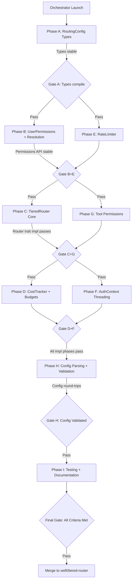

# SPARC Master Orchestration Plan: Tiered Router & Permission System

**Project**: clawft -- Tiered Router (Level 1) & Permission System
**Design Doc**: `.planning/08-tiered-router.md`
**Created**: 2026-02-18
**Status**: Ready for execution
**Execution Model**: Single orchestrator spawns all agents via dependency graph

---

## 1. Executive Summary

This orchestration plan coordinates 9 implementation phases across 6 parallel execution windows to deliver the Tiered Router and Permission System for clawft. The project follows a bottom-up build pattern:

- **Window 1 (Foundation)**: Config types and serde integration (Phase A)
- **Window 2 (Permissions + Rate Limiter)**: User permission resolution and sliding-window rate limiter (Phases B, E -- parallel)
- **Window 3 (Router + Tool Security)**: TieredRouter core algorithm and tool permission enforcement (Phases C, G -- parallel)
- **Window 4 (Cost + Auth)**: Budget tracking and auth context threading through the pipeline (Phases D, F -- parallel)
- **Window 5 (Config Integration)**: Validation rules, deep merge, test fixtures (Phase H)
- **Window 6 (Testing + Docs)**: Integration tests covering all 14 success criteria, documentation (Phase I)

**Critical Path**: A -> B -> C -> D -> H -> I

**What is being built**: The `StaticRouter` (Level 0) always returns the same provider/model pair regardless of task complexity, user identity, or cost. A "what time is it?" message routes to `anthropic/claude-opus-4-5` at $0.05/1K tokens. The `TieredRouter` (Level 1) replaces this with complexity-aware, permission-gated, budget-enforced model selection.

**Why**: Three problems are solved simultaneously:
1. **Cost waste** -- Trivial requests route to free/cheap models; complex tasks get premium models.
2. **No access control** -- Three permission levels (zero_trust, user, admin) gate model tiers, tools, and budgets per user and per channel.
3. **No budget enforcement** -- Daily and monthly cost caps per user and globally, with automatic fallback to cheaper tiers.

**Approach**: Nine phases build the system bottom-up. Foundation types first, then permissions and core router, then enforcement layers (cost, rate limits, auth threading, tool permissions), then config integration, and finally comprehensive testing. Each phase produces a discrete, testable deliverable.

**Design Principles**:
- **Additive, not breaking**: `StaticRouter` remains the Level 0 default. `TieredRouter` is opt-in via `"routing": { "mode": "tiered" }`.
- **Config-driven**: All tiers, permissions, and budgets defined in `config.json`. No code changes to add models or adjust thresholds.
- **Backward compatible**: Existing configs without a `routing` section are unchanged.
- **Private by default**: Unidentified users get `zero_trust` permissions (free models only, no tools, aggressive rate limits).
- **CLI defaults to admin**: Local CLI user owns the machine and gets full access.

**Scope**: 9 workspace crates. 6-stage pipeline: Classifier -> Router -> Assembler -> Transport -> Scorer -> Learner. `TieredRouter` replaces `StaticRouter` as the Level 1 implementation.

**Timeline**: 8.5 developer-days total (7.5 working + 1 day buffer for gates and merges).

---

## 2. Dependency Graph



### Phase Dependency Summary

| Phase | Depends On | Blocks |
|-------|-----------|--------|
| A | None | B, E |
| B | A | C, G, F |
| C | A, B | D, F |
| D | C | H |
| E | A | F |
| F | B, C, E | H |
| G | B | H |
| H | A-G (all) | I |
| I | A-H (all) | Final merge |

---

## 3. Phase Execution Strategy

### Window 1: Foundation (Phase A)

**Phases**: A only
**Agents**: 1
**Effort**: 0.5 days
**Rationale**: All other phases depend on the config types defined here. Must stabilize first.
**Blocking**: ALL other phases wait for Window 1 completion.

### Window 2: Permissions + Rate Limiter (Phases B, E -- parallel)

**Phases**: B, E (concurrent)
**Agents**: 2
**Effort**: 1.0 days (B takes 1 day, E takes 0.5 days; parallel = 1 day wall-clock)
**Rationale**: B defines `UserPermissions` and the 5-layer resolution algorithm. E defines the sliding-window `RateLimiter`. Both depend only on A. Neither depends on the other.

### Window 3: Router Core + Tool Permissions (Phases C, G -- parallel)

**Phases**: C, G (concurrent)
**Agents**: 2
**Effort**: 1.5 days (C takes 1.5 days, G takes 0.5 days; parallel = 1.5 days wall-clock)
**Rationale**: C implements `TieredRouter` using types from A and permissions from B. G implements tool permission enforcement using permissions from B. Neither depends on the other.

### Window 4: Cost Tracker + Auth Threading (Phases D, F -- parallel)

**Phases**: D, F (concurrent)
**Agents**: 2
**Effort**: 1.0 days (D takes 1 day, F takes 1 day; parallel = 1 day wall-clock)
**Rationale**: D adds budget enforcement to the router from C. F threads `AuthContext` from channel plugins through the agent loop to the router, requiring B, C, and E. Neither D nor F depends on the other.

### Window 5: Config Integration (Phase H)

**Phases**: H only
**Agents**: 1
**Effort**: 1.0 days
**Rationale**: Config parsing must validate all types from A through G. Cannot begin until all implementation phases are complete, because config validation must exercise all structs.

### Window 6: Testing + Documentation (Phase I)

**Phases**: I only
**Agents**: 1
**Effort**: 1.5 days
**Rationale**: End-to-end integration tests and documentation require all code to be in place. Covers all 14 success criteria from design doc Section 13.

---

## 4. Agent Assignments

### Phase A: RoutingConfig Types (0.5 days, CRITICAL PATH)

- **Agent**: `types-architect`
- **Plan**: `.planning/sparc/01-tiered-router/A-routing-config-types.md`
- **Branch**: `weft/tiered-router`
- **Dependencies**: None
- **Crate**: `clawft-types`
- **Deliverables**:
  - `RoutingConfig` struct with `mode`, `tiers`, `selection_strategy`, `fallback_model`, `permissions`, `escalation`, `cost_budgets`, `rate_limiting` fields
  - `ModelTierConfig` struct with `name`, `models`, `complexity_range`, `cost_per_1k_tokens`, `max_context_tokens`
  - `PermissionsConfig` struct with level defaults (`zero_trust`, `user`, `admin`), `users` map, `channels` map
  - `PermissionLevelConfig` struct with all-Option fields for partial overrides
  - `UserPermissions` struct with all 16 concrete dimension fields from design doc Section 3.1
  - `EscalationConfig`, `CostBudgetConfig`, `RateLimitConfig` structs
  - `AuthContext` struct with `sender_id`, `channel`, `permissions`
  - Integration into existing `Config` struct as `pub routing: RoutingConfig` with `#[serde(default)]`
  - All types derive `Debug, Clone, Serialize, Deserialize` with serde defaults for backward compat
  - Both `snake_case` and `camelCase` field names via `serde(alias)`
  - New routing module: `crates/clawft-types/src/routing.rs`
  - Test fixture: `tests/fixtures/config_tiered.json`
  - 16 unit tests: defaults, round-trip, camelCase aliases, unknown fields, backward compat

### Phase B: UserPermissions + Resolution (1 day)

- **Agent**: `security-engineer`
- **Plan**: `.planning/sparc/01-tiered-router/B-permissions-resolution.md`
- **Branch**: `weft/tiered-router`
- **Dependencies**: Phase A (types must be stable)
- **Crate**: `clawft-core` (new file: `src/pipeline/permissions.rs`)
- **Deliverables**:
  - `PermissionResolver` struct implementing the 5-layer resolution chain
  - Built-in defaults for levels 0, 1, 2 matching design doc Section 2 exactly
  - `UserPermissions::merge()` method applying partial overrides from `PermissionLevelConfig`
  - `PermissionResolver::resolve(sender_id, channel) -> UserPermissions` main entry point
  - `PermissionResolver::from_config(routing, channels, workspace_routing)` constructor
  - CLI channel defaults to admin (Level 2) unless explicitly overridden
  - Unknown senders default to zero_trust (Level 0)
  - Unknown levels (>2) fall back to zero_trust
  - 19 unit tests: built-in defaults (3), level resolution (5), merge semantics (4), full resolution (4), edge cases (3)

### Phase C: TieredRouter Core (1.5 days)

- **Agent**: `router-engineer`
- **Plan**: `.planning/sparc/01-tiered-router/C-tiered-router-core.md`
- **Branch**: `weft/tiered-router`
- **Dependencies**: Phase A (types), Phase B (permissions)
- **Crate**: `clawft-core` (new file: `src/pipeline/tiered_router.rs`)
- **Deliverables**:
  - `TieredRouter` struct implementing `ModelRouter` trait
  - `TieredRouter::from_config()` constructor
  - Tier filtering by permission `max_tier`
  - Tier selection by complexity score against `complexity_range`
  - Escalation logic: when no tier covers complexity and `escalation_allowed`, promote up to `max_escalation_tiers` beyond `max_tier`
  - All 4 `TierSelectionStrategy` modes (PreferenceOrder, RoundRobin, LowestCost, Random)
  - Model filtering against `model_access` allowlist and `model_denylist`
  - Fallback chain: next model in tier -> next lower tier -> `fallback_model` -> error
  - Extended `RoutingDecision` with optional `tier`, `cost_estimate_usd`, `escalated`, `budget_constrained` fields
  - Pipeline integration: `AgentLoop` selects `TieredRouter` when `routing.mode == "tiered"`, `StaticRouter` otherwise
  - Unit tests for all strategies, escalation, fallback, backward compat

### Phase D: CostTracker + Budgets (1 day)

- **Agent**: `budget-engineer`
- **Plan**: `.planning/sparc/01-tiered-router/D-cost-tracker-budgets.md`
- **Branch**: `weft/tiered-router`
- **Dependencies**: Phase C (TieredRouter)
- **Crate**: `clawft-core` (new file: `src/pipeline/cost_tracker.rs`)
- **Deliverables**:
  - `CostTracker` struct with `DashMap<String, f64>` for daily and monthly per-user spend
  - `record()` method to accumulate cost after a response
  - `check_budget()` method returning `BudgetStatus` (`Ok`, `NearLimit`, `Exceeded`)
  - Daily and monthly reset logic based on `reset_hour_utc`
  - Global budget enforcement (`global_daily_limit_usd`, `global_monthly_limit_usd`)
  - Periodic persistence to `~/.clawft/cost_tracking.json`
  - Load from persistence on startup
  - Integration with `TieredRouter`: fall back to cheaper tier when budget exceeded
  - Integration with `clawft-llm::UsageTracker` for actual cost recording via `ModelRouter::update()`
  - LRU eviction (10K max tracked users)
  - Unit tests: budget check, daily/monthly reset, persistence, LRU eviction, global limits

### Phase E: RateLimiter (0.5 days)

- **Agent**: `rate-limiter-engineer`
- **Plan**: `.planning/sparc/01-tiered-router/E-rate-limiter.md`
- **Branch**: `weft/tiered-router`
- **Dependencies**: Phase A (types for `RateLimitConfig`)
- **Crate**: `clawft-core` (new file: `src/pipeline/rate_limiter.rs`)
- **Deliverables**:
  - `RateLimiter` struct with `DashMap<String, SlidingWindowEntry>`
  - `check(sender_id, limit) -> bool` method (true = allowed, false = rate limited)
  - Configurable window size from `RateLimitConfig.window_seconds` (default 60s)
  - Sliding window algorithm using `VecDeque<Instant>` per sender
  - `limit == 0` means unlimited (always returns true, no entry created)
  - LRU eviction at 10K max tracked senders
  - Thread-safe via `DashMap`
  - Utility methods: `current_count()`, `tracked_senders()`, `clear()`
  - 11 unit tests: basic allow, reject at limit, unlimited, independent senders, window expiry, LRU eviction, concurrent access

### Phase F: AuthContext Threading (1 day)

- **Agent**: `integration-engineer`
- **Plan**: `.planning/sparc/01-tiered-router/F-auth-context-threading.md`
- **Branch**: `weft/tiered-router`
- **Dependencies**: Phase B (UserPermissions), Phase C (TieredRouter), Phase E (RateLimiter)
- **Crate**: `clawft-core` (modify: `src/pipeline/traits.rs`, `src/agent/loop.rs`)
- **Deliverables**:
  - Add `auth_context: Option<AuthContext>` field to `ChatRequest` with `#[serde(default)]`
  - Channel plugins extract `sender_id` from platform-specific auth and set it on `InboundMessage.metadata`
  - `AgentLoop::process_message()` resolves `UserPermissions` via `PermissionResolver`
  - `AgentLoop` attaches `AuthContext` to `ChatRequest` before calling `PipelineRegistry::complete()`
  - `TieredRouter::route()` reads `auth_context` (default to zero_trust if absent)
  - Rate limiter check integrated into routing flow
  - Token limit clamping: clamp `max_tokens` and context window to user's `max_output_tokens` and `max_context_tokens`
  - Backward compatibility: `auth_context` is `Option`, absent = zero_trust behavior
  - Integration tests: full flow from inbound message to routing decision with auth context

### Phase G: Tool Permission Enforcement (0.5 days)

- **Agent**: `tool-security-engineer`
- **Plan**: `.planning/sparc/01-tiered-router/G-tool-permissions.md`
- **Branch**: `weft/tiered-router`
- **Dependencies**: Phase B (UserPermissions)
- **Crate**: `clawft-core` (modify: tool dispatch path)
- **Deliverables**:
  - Permission checking in `ToolRegistry` dispatch path (before tool implementation runs)
  - `tool_access` allowlist: `["*"]` = all, named list = only those, `[]` = none
  - `tool_denylist` checked after allowlist: denies even if `tool_access` allows
  - Glob pattern support in `tool_access` (e.g., `"mcp_*"`)
  - Plugin-declared `required_permission_level`: check `permissions.level >= tool.required_level`
  - `ToolError::PermissionDenied` variant for denied tools
  - When `permissions` is `None`, allow all (backward compat for non-tiered mode)
  - Unit tests: allowlist, denylist, wildcard, glob, permission denied, backward compat

### Phase H: Config Parsing + Validation (1 day)

- **Agent**: `config-engineer`
- **Plan**: `.planning/sparc/01-tiered-router/H-config-parsing-validation.md`
- **Branch**: `weft/tiered-router`
- **Dependencies**: Phases A through G (all implementation must be complete)
- **Crate**: `clawft-types` (extend `src/config.rs` or `src/routing.rs`), test fixtures
- **Deliverables**:
  - Full `RoutingConfig` parsing from JSON with all sub-structs
  - Validation rules: unique tier names, valid complexity ranges, valid `max_tier` references, valid `fallback_model` format, non-negative budgets, escalation warnings
  - Deep merge support for workspace-level `.clawft/config.json` overrides (routing section)
  - `serde(alias)` for camelCase/snake_case field names
  - Default values for all fields matching design doc Section 7.2
  - Backward compatibility: configs without `routing` section parse to `RoutingConfig::default()` (mode = "static")
  - Test fixtures: `config_tiered.json`, `config_tiered_minimal.json`, `config_tiered_invalid.json`
  - Unit tests: round-trip, validation errors, deep merge, camelCase aliases, missing sections

### Phase I: Testing + Documentation (1.5 days)

- **Agent**: `test-engineer`
- **Plan**: `.planning/sparc/01-tiered-router/I-testing-docs.md` (to be created)
- **Branch**: `weft/tiered-router`
- **Dependencies**: Phases A through H (all code must be in place)
- **Crate**: Workspace-level `tests/`, `docs/`
- **Deliverables**:
  - `tests/tiered_router_integration.rs` with 12+ integration tests
  - All 14 success criteria from design doc Section 13 verified by tests
  - Full message flow test: inbound message -> classify -> resolve permissions -> route -> select model -> apply limits
  - Permission boundary tests: zero_trust blocked from premium, user escalation, admin override
  - Rate limiting integration test
  - Cost budget fallback integration test
  - Tool permission denied integration test
  - Backward compatibility tests: StaticRouter still works, `allow_from` still functions
  - Config deep merge integration test
  - Update `docs/reference/config.md` routing section
  - Create `docs/guides/tiered-routing.md` with migration examples (Level 0->1, 1->2, 2->3)
  - Final rustdoc review pass (`cargo doc --no-deps` builds without warnings)

---

## 5. Quality Gates

Quality gates are hard checkpoints between execution windows. The orchestrator MUST NOT advance to the next window until the gate passes.

### Gate A (after Window 1)

| # | Check | Command |
|---|-------|---------|
| 1 | `clawft-types` compiles with new routing types | `cargo build -p clawft-types` |
| 2 | All existing tests still pass | `cargo test -p clawft-types` |
| 3 | Config without `routing` section parses to defaults | Unit test assertion |
| 4 | Config with full `routing` section round-trips through serde | Unit test assertion |
| 5 | Clippy clean | `cargo clippy -p clawft-types` |
| 6 | Rustdoc clean | `cargo doc --no-deps -p clawft-types` |

### Gate B+E (after Window 2)

| # | Check | Command |
|---|-------|---------|
| 1 | Permission resolution matches design doc examples | `cargo test -p clawft-core -- permissions` |
| 2 | CLI defaults to admin, unknown to zero_trust | Unit test assertions |
| 3 | Rate limiter correctly throttles | `cargo test -p clawft-core -- rate_limiter` |
| 4 | Rate limiter `limit=0` passes all requests | Unit test assertion |
| 5 | No new clippy warnings | `cargo clippy -p clawft-core` |
| 6 | Workspace builds clean | `cargo build --workspace` |
| 7 | Rustdoc clean | `cargo doc --no-deps -p clawft-core` |

### Gate C+G (after Window 3)

| # | Check | Command |
|---|-------|---------|
| 1 | `TieredRouter` implements `ModelRouter` trait | Compile check |
| 2 | `StaticRouter` still works when `routing.mode == "static"` | `cargo test -p clawft-core -- static_router` |
| 3 | Tier selection by complexity matches design doc | Unit tests |
| 4 | Escalation respects `max_escalation_tiers` | Unit test |
| 5 | All 4 selection strategies work | Unit tests |
| 6 | Tool permission enforcement blocks restricted tools | `cargo test -p clawft-core -- tool_perm` |
| 7 | Wildcard `["*"]` allows all tools | Unit test |
| 8 | No new clippy warnings | `cargo clippy --workspace` |
| 9 | Rustdoc clean | `cargo doc --no-deps --workspace` |

### Gate D+F (after Window 4)

| # | Check | Command |
|---|-------|---------|
| 1 | Budget enforcement falls back to cheaper tier | Unit test |
| 2 | Daily/monthly reset works | Unit test |
| 3 | Cost persistence round-trips | Unit test |
| 4 | Auth context flows from channel to router | Integration test |
| 5 | Missing auth_context defaults to zero_trust | Unit test |
| 6 | Token limits clamped per user | Unit test |
| 7 | Full workspace build passes | `cargo build --workspace` |
| 8 | All tests pass | `cargo test --workspace` |
| 9 | Rustdoc clean | `cargo doc --no-deps --workspace` |

### Gate H (after Window 5)

| # | Check | Command |
|---|-------|---------|
| 1 | Full config from design doc Section 7.1 parses | Test fixture assertion |
| 2 | Validation catches all invalid configs | Test fixture assertions |
| 3 | Deep merge works for workspace routing overrides | Unit test |
| 4 | camelCase and snake_case aliases both work | Unit test |
| 5 | Backward compat: no `routing` key = StaticRouter | Unit test |
| 6 | Rustdoc clean | `cargo doc --no-deps --workspace` |

### Gate I / Final Gate (after Window 6)

| # | Check | Command |
|---|-------|---------|
| 1 | All 14 success criteria from Section 13 pass | See Section 7 |
| 2 | `cargo test --workspace` passes | Full test suite |
| 3 | `cargo clippy --all-targets --all-features` clean | Lint |
| 4 | `cargo doc --no-deps` builds without warnings | Doc check |
| 5 | Documentation complete | Manual review |
| 6 | No TODO/FIXME without tracking issue | `grep -r "TODO\|FIXME" crates/` |

---

## 6. Risk Register

| # | Risk | Likelihood | Impact | Score | Mitigation |
|---|------|-----------|--------|-------|------------|
| 1 | **Extended `RoutingDecision` breaks existing code** | Medium | High | 6 | Add new fields as `Option<T>` with `#[serde(default)]`. Existing code that pattern-matches on `RoutingDecision` uses the 3 existing fields only; new fields are additive. Run full workspace test suite after change. |
| 2 | **`ChatRequest` extension breaks downstream** | Medium | High | 6 | `auth_context` is `Option<AuthContext>` defaulting to `None`. Existing code that constructs `ChatRequest` is unaffected because `#[serde(default)]` handles deserialization and the field is optional. |
| 3 | **Permission config too complex for users** | Medium | Medium | 4 | Sensible defaults mean only `routing.mode` and `routing.tiers` are needed for basic use. Document migration levels (0->1->2->3) with incremental examples in Phase I. |
| 4 | **Complexity score too coarse for good tier selection** | Medium | Medium | 4 | Tiers have overlapping `complexity_range` values by design. The router picks the highest-quality tier the user is allowed and can afford. Level 1+ classifiers (future work) improve accuracy. |
| 5 | **Budget tracking lost on crash** | Medium | Low | 3 | Periodic persistence to disk (configurable interval). Conservative budget checks (estimate before actual). Load from disk on startup. |
| 6 | **Rate limiter memory grows unbounded** | Low | Medium | 2 | LRU eviction capped at 10K entries per design. Stale entries expire naturally as the sliding window advances. |
| 7 | **Escalation causes unexpected cost spikes** | Low | Medium | 2 | `max_escalation_tiers: 1` limits escalation to one tier above max. Admin-configurable. Budget enforcement is the second safety net. |
| 8 | **Config merge conflicts between global and workspace** | Low | Medium | 2 | Same deep-merge rules as all other config (workspace wins at leaf level). Covered by integration tests in Phase H. |
| 9 | **DashMap contention under high concurrency** | Low | Low | 1 | DashMap is sharded by default. Rate limiter and cost tracker access patterns are per-sender (low contention). Benchmark if issues arise. |
| 10 | **Phase ordering causes rework** | Low | Medium | 2 | Dependency graph is strictly ordered. Each phase has clear input/output contracts. No phase modifies types defined in a prior phase without explicit backward compat. |

---

## 7. Success Criteria

The full checklist from design doc Section 13, mapped to the phase that delivers each criterion and the test that verifies it.

| # | Criterion | Phase | Test |
|---|-----------|-------|------|
| 1 | `StaticRouter` continues to work unchanged when `routing` section is absent | A, C | Integration test: parse config without routing, verify StaticRouter selected |
| 2 | `TieredRouter` routes simple requests to `free` tier and complex requests to `premium/elite` | C | Unit test: complexity 0.1 -> free, complexity 0.9 -> premium/elite |
| 3 | Permission Level 0 users cannot access premium models even with high-complexity requests (unless escalation configured) | B, C | Unit test: zero_trust user, complexity 0.9, escalation_allowed=false -> free tier only |
| 4 | Permission Level 1 users can escalate to premium when complexity exceeds threshold | C | Unit test: user level, complexity 0.8, escalation_threshold=0.6 -> premium |
| 5 | Permission Level 2 users can access all models and override routing manually | C | Unit test: admin level, model_override=true, explicit model -> that model |
| 6 | Rate limiting rejects requests that exceed the per-user limit | E, F | Integration test: send 11 requests at limit=10, verify 11th rejected |
| 7 | Cost budget enforcement falls back to cheaper tiers when budget is near exhaustion | D | Unit test: user at 99% of daily budget, premium request -> standard fallback |
| 8 | Tool access is enforced: Level 0 users cannot invoke `exec` or `spawn` | G | Unit test: zero_trust user, exec_shell -> PermissionDenied |
| 9 | CLI channel defaults to admin permissions | B, F | Unit test: channel="cli", no override -> Level 2 |
| 10 | Per-user config overrides work (user-specific budgets, tool lists) | B, H | Unit test: user "bob" with custom budget overrides level default |
| 11 | Config deep merge between global and project routing sections works correctly | H | Unit test: global + workspace config merge, workspace wins at leaf |
| 12 | Existing `allow_from` channel configs continue to function unchanged | F | Integration test: channel with allow_from still gates access |
| 13 | All new config types serialize/deserialize with backward compatibility (unknown fields ignored) | A, H | Unit test: parse config with extra unknown fields, no error |
| 14 | `weft status` reports the active routing mode, tier count, and permission summary | I | Integration test or manual verification |

---

## 8. File Ownership Matrix

Prevents merge conflicts by assigning clear ownership per phase.

| Phase | Crate | New Files | Modified Files |
|-------|-------|-----------|----------------|
| **A** | `clawft-types` | `src/routing.rs`, `tests/fixtures/config_tiered.json` | `src/config.rs` (add `routing` field), `src/lib.rs` (add `pub mod routing`) |
| **B** | `clawft-core` | `src/pipeline/permissions.rs` | `src/pipeline/mod.rs` (add module) |
| **C** | `clawft-core` | `src/pipeline/tiered_router.rs` | `src/pipeline/mod.rs`, `src/pipeline/traits.rs` (RoutingDecision extension) |
| **D** | `clawft-core` | `src/pipeline/cost_tracker.rs` | `src/pipeline/mod.rs`, `src/pipeline/tiered_router.rs` (integrate CostTracker) |
| **E** | `clawft-core` | `src/pipeline/rate_limiter.rs` | `src/pipeline/mod.rs` (add module) |
| **F** | `clawft-core` | None | `src/pipeline/traits.rs` (ChatRequest extension), `src/agent/loop.rs`, `src/pipeline/tiered_router.rs` |
| **G** | `clawft-core` | None | Tool dispatch path (`src/tools/` or `src/agent/loop_core.rs`) |
| **H** | `clawft-types` | Test fixtures (`config_tiered_minimal.json`, `config_tiered_invalid.json`) | `src/routing.rs` (validation), `src/config.rs` (deep merge) |
| **I** | workspace | `tests/tiered_router_integration.rs`, `docs/guides/tiered-routing.md` | `docs/reference/config.md` |

### Conflict Resolution Protocol

If Phase X needs to modify a file owned by Phase Y (which has already been merged):
1. Phase X agent notes the conflict in its plan
2. Phase X makes the modification with explicit backward compatibility
3. Orchestrator verifies the modification does not break Phase Y's deliverables
4. Full workspace test suite must pass after the modification

---

## 9. Interface Contracts (Must Be Agreed BEFORE Coding)

These contracts are frozen after Phase A completes. Breaking changes require consensus (see Section 12).

### 1. RoutingConfig on Config struct

**Owner**: Phase A
**Dependents**: All phases
**Contract**: `Config.routing: RoutingConfig` with `#[serde(default)]`

### 2. UserPermissions schema

**Owner**: Phase A (definition), Phase B (resolution logic)
**Dependents**: C, D, E, F, G
**Contract**: 16 concrete fields (level, max_tier, model_access, model_denylist, tool_access, tool_denylist, max_context_tokens, max_output_tokens, rate_limit, streaming_allowed, escalation_allowed, escalation_threshold, model_override, cost_budget_daily_usd, cost_budget_monthly_usd, custom_permissions)

### 3. PermissionResolver API

**Owner**: Phase B
**Dependents**: F
**Contract**: `resolve(sender_id: &str, channel: &str) -> UserPermissions`

### 4. ModelRouter trait (unchanged)

**Owner**: Existing code
**Contract**: `route(&self, request: &ChatRequest, profile: &TaskProfile) -> RoutingDecision` and `update(&self, decision: &RoutingDecision, outcome: &ResponseOutcome)`

### 5. RoutingDecision extension

**Owner**: Phase C
**Dependents**: D, F
**Contract**: Add optional fields `tier`, `cost_estimate_usd`, `escalated`, `budget_constrained` without changing existing fields

### 6. ChatRequest extension

**Owner**: Phase C (per FIX-09 remediation; Phase C adds the field with `#[serde(default, skip_deserializing)]`)
**Dependents**: F (populates it at runtime)
**Contract**: Add `auth_context: Option<AuthContext>` with `#[serde(default, skip_deserializing)]`

> **Remediation note (FIX-09, FIX-05, applied 2026-02-18)**: Ownership transferred from
> Phase F to Phase C. Phase C adds the field to ChatRequest and updates all existing
> construction sites with `auth_context: None`. Phase F populates the field at runtime
> via `PermissionResolver` but does NOT re-add it. The `skip_deserializing` attribute
> prevents JSON injection of auth context via the gateway API (FIX-05).

---

## 10. Testing Strategy

### Unit Tests Per Phase

| Phase | Min Tests | Focus |
|-------|-----------|-------|
| A | 16 | Serde round-trip, defaults, aliases, backward compat, fixtures |
| B | 19 | Built-in defaults, level resolution, merge semantics, full resolution, edge cases |
| C | 12+ | Tier selection, escalation, fallback, all strategies, model filtering |
| D | 10+ | Budget check, reset, persistence, LRU, global limits |
| E | 11 | Allow/reject, unlimited, window expiry, LRU, concurrent access |
| F | 8+ | Auth flow, CLI admin, missing auth, token clamping |
| G | 8+ | Allowlist, denylist, wildcard, glob, permission denied |
| H | 8+ | Validation errors, deep merge, camelCase, backward compat |
| I | 14+ | Integration tests covering all Section 13 criteria |

### Test Fixture Files

| Fixture | Created By | Used By |
|---------|-----------|---------|
| `tests/fixtures/config_tiered.json` | Phase A | A, B, C, D, F, H, I |
| `tests/fixtures/config_tiered_minimal.json` | Phase H | H, I |
| `tests/fixtures/config_tiered_invalid.json` | Phase H | H, I |
| `tests/fixtures/config.json` (existing) | Existing | A (backward compat) |

### Coverage Requirements

- Unit test coverage: >= 80% (measured via `cargo-tarpaulin`)
- Critical paths: 100% (permission resolution, budget enforcement, rate limiting, tool access checks)
- CI enforcement: `cargo tarpaulin --workspace --fail-under 80`

---

## 11. Documentation Strategy

Each phase produces documentation proportional to its scope.

| Phase | Documentation Output |
|-------|---------------------|
| A | Rustdoc on all new config types. Inline examples in doc comments. |
| B | Rustdoc on `PermissionResolver`. Document resolution priority chain in module-level doc comment. |
| C | Rustdoc on `TieredRouter`. Document routing algorithm steps in module-level doc comment. |
| D | Rustdoc on `CostTracker`. Document persistence format and reset behavior. |
| E | Rustdoc on `RateLimiter`. Document sliding window algorithm. |
| F | Rustdoc on `AuthContext` flow. Document the channel -> agent loop -> router threading. |
| G | Rustdoc on tool permission check. Document allowlist/denylist semantics. |
| H | Inline validation error messages. No standalone docs until Phase I. |
| I | `docs/reference/config.md` routing section. `docs/guides/tiered-routing.md` migration guide. Final rustdoc review. |

### Documentation Requirements

- All public types and methods MUST have `///` doc comments
- Module-level `//!` docs on each new file explaining the component's role
- `cargo doc --no-deps` MUST build without warnings after each phase
- No standalone documentation files created until Phase I (code-level docs only in A-H)

### Per-Phase Development Notes (added per FIX-11 remediation, 2026-02-18)

Each phase agent MUST write a `decisions.md` file in the corresponding phase directory
under `.planning/development_notes/01-tiered-router/phase-X/`. This file records:

- Design decisions made during implementation (with confidence levels)
- Alternatives considered and reasons for rejection
- Deviations from the SPARC plan (with justification)
- Open questions or issues encountered
- Consensus items raised (cross-referenced to the consensus log)

Directory structure:
```
.planning/development_notes/01-tiered-router/
  phase-A/decisions.md
  phase-B/decisions.md
  phase-C/decisions.md
  phase-D/decisions.md
  phase-E/decisions.md
  phase-F/decisions.md
  phase-G/decisions.md
  phase-H/decisions.md
  phase-I/decisions.md
  consensus-log.md
```

Phase agents MUST create the `decisions.md` before marking the phase complete.
The orchestrator verifies the file exists as part of the quality gate for each window.

---

## 12. Consensus Protocol

When confidence in a design decision is below 95%, multi-agent consensus is required.

### When to Trigger Consensus

- Any change to the `ModelRouter` trait signature
- Any modification to `ChatRequest` struct fields
- Permission resolution behavior that could affect security (e.g., default level for unknown senders)
- Cost tracking persistence format (must be stable across versions)
- Any decision that affects backward compatibility with existing configs

### Consensus Process

1. **Proposer** writes a brief (3-5 sentence) proposal describing the change and rationale
2. **Orchestrator** spawns 2 review agents with the proposal
3. Each reviewer produces a verdict: `APPROVE`, `APPROVE_WITH_CHANGES`, or `REJECT` with reasoning
4. **Consensus rule**: 2 of 3 (proposer + 2 reviewers) must agree. If rejected, the proposer revises and resubmits.
5. **Timeout**: If consensus is not reached within 1 review cycle, the orchestrator makes the final decision based on the design doc as authoritative source.

---

## 13. Agent Spawning Execution Plan

This section is the actionable orchestration script for a single orchestrator agent.

### Pre-Flight Checks

```bash
# 1. Verify repository state
cd /home/aepod/dev/clawft
git status  # Ensure clean working tree

# 2. Verify design doc and plan files exist
ls -l .planning/08-tiered-router.md
ls -l .planning/sparc/01-tiered-router/A-routing-config-types.md
ls -l .planning/sparc/01-tiered-router/B-permissions-resolution.md
ls -l .planning/sparc/01-tiered-router/C-tiered-router-core.md
ls -l .planning/sparc/01-tiered-router/D-cost-tracker-budgets.md
ls -l .planning/sparc/01-tiered-router/E-rate-limiter.md
ls -l .planning/sparc/01-tiered-router/F-auth-context-threading.md
ls -l .planning/sparc/01-tiered-router/G-tool-permissions.md
ls -l .planning/sparc/01-tiered-router/H-config-parsing-validation.md

# 3. Verify existing code compiles
cargo build --workspace
cargo test --workspace

# 4. Ensure branch exists
git checkout weft/tiered-router || git checkout -b weft/tiered-router
```

### Window 1: Launch Phase A (BLOCKING)

```javascript
Task(
  "types-architect",
  `You are the Types Architect for the clawft Tiered Router sprint.

YOUR PLAN: /home/aepod/dev/clawft/.planning/sparc/01-tiered-router/A-routing-config-types.md
YOUR BRANCH: weft/tiered-router
YOUR DESIGN DOC: /home/aepod/dev/clawft/.planning/08-tiered-router.md (Sections 2, 3.1, 4.1, 7.2)

YOUR MISSION:
- Create crates/clawft-types/src/routing.rs with all routing/permission config types
- Add pub mod routing to crates/clawft-types/src/lib.rs
- Add routing: RoutingConfig field to Config struct in config.rs
- All types: Debug, Clone, Serialize, Deserialize with serde(default) for backward compat
- Both snake_case and camelCase field names via serde(alias)
- Create test fixture tests/fixtures/config_tiered.json
- 16 unit tests

EXIT CRITERIA:
- cargo build -p clawft-types
- cargo test -p clawft-types
- cargo clippy -p clawft-types (clean)
- Existing config fixtures parse without error

Never commit to master. Branch: weft/tiered-router`,
  "types-architect",
  { run_in_background: true }
)
```

**Orchestrator Action**: WAIT for Phase A completion. Run Gate A checks.

### Window 2: Launch Phases B and E (PARALLEL, after Gate A passes)

```javascript
// SINGLE MESSAGE: Launch B and E in parallel
[Parallel Agent Execution]:
  Task(
    "security-engineer",
    `You are the Security Engineer for the clawft Tiered Router sprint.

YOUR PLAN: /home/aepod/dev/clawft/.planning/sparc/01-tiered-router/B-permissions-resolution.md
YOUR BRANCH: weft/tiered-router
YOUR DESIGN DOC: /home/aepod/dev/clawft/.planning/08-tiered-router.md (Sections 2, 3.2, 3.3)

YOUR MISSION:
- Create clawft-core/src/pipeline/permissions.rs
- Implement PermissionResolver with the 5-layer resolution chain
- Built-in defaults for levels 0, 1, 2 matching design doc exactly
- UserPermissions::merge() for partial overrides
- CLI = admin (level 2), unknown = zero_trust (level 0)
- 19+ unit tests

EXIT CRITERIA:
- cargo build -p clawft-core
- cargo test -p clawft-core -- permissions (19+ tests pass)
- cargo clippy -p clawft-core (clean)

Never commit to master. Branch: weft/tiered-router`,
    "security-engineer",
    { run_in_background: true }
  )

  Task(
    "rate-limiter-engineer",
    `You are the Rate Limiter Engineer for the clawft Tiered Router sprint.

YOUR PLAN: /home/aepod/dev/clawft/.planning/sparc/01-tiered-router/E-rate-limiter.md
YOUR BRANCH: weft/tiered-router
YOUR DESIGN DOC: /home/aepod/dev/clawft/.planning/08-tiered-router.md (Section 5.2 Step 3)

YOUR MISSION:
- Create clawft-core/src/pipeline/rate_limiter.rs
- Sliding window rate limiter keyed by sender_id using DashMap
- check(sender_id, limit) -> bool
- limit=0 means unlimited (always returns true, no entry created)
- LRU eviction at 10K max senders
- 11 unit tests including concurrent access

EXIT CRITERIA:
- cargo build -p clawft-core
- cargo test -p clawft-core -- rate_limiter
- cargo clippy -p clawft-core (clean)

Never commit to master. Branch: weft/tiered-router`,
    "rate-limiter-engineer",
    { run_in_background: true }
  )
```

**Orchestrator Action**: WAIT for BOTH B and E to complete. Run Gate B+E checks.

### Window 3: Launch Phases C and G (PARALLEL, after Gate B+E passes)

```javascript
// SINGLE MESSAGE: Launch C and G in parallel
[Parallel Agent Execution]:
  Task(
    "router-engineer",
    `You are the Router Engineer for the clawft Tiered Router sprint.

YOUR PLAN: /home/aepod/dev/clawft/.planning/sparc/01-tiered-router/C-tiered-router-core.md
YOUR BRANCH: weft/tiered-router
YOUR DESIGN DOC: /home/aepod/dev/clawft/.planning/08-tiered-router.md (Sections 4, 5)

YOUR MISSION:
- Create clawft-core/src/pipeline/tiered_router.rs
- Implement TieredRouter: ModelRouter trait
- Tier filtering by max_tier, selection by complexity, escalation logic
- All 4 TierSelectionStrategy modes
- Model allowlist/denylist filtering
- Fallback chain: next model in tier -> lower tier -> fallback_model -> error
- Extend RoutingDecision with optional tier/cost/escalated/budget_constrained fields
- Wire into PipelineRegistry based on routing.mode

EXIT CRITERIA:
- TieredRouter passes ModelRouter trait contract
- StaticRouter still works when mode="static"
- All strategies tested
- cargo clippy clean

Never commit to master. Branch: weft/tiered-router`,
    "router-engineer",
    { run_in_background: true }
  )

  Task(
    "tool-security-engineer",
    `You are the Tool Security Engineer for the clawft Tiered Router sprint.

YOUR PLAN: /home/aepod/dev/clawft/.planning/sparc/01-tiered-router/G-tool-permissions.md
YOUR BRANCH: weft/tiered-router
YOUR DESIGN DOC: /home/aepod/dev/clawft/.planning/08-tiered-router.md (Section 9.4)

YOUR MISSION:
- Add permission checking to tool dispatch path
- Check tool_access allowlist and tool_denylist
- Support wildcard ["*"] and glob patterns
- ToolError::PermissionDenied for denied tools
- Backward compat: None permissions = allow all

EXIT CRITERIA:
- Level 0 cannot invoke exec/spawn
- Level 2 can invoke all tools
- Denylist overrides allowlist
- cargo clippy clean

Never commit to master. Branch: weft/tiered-router`,
    "tool-security-engineer",
    { run_in_background: true }
  )
```

**Orchestrator Action**: WAIT for BOTH C and G to complete. Run Gate C+G checks.

### Window 4: Launch Phases D and F (PARALLEL, after Gate C+G passes)

```javascript
// SINGLE MESSAGE: Launch D and F in parallel
[Parallel Agent Execution]:
  Task(
    "budget-engineer",
    `You are the Budget Engineer for the clawft Tiered Router sprint.

YOUR PLAN: /home/aepod/dev/clawft/.planning/sparc/01-tiered-router/D-cost-tracker-budgets.md
YOUR BRANCH: weft/tiered-router
YOUR DESIGN DOC: /home/aepod/dev/clawft/.planning/08-tiered-router.md (Section 6)

YOUR MISSION:
- Create clawft-core/src/pipeline/cost_tracker.rs
- CostTracker with DashMap per-user daily/monthly spend
- record(), check_budget(), daily/monthly reset
- Global budget limits
- Persistence to disk, load on startup
- Integrate with TieredRouter budget constraints
- LRU eviction (10K max entries)

EXIT CRITERIA:
- Budget enforcement falls back to cheaper tiers
- Reset works correctly
- Persistence round-trips
- cargo clippy clean

Never commit to master. Branch: weft/tiered-router`,
    "budget-engineer",
    { run_in_background: true }
  )

  Task(
    "integration-engineer",
    `You are the Integration Engineer for the clawft Tiered Router sprint.

YOUR PLAN: /home/aepod/dev/clawft/.planning/sparc/01-tiered-router/F-auth-context-threading.md
YOUR BRANCH: weft/tiered-router
YOUR DESIGN DOC: /home/aepod/dev/clawft/.planning/08-tiered-router.md (Sections 3.3, 9.2, 9.3)

YOUR MISSION:
- Add auth_context: Option<AuthContext> to ChatRequest
- Channel plugins set sender_id in InboundMessage metadata
- AgentLoop resolves UserPermissions and attaches AuthContext
- TieredRouter reads auth_context (default zero_trust if absent)
- Rate limiter check integrated into routing flow
- Token limit clamping per user permissions

EXIT CRITERIA:
- Auth context flows from channel to router
- CLI defaults to admin
- Missing auth_context = zero_trust
- Existing tests still pass
- cargo clippy clean

Never commit to master. Branch: weft/tiered-router`,
    "integration-engineer",
    { run_in_background: true }
  )
```

**Orchestrator Action**: WAIT for BOTH D and F to complete. Run Gate D+F checks.

### Window 5: Launch Phase H (after Gate D+F passes)

```javascript
Task(
  "config-engineer",
  `You are the Config Engineer for the clawft Tiered Router sprint.

YOUR PLAN: /home/aepod/dev/clawft/.planning/sparc/01-tiered-router/H-config-parsing-validation.md
YOUR BRANCH: weft/tiered-router
YOUR DESIGN DOC: /home/aepod/dev/clawft/.planning/08-tiered-router.md (Section 7)

YOUR MISSION:
- Add validation rules to RoutingConfig parsing
- Deep merge support for workspace overrides
- serde(alias) for camelCase/snake_case
- Create test fixtures (config_tiered_minimal.json, config_tiered_invalid.json)
- Verify backward compat with all existing config fixtures

EXIT CRITERIA:
- Full config from Section 7.1 parses and round-trips
- Validation catches all invalid configs with clear errors
- Deep merge works
- cargo clippy clean

Never commit to master. Branch: weft/tiered-router`,
  "config-engineer",
  { run_in_background: true }
)
```

**Orchestrator Action**: WAIT for H to complete. Run Gate H checks.

### Window 6: Launch Phase I (after Gate H passes)

```javascript
Task(
  "test-engineer",
  `You are the Test Engineer for the clawft Tiered Router sprint.

YOUR PLAN: /home/aepod/dev/clawft/.planning/sparc/01-tiered-router/I-testing-docs.md
YOUR BRANCH: weft/tiered-router
YOUR DESIGN DOC: /home/aepod/dev/clawft/.planning/08-tiered-router.md (Section 13)

YOUR MISSION:
- Create tests/tiered_router_integration.rs with 14+ integration tests
- Cover all 14 success criteria from Section 13
- Update docs/reference/config.md routing section
- Create docs/guides/tiered-routing.md
- Final rustdoc review pass

EXIT CRITERIA:
- All 14 success criteria pass
- cargo test --workspace passes
- cargo clippy --all-targets --all-features clean
- cargo doc --no-deps builds without warnings
- Documentation complete

Never commit to master. Branch: weft/tiered-router`,
  "test-engineer",
  { run_in_background: true }
)
```

**Orchestrator Action**: WAIT for I to complete. Run Final Gate checks. If all pass, merge sequence begins.

### Final Merge Sequence

```bash
# Verify integration branch
cd /home/aepod/dev/clawft
git checkout weft/tiered-router

# Final verification
cargo build --workspace
cargo test --workspace
cargo clippy --all-targets --all-features
cargo doc --no-deps

# If ALL pass, create PR to master
# (Do NOT merge to master directly per CLAUDE.md rules)
gh pr create --base master --head weft/tiered-router \
  --title "feat: tiered router and permission system" \
  --body "Replaces StaticRouter with TieredRouter (Level 1). Adds 3-level permission system, per-user cost budgets, sliding-window rate limiter, and tool access enforcement. Config-driven, backward compatible."
```

---

## 14. Estimated Timeline

| Window | Phases | Wall-Clock Days | Cumulative |
|--------|--------|----------------|------------|
| 1 | A | 0.5 | 0.5 |
| 2 | B, E (parallel) | 1.0 | 1.5 |
| 3 | C, G (parallel) | 1.5 | 3.0 |
| 4 | D, F (parallel) | 1.0 | 4.0 |
| 5 | H | 1.0 | 5.0 |
| 6 | I | 1.5 | 6.5 |
| Gates + merges | -- | 1.0 | 7.5 |
| **Buffer** | -- | 1.0 | **8.5** |
| **Total** | **A-I** | -- | **8.5 days** |

**Total effort: 8.5 developer-days** (matches design doc Section 11 estimate).

---

## 15. Orchestrator Monitoring Dashboard

### Phase Health Tracker

| Phase | Status | Agent | Plan File | Branch | Blocker | Risk |
|-------|--------|-------|-----------|--------|---------|------|
| A | Pending | types-architect | A-routing-config-types.md | weft/tiered-router | None | Low |
| B | Pending | security-engineer | B-permissions-resolution.md | weft/tiered-router | A | Low |
| C | Pending | router-engineer | C-tiered-router-core.md | weft/tiered-router | A, B | Medium |
| D | Pending | budget-engineer | D-cost-tracker-budgets.md | weft/tiered-router | C | Low |
| E | Pending | rate-limiter-engineer | E-rate-limiter.md | weft/tiered-router | A | Low |
| F | Pending | integration-engineer | F-auth-context-threading.md | weft/tiered-router | B, C, E | Medium |
| G | Pending | tool-security-engineer | G-tool-permissions.md | weft/tiered-router | B | Low |
| H | Pending | config-engineer | H-config-parsing-validation.md | weft/tiered-router | A-G | Low |
| I | Pending | test-engineer | I-testing-docs.md | weft/tiered-router | H | Low |

### Gate Checklist Status

```
Gate A:     0/5 checks passed
Gate B+E:   0/6 checks passed
Gate C+G:   0/8 checks passed
Gate D+F:   0/8 checks passed
Gate H:     0/5 checks passed
Final Gate: 0/6 checks passed
```

### Timeline Tracking

```
Sprint Start:     2026-02-18 (Day 0)
Window 1 Target:  2026-02-18 (Day 0.5)
Window 2 Target:  2026-02-19 (Day 1.5)
Window 3 Target:  2026-02-21 (Day 3.0)
Window 4 Target:  2026-02-22 (Day 4.0)
Window 5 Target:  2026-02-23 (Day 5.0)
Window 6 Target:  2026-02-25 (Day 6.5)
Final Gate:       2026-02-26 (Day 7.5)
Buffer Expires:   2026-02-27 (Day 8.5)

Current Day: 0
Days Elapsed: 0
Days Remaining: 8.5
```

---

## 16. Escalation Protocols

### When to Escalate

1. Any phase blocked for more than 4 hours without resolution path
2. Any quality gate fails a critical check
3. Any change required to `ModelRouter` trait signature (consensus required)
4. Any modification to `ChatRequest` struct (consensus required)
5. Security concern in permission resolution (immediate escalation)
6. Backward compatibility breakage detected
7. Test coverage drops below 80%
8. Binary size regression detected

### Escalation Format

```markdown
## ESCALATION: [Issue Title]

**Phase**: [Phase ID]
**Severity**: Critical / High / Medium
**Impact**: [Which phases blocked]
**Timeline Impact**: [Hours slip projected]

**Problem**:
[Clear description]

**Attempted Resolution**:
[What was tried]

**Recommended Action**:
[Proposed fix with effort estimate]

**Decision Needed By**: [Date]
```

---

## 17. Definition of Done (All Phases)

Before ANY phase can be marked complete:

1. **Code Quality**
   - `cargo build --workspace` passes
   - `cargo clippy --all-targets --all-features` has ZERO warnings
   - `cargo fmt --check` passes
   - No new `unsafe` blocks without justification comment

2. **Testing**
   - `cargo test --workspace` passes
   - Phase-specific tests pass per plan file
   - Code coverage >= 80% for new code

3. **Documentation**
   - All public items have `///` doc comments
   - Module-level `//!` docs on new files
   - `cargo doc --no-deps` builds without warnings

4. **Security**
   - No hardcoded secrets or API keys
   - Input validation at system boundaries
   - Error messages do not leak sensitive data

5. **Backward Compatibility**
   - Existing test fixtures parse without error
   - Existing `ModelRouter` implementations still work
   - Existing `ChatRequest` construction sites compile unchanged

6. **Development Notes** (added per FIX-11 remediation)
   - `decisions.md` written in `.planning/development_notes/01-tiered-router/phase-X/`
   - All decisions with confidence < 95% cross-referenced to consensus log

---

## 18. Final Instructions for Orchestrator Agent

You are the orchestrator for the Tiered Router & Permission System sprint. Your role:

1. **Execute this plan sequentially by window** (Window 1 -> 2 -> 3 -> 4 -> 5 -> 6)
2. **Spawn agents using Task tool** as specified in the agent spawning sections
3. **Enforce dependency gates** -- never advance to next window until current gate passes
4. **Run full workspace build + test** after each window completes
5. **Trigger consensus** for any trait signature or struct changes per Section 12
6. **Escalate blockers** per Section 16
7. **Never commit to master** -- all work on branch `weft/tiered-router`
8. **Track progress** by updating the monitoring dashboard in memory

### Your Success Criteria

- All 9 phases complete without critical bugs
- All 6 quality gates pass
- All 14 design doc success criteria (Section 13) verified
- `cargo build --workspace && cargo test --workspace && cargo clippy --all-targets` clean
- Zero backward compatibility breakages
- Documentation complete
- Total elapsed time <= 8.5 developer-days

### How to Use This Plan

1. Read entire plan (this file) thoroughly
2. Run pre-flight checks
3. Launch Phase A (blocking, wait for completion)
4. When Gate A passes, launch Phases B and E in parallel
5. When Gate B+E passes, launch Phases C and G in parallel
6. When Gate C+G passes, launch Phases D and F in parallel
7. When Gate D+F passes, launch Phase H
8. When Gate H passes, launch Phase I
9. When Final Gate passes, create PR to master

**This plan is your source of truth. Execute it with precision.**

---

## 19. Remediation Log

Fixes applied from `.planning/sparc/01-tiered-router/remediation-plan.md` on 2026-02-18.

| Fix | Description | Status |
|-----|-------------|--------|
| FIX-09 | ChatRequest extension ownership transferred from Phase F to Phase C (Section 9, Contract #6) | APPLIED |
| FIX-11 | Per-phase dev notes requirement added (Section 11, Section 17 Definition of Done) | APPLIED |
| FIX-11 | `cargo doc --no-deps` added to all intermediate quality gates (Section 5) | APPLIED |
| FIX-12 | "15 dimensions" -> "16 dimensions": already correct in this file (no change needed) | VERIFIED |

---

**END OF ORCHESTRATION PLAN**
