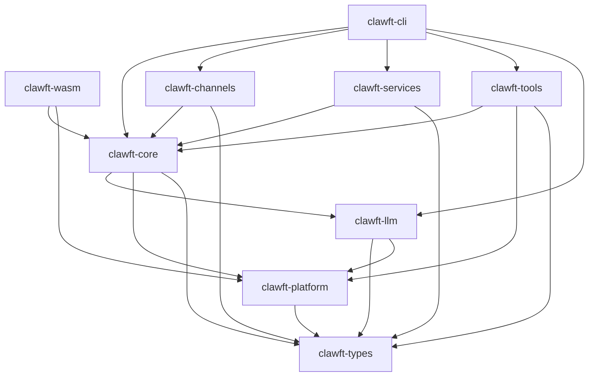

# clawft

[](https://crates.io/crates/clawft)
[](https://docs.rs/clawft)
[](https://github.com/clawft/clawft/actions/workflows/ci.yml)
[](LICENSE)

A modular, async Rust framework for building AI assistants that connect to
multiple messaging channels and LLM providers. The CLI binary is called `weft`.

clawft provides a 6-stage message processing pipeline, pluggable channel
adapters (Telegram, Slack, Discord), and a provider-agnostic LLM layer with
OpenAI-compatible API support.

## Key Features

- **Multi-channel messaging** -- Telegram, Slack, and Discord adapters with a
  unified PluginHost architecture
- **LLM provider abstraction** -- OpenAI-compatible and native provider
  interfaces behind a single trait
- **6-stage pipeline** -- Classifier, Router, Assembler, Transport, Scorer,
  Learner for structured message processing
- **Tool system** -- File operations, shell execution, memory, web search/fetch,
  message dispatch, and agent spawning
- **MCP integration** -- Dual-mode Model Context Protocol support: `weft
  mcp-server` exposes built-in tools to an LLM host (server mode), and
  `tools.mcp_servers` config connects to external MCP servers as a client
- **Session persistence** -- JSONL-based session history with consolidation,
  long-term memory (MEMORY.md), and history summaries (HISTORY.md)
- **Vector memory** -- Optional `vector-memory` feature gate for
  IntelligentRouter, VectorStore, and SessionIndexer
- **Scheduled jobs** -- CronService for recurring tasks with full CRUD
  management
- **Security** -- Workspace-sandboxed file operations with path traversal
  prevention
- **WASM support** -- `clawft-wasm` crate for wasm32 targets
- **Tiny release binaries** -- opt-level="z", LTO, stripped, single codegen
  unit, panic=abort
- **Graceful shutdown** -- CancellationToken-based coordinated shutdown across
  all services

## Quick Start

### Install from crates.io

```sh
cargo install clawft-cli
```

### Configure

Create a configuration file (default: `config.json`):

```json
{
  "llm": {
    "provider": "openai",
    "model": "gpt-4o",
    "api_key_env": "OPENAI_API_KEY"
  },
  "agent": {
    "system_prompt": "You are a helpful assistant.",
    "workspace": "."
  }
}
```

Set environment variables for your LLM provider:

```sh
export OPENAI_API_KEY="sk-..."
```

### Run

Start an interactive agent session:

```sh
weft agent
```

Send a single message:

```sh
weft agent -m "Summarize this project"
```

Start the gateway (channels + agent loop):

```sh
weft gateway
```

## CLI Usage

```
weft <COMMAND>

Commands:
  agent        Interactive agent session or single message
  gateway      Start channels + agent loop
  status       Configuration diagnostics
  channels     Channel management
  cron         Scheduled job management
  sessions     Session management
  memory       Agent memory operations
  config       Configuration inspection
  completions  Generate shell completions
```

### Examples

```sh
# Check configuration
weft status

# View channel status
weft channels status

# Manage scheduled jobs
weft cron list
weft cron add --name daily-summary --schedule "0 9 * * *" --command "summarize"
weft cron enable daily-summary
weft cron run daily-summary

# Session management
weft sessions list
weft sessions inspect <session-id>
weft sessions delete <session-id>

# Memory operations
weft memory show
weft memory history
weft memory search "authentication patterns"

# Configuration
weft config show
weft config section llm

# Shell completions
weft completions bash > ~/.local/share/bash-completion/completions/weft
weft completions zsh > ~/.zfunc/_weft
weft completions fish > ~/.config/fish/completions/weft.fish
```

## Configuration

clawft resolves configuration from multiple sources in order of precedence:

1. Command-line arguments
2. Environment variables
3. Configuration file (`config.json`)

### Configuration File

```json
{
  "llm": {
    "provider": "openai",
    "model": "gpt-4o",
    "api_key_env": "OPENAI_API_KEY",
    "base_url": "https://api.openai.com/v1",
    "max_tokens": 4096,
    "temperature": 0.7
  },
  "agent": {
    "system_prompt": "You are a helpful assistant.",
    "workspace": "/path/to/workspace",
    "tools": ["file", "shell", "memory", "web_search", "web_fetch", "message", "spawn"]
  },
  "channels": {
    "telegram": {
      "enabled": true,
      "token_env": "TELEGRAM_BOT_TOKEN"
    },
    "slack": {
      "enabled": true,
      "token_env": "SLACK_BOT_TOKEN",
      "app_token_env": "SLACK_APP_TOKEN"
    },
    "discord": {
      "enabled": true,
      "token_env": "DISCORD_BOT_TOKEN"
    }
  },
  "tools": {
    "mcp_servers": {
      "filesystem": {
        "command": "npx",
        "args": ["-y", "@modelcontextprotocol/server-filesystem", "/path/to/allowed"]
      }
    }
  },
  "services": {
    "heartbeat_interval_secs": 30
  }
}
```

### Environment Variables

| Variable | Description |
|----------|-------------|
| `OPENAI_API_KEY` | OpenAI API key |
| `TELEGRAM_BOT_TOKEN` | Telegram bot token |
| `SLACK_BOT_TOKEN` | Slack bot OAuth token |
| `SLACK_APP_TOKEN` | Slack app-level token (Socket Mode) |
| `DISCORD_BOT_TOKEN` | Discord bot token |
| `CLAWFT_CONFIG` | Path to configuration file |
| `CLAWFT_LOG` | Log level (trace, debug, info, warn, error) |

## Architecture

clawft is organized as a Cargo workspace with 9 crates:



| Crate | Description |
|-------|-------------|
| `clawft-types` | Core types: Config, events, errors |
| `clawft-platform` | Platform abstraction (filesystem, HTTP, env, process) for native + WASM |
| `clawft-core` | Agent engine: AgentLoop, MessageBus, 6-stage pipeline, session management, memory, security |
| `clawft-llm` | LLM provider abstraction (OpenAI-compatible + native) |
| `clawft-tools` | Tool implementations: file ops, shell, memory, web search/fetch, message, spawn |
| `clawft-channels` | Channel plugins (Telegram, Slack, Discord) with PluginHost |
| `clawft-services` | Background services: CronService, HeartbeatService, MCP |
| `clawft-cli` | CLI binary `weft` with subcommands |
| `clawft-wasm` | WASM entrypoint for wasm32 targets |

### Message Pipeline

```
Inbound message
    |
    v
[Classifier] -- Categorize intent and extract metadata
    |
    v
[Router] -- Select handler (or IntelligentRouter with vector-memory)
    |
    v
[Assembler] -- Build LLM prompt with context, tools, and history
    |
    v
[Transport] -- Send to LLM provider, stream response
    |
    v
[Scorer] -- Evaluate response quality
    |
    v
[Learner] -- Update memory and session state
    |
    v
Outbound message (markdown -> channel-native format)
```

## Building from Source

### Prerequisites

- Rust 1.93 or later (edition 2024)
- Cargo

### Build

```sh
git clone https://github.com/clawft/clawft.git
cd clawft
cargo build --release
```

The release binary will be at `target/release/weft`.

### Build for WASM

```sh
cargo build --release --target wasm32-unknown-unknown -p clawft-wasm
```

## Feature Flags

| Feature | Crate | Description |
|---------|-------|-------------|
| `vector-memory` | `clawft-core` | Enables IntelligentRouter, VectorStore, and SessionIndexer |

Enable features at build time:

```sh
cargo build --release --features vector-memory
```

## Testing

The workspace includes 892 tests across all crates.

```sh
# Run all tests
cargo test --workspace

# Run tests for a specific crate
cargo test -p clawft-core

# Run tests with the vector-memory feature
cargo test --workspace --features vector-memory
```

## Contributing

Contributions are welcome. Please follow these guidelines:

1. Fork the repository and create a feature branch
2. Write tests for new functionality
3. Ensure all tests pass: `cargo test --workspace`
4. Run clippy: `cargo clippy --workspace -- -D warnings`
5. Format code: `cargo fmt --all`
6. Submit a pull request

## License

Licensed under either of:

- Apache License, Version 2.0 ([LICENSE-APACHE](LICENSE-APACHE) or
  <http://www.apache.org/licenses/LICENSE-2.0>)
- MIT License ([LICENSE-MIT](LICENSE-MIT) or
  <http://opensource.org/licenses/MIT>)

at your option.

## Attribution

clawft builds on ideas and patterns from several related projects:

- [claude-code](https://github.com/anthropics/claude-code) -- Anthropic's agentic coding tool
- [claude-flow](https://github.com/ruvnet/claude-flow) -- Multi-agent orchestration framework
- [ruvector](https://github.com/ruvnet/ruvector) -- Rust vector operations library
- [nanobot](https://github.com/robinsonb5/nanobot) -- Lightweight bot framework
- More TBD
