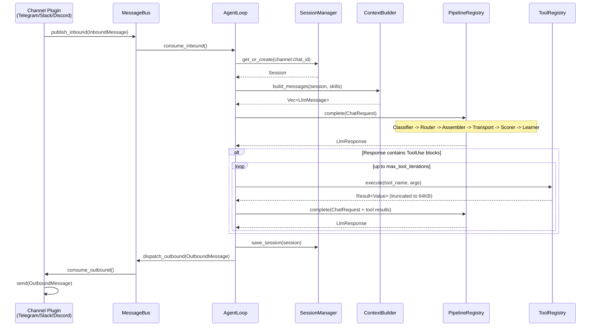
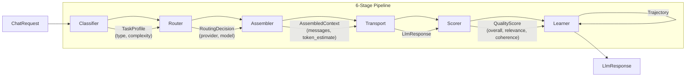
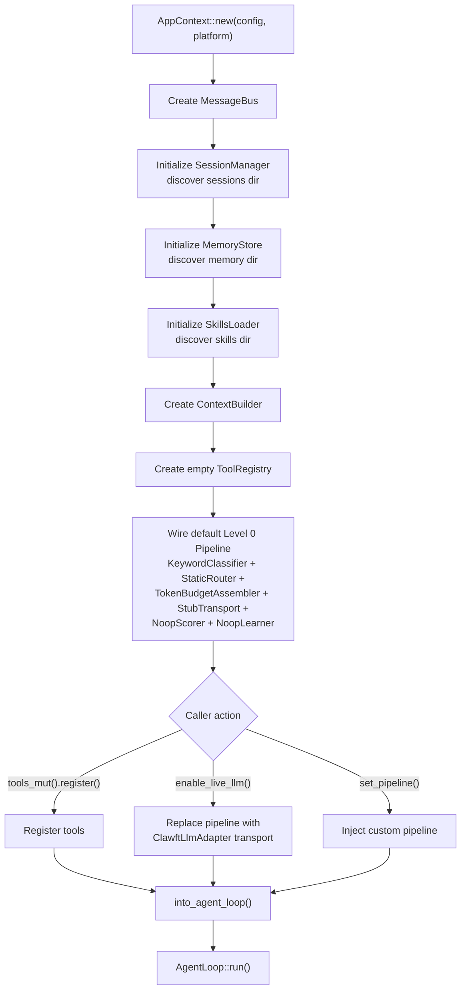

# clawft Architecture Overview

clawft is a Rust AI assistant framework designed around a modular, platform-abstracted pipeline architecture. It processes messages from chat channels (Telegram, Slack, Discord) through a 6-stage LLM pipeline with tool execution, session persistence, and long-term memory. The binary is named `weft`.

The workspace contains 18 crates organized in a strict dependency hierarchy that enforces separation of concerns: shared types at the bottom, platform abstraction above them, then core engine logic, with tools, channels, services, plugins, and the CLI at the top. A WASM crate provides a browser-compatible entrypoint using only the types layer. Nine plugin crates (added in Element 04) extend the framework with git tools, cargo integration, OAuth2, AST analysis, browser automation, calendar, container management, and security auditing.

---

## Crate Dependency Graph

```mermaid
graph BT
    types["clawft-types"]
    platform["clawft-platform"]
    llm["clawft-llm"]
    core["clawft-core"]
    tools["clawft-tools"]
    channels["clawft-channels"]
    services["clawft-services"]
    cli["clawft-cli"]
    wasm["clawft-wasm"]
    plugin["clawft-plugin"]
    pgit["clawft-plugin-git"]
    pcargo["clawft-plugin-cargo"]
    poauth["clawft-plugin-oauth2"]
    ptree["clawft-plugin-treesitter"]
    pbrowser["clawft-plugin-browser"]
    pcal["clawft-plugin-calendar"]
    pcontain["clawft-plugin-containers"]
    security["clawft-security"]

    platform --> types
    core --> types
    core --> platform
    core --> llm
    tools --> types
    tools --> platform
    tools --> core
    channels --> types
    channels --> platform
    services --> types
    plugin --> types
    pgit --> plugin
    pcargo --> plugin
    poauth --> plugin
    ptree --> plugin
    pbrowser --> plugin
    pcal --> plugin
    pcontain --> plugin
    security --> types
    security --> plugin
    cli --> types
    cli --> platform
    cli --> core
    cli --> llm
    cli --> tools
    cli --> channels
    cli --> services
    cli --> plugin
    cli --> security
    wasm --> types

    style types fill:#e8f4fd,stroke:#1a73e8
    style platform fill:#e8f4fd,stroke:#1a73e8
    style core fill:#fce8e6,stroke:#d93025
    style cli fill:#f1f3f4,stroke:#5f6368
    style plugin fill:#e6f4ea,stroke:#137333
    style pgit fill:#e6f4ea,stroke:#137333
    style pcargo fill:#e6f4ea,stroke:#137333
    style poauth fill:#e6f4ea,stroke:#137333
    style ptree fill:#e6f4ea,stroke:#137333
    style pbrowser fill:#e6f4ea,stroke:#137333
    style pcal fill:#e6f4ea,stroke:#137333
    style pcontain fill:#e6f4ea,stroke:#137333
    style security fill:#fef7e0,stroke:#ea8600
```



`clawft-llm` has no internal dependencies -- it is a standalone LLM provider abstraction depending only on `async-trait`, `reqwest`, and `serde`.

---

## Crate Reference

### clawft-types

Foundation crate with zero internal dependencies. All other crates depend on it.

**Purpose:** Canonical type definitions shared across the entire framework.

**Key types:**
- `ClawftError` / `ChannelError` -- error enums used framework-wide
- `Config` -- root configuration schema (deserialized from JSON)
- `AgentsConfig` / `AgentDefaults` -- agent parameters (model, max_tokens, temperature, memory_window, max_tool_iterations)
- `InboundMessage` / `OutboundMessage` -- message events flowing through the bus
- `LlmResponse` / `ContentBlock` / `StopReason` / `Usage` -- LLM response types
- `Session` -- conversation session state with JSONL-backed persistence
- `CronJob` -- scheduled job definitions

**Dependencies:** serde, chrono, thiserror, serde_json

---

### clawft-platform

Platform abstraction layer enabling portability across native and WASM targets.

**Purpose:** Define traits for all platform-dependent operations so the core engine is platform-agnostic.

**Key types and traits:**
- `Platform` trait -- bundles `fs()`, `env()`, `http()`, and `process()` accessors
- `NativePlatform` -- production implementation using reqwest, tokio::fs, std::env, tokio::process
- `HttpClient` trait / `NativeHttpClient` -- async HTTP with `request()` and convenience `get()`/`post()` methods
- `FileSystem` trait / `NativeFileSystem` -- async file I/O (`read_to_string`, `write_string`, `append_string`, `exists`, `list_dir`, `create_dir_all`, `remove_file`, `home_dir`)
- `Environment` trait / `NativeEnvironment` -- env var access (`get_var`, `set_var`, `remove_var`)
- `ProcessSpawner` trait / `NativeProcessSpawner` -- child process execution (returns `Option` from `Platform::process()` since WASM lacks process spawning)
- `ConfigLoader` -- config file discovery chain: `CLAWFT_CONFIG` env var, then `~/.clawft/config.json`, then `~/.nanobot/config.json` (legacy fallback), with camelCase-to-snake_case key normalization

**Dependencies:** clawft-types, async-trait, reqwest, tokio, dirs

---

### clawft-llm

Standalone LLM provider abstraction with no internal crate dependencies.

**Purpose:** Unified interface for calling LLM APIs through OpenAI-compatible endpoints.

**Key types and traits:**
- `Provider` trait -- defines `complete(ChatRequest) -> ChatResponse`
- `OpenAiCompatProvider` -- implementation for any OpenAI-compatible HTTP API
- `ProviderRouter` -- routes model identifiers (e.g., `"openai/gpt-4o"`, `"anthropic/claude-opus-4-5"`) to the correct provider instance
- `ProviderConfig` -- connection configuration (base URL, API key, headers)
- `ChatRequest` / `ChatMessage` / `ChatResponse` / `ToolCall` / `Usage` -- request/response types

**Dependencies:** async-trait, reqwest, serde, serde_json

---

## Provider Architecture

`ProviderRouter` resolves model names (e.g. `"anthropic/claude-opus-4-5"`) to providers via longest-prefix matching. `OpenAiCompatProvider` is the sole `Provider` implementation, targeting any OpenAI-compatible endpoint. API keys are resolved from environment variables at request time.

**Built-in providers (9):** openai, anthropic, groq, deepseek, mistral, together, openrouter, gemini, xai. Each has a prefix, base URL, and API key env var. Users can override per-provider settings in the config file.

`ClawftLlmAdapter` bridges the pipeline's `LlmProvider` trait (`serde_json::Value`) to `clawft-llm`'s typed `ChatRequest`/`ChatResponse`. `create_adapter_from_config()` resolves the provider and returns `Arc<dyn LlmProvider>`.

---

### clawft-core

Central engine crate containing the agent loop, message bus, pipeline system, session management, and security primitives.

**Purpose:** Orchestrate message processing from ingestion through LLM invocation to response dispatch.

**Modules:**

**Modules:**
- **bus** -- `MessageBus`: tokio MPSC channels for inbound/outbound message routing (Send + Sync via `Arc<Mutex<UnboundedReceiver>>`)
- **pipeline** -- 6-stage pluggable pipeline: `TaskClassifier`, `ModelRouter`, `ContextAssembler`, `LlmTransport`, `QualityScorer`, `LearningBackend`. `PipelineRegistry` maps `TaskType` to specialized pipelines with a default fallback.
- **agent** -- `AgentLoop` (message processing), `ContextBuilder` (system prompt + skills + memory + history), `MemoryStore` (MEMORY.md/HISTORY.md), `SkillsLoader`
- **session** -- `SessionManager`: JSONL-backed persistence keyed by `"{channel}:{chat_id}"` with in-memory cache
- **security** -- `validate_session_id()`, `sanitize_content()`, `truncate_result()` (64KB cap)
- **bootstrap** -- `AppContext`: wires all dependencies; `enable_live_llm()` swaps stub for `ClawftLlmAdapter`

**Optional feature:** `vector-memory` -- enables embeddings, vector_store, intelligent_router, session_indexer

**Dependencies:** clawft-types, clawft-platform, clawft-llm, async-trait, tokio, serde_json, chrono, tracing

---

### clawft-tools

Built-in tool implementations and bulk registration.

**Purpose:** Provide the file, shell, memory, web, and agent tools that the LLM invokes during conversations.

**Key types:**
- `Tool` trait (defined in clawft-core) -- `name()`, `description()`, `parameters()` (JSON Schema), `execute(args) -> Result<Value, ToolError>`
- `ToolRegistry` (defined in clawft-core) -- registration, lookup by name, schema export, and dispatch
- `ToolError` -- NotFound, InvalidArgs, ExecutionFailed, PermissionDenied, FileNotFound, InvalidPath, Timeout

**Built-in tools:**
| Tool | Module | Description |
|------|--------|-------------|
| `read_file` | `file_tools` | Read file contents (workspace-sandboxed) |
| `write_file` | `file_tools` | Write file contents (workspace-sandboxed) |
| `edit_file` | `file_tools` | Apply edits to existing files (workspace-sandboxed) |
| `list_directory` | `file_tools` | List directory contents (workspace-sandboxed) |
| `exec_shell` | `shell_tool` | Execute shell commands (workspace CWD) |
| `memory_read` | `memory_tool` | Read from long-term memory |
| `memory_write` | `memory_tool` | Write to long-term memory |
| `web_search` | `web_search` | Search the web |
| `web_fetch` | `web_fetch` | Fetch raw content from URLs (with SSRF protection and body size limits) |
| `message` | `message_tool` | Send messages to chat channels |
| `spawn` | `spawn_tool` | Spawn sub-agent processes |

`register_all(registry, platform, workspace_dir)` registers all tools with workspace path containment enforced for file operations.

**Dependencies:** clawft-types, clawft-platform, clawft-core, async-trait, serde_json

---

### clawft-channels

Plugin-based chat channel system.

**Purpose:** Provide a trait-driven architecture for bidirectional communication with chat platforms.

**Key traits:**
- `Channel` -- implemented by each plugin: `name()`, `metadata()`, `status()`, `is_allowed(sender_id)`, `start(host, cancel)`, `send(msg) -> MessageId`
- `ChannelHost` -- host-side interface consumed by plugins: `deliver_inbound()`, `register_command()`, `publish_inbound()`
- `ChannelFactory` -- creates `Channel` instances from JSON config sections

**Key types:**
- `PluginHost` -- manages the full lifecycle: factory registration, channel initialization from config, start/stop via `CancellationToken` + `JoinHandle`, outbound message routing
- `ChannelMetadata` -- capabilities (name, display_name, supports_threads, supports_media)
- `ChannelStatus` -- Stopped, Starting, Running, Error(String), Stopping
- `MessageId` -- opaque identifier returned by `send()`

**Built-in channels:**
- `telegram` -- Telegram Bot API (HTTP long polling)
- `slack` -- Slack Socket Mode (WebSocket)
- `discord` -- Discord Gateway (WebSocket)

**Dependencies:** clawft-types, clawft-platform, async-trait, tokio, tokio-util (CancellationToken), tokio-tungstenite (WebSocket)

---

### clawft-services

Background services that generate inbound events.

**Purpose:** Provide scheduled jobs, health monitoring, and external tool server integration.

**Modules:**
- `CronService` -- JSONL-backed scheduled job execution using cron expressions. Jobs fire as `InboundMessage` events on the bus.
- `HeartbeatService` -- periodic health check messages at configurable intervals.
- `mcp` -- Dual-mode MCP (Model Context Protocol) subsystem. In server mode (`weft mcp-server`), `McpServerShell` exposes built-in tools to an LLM host via JSON-RPC over stdio. In client mode (`tools.mcp_servers` config), `McpClient` connects to external MCP servers. Both modes use the pluggable `ToolProvider` trait. See [Pluggable MCP Architecture](#pluggable-mcp-architecture-phase-3h) below.

**Key types:** `ToolProvider` trait, `McpServerShell`, `CompositeToolProvider`, `McpClient`, `McpTransport` trait, `StdioTransport`, `HttpTransport`, `ToolDefinition`

**Dependencies:** clawft-types, async-trait, serde, cron, tokio

---

### Pluggable MCP Architecture (Phase 3H)

The MCP subsystem (`clawft-services/src/mcp/`) uses a pluggable `ToolProvider` trait (`namespace()`, `list_tools()`, `call_tool()`) with four concrete providers: `BuiltinToolProvider` (wraps `ToolRegistry`), `RvfToolProvider` (11 vector tools), `ProxyToolProvider` (external MCP servers via `McpClient`), and `DelegationToolProvider` (Claude bridge).

`CompositeToolProvider` aggregates providers with `{server}__{tool}` namespace routing. `McpServerShell` exposes tools over newline-delimited JSON-RPC stdio (server mode: `weft mcp-server`). Client mode connects to external servers via `McpClient`. Middleware pipeline: `SecurityGuard` -> `PermissionFilter` -> execution -> `ResultGuard` -> `AuditLog`.

---

### clawft-cli

The `weft` binary. Depends on all other crates.

**Purpose:** Command-line interface for running the assistant, managing sessions, and interacting with channels.

**Binary name:** `weft`

**Key modules:**
- `commands` -- clap-derived CLI command tree
- `markdown` -- terminal-friendly markdown rendering (pulldown-cmark to styled output)

**Dependencies:** all workspace crates, clap, tokio, tracing-subscriber, pulldown-cmark, comfy-table

**Feature flags:** `vector-memory` -- enables semantic search capabilities in clawft-core

---

### clawft-wasm

Browser/WASM entrypoint. Depends only on clawft-types.

**Purpose:** Provide a WASM-compatible surface for clawft types and (future) a platform implementation using browser APIs.

**Status:** Phase 3A stub. The `Platform` trait is designed for this target -- `process()` returns `None`, HTTP uses fetch API, filesystem uses WASI or in-memory backends.

**Dependencies:** clawft-types

---

### clawft-plugin

Plugin trait definitions and runtime infrastructure.

**Purpose:** Define the six extension-point traits, plugin manifest format, WASM sandbox host (wasmtime 29), skill loader, hot-reload watcher, permission system, slash-command registry, and PluginHost unification.

**Key types:**
- 6 extension-point traits: `Tool`, `ChannelAdapter`, `PipelineStage`, `Skill`, `MemoryBackend`, `VoiceHandler`
- `PluginManifest` -- manifest parser and validator
- `WasmHost` -- wasmtime engine with fuel metering, memory limits, epoch interruption, 5 host functions
- `SkillLoader` -- YAML-based discovery (workspace > user > builtin precedence)
- `HotReloadWatcher` -- `notify`-based file watcher with atomic swap and debounce
- `PluginPermissions` / `PermissionDiff` / `PermissionStore` -- permission system with upgrade re-prompt
- `SlashCommandRegistry` -- command registration with collision detection
- `SkillToolProvider` -- MCP bridge for skill-contributed tools
- `PluginHost` -- unified lifecycle with `ChannelAdapterShim` and concurrent start/stop

**Dependencies:** clawft-types, async-trait, wasmtime, notify, serde_yaml, serde_json, tokio

---

### Plugin Crates (Element 04)

| Crate | Purpose | Key Dependencies |
|-------|---------|-----------------|
| `clawft-plugin-git` | 7 git tools (status, diff, log, commit, branch, checkout, blame) | clawft-plugin, git2 |
| `clawft-plugin-cargo` | 5 cargo subcommands (build, test, check, clippy, fmt) | clawft-plugin |
| `clawft-plugin-oauth2` | OAuth2 auth flows + authenticated REST tools | clawft-plugin, reqwest |
| `clawft-plugin-treesitter` | AST analysis (parse, query, symbols, patterns) | clawft-plugin, tree-sitter |
| `clawft-plugin-browser` | CDP browser automation (navigate, screenshot, eval, interact) | clawft-plugin, tokio |
| `clawft-plugin-calendar` | Calendar CRUD (create, read, update, delete, list) | clawft-plugin, chrono |
| `clawft-plugin-containers` | Docker/Podman lifecycle (build, run, stop, logs, list) | clawft-plugin, tokio |
| `clawft-security` | 57 audit checks across 10 categories; `weft security scan` + skill install gate | clawft-types, clawft-plugin |

All plugin crates depend on `clawft-plugin` for the `Tool` trait. The `clawft-security` crate additionally depends on `clawft-types`.

---

## Message Flow



---

## Pipeline Stages



The `PipelineRegistry` maps `TaskType` variants to specialized `Pipeline` instances. Unregistered task types fall back to the default pipeline. The registry's `complete()` method orchestrates the full flow and feeds the `Trajectory` (request + routing + response + quality score) back into the `LearningBackend`.

---

## Pipeline Stage Details

Each stage is defined by a trait in `clawft-core::pipeline::traits`. Current Level 0 implementations: `KeywordClassifier` (keyword-based `TaskType` assignment), `StaticRouter` (config-driven model selection), `TokenBudgetAssembler` (chars/4 heuristic, drops middle messages), `OpenAiCompatTransport` (stub or live via `ClawftLlmAdapter`), `NoopScorer` (returns 1.0), `NoopLearner` (discards trajectories).

`PipelineRegistry` maps `TaskType` to specialized `Pipeline` instances with a default fallback. Its `complete()` method runs all 6 stages in sequence: classify, route, assemble, transport, score, learn.

During bootstrap, `AppContext::enable_live_llm()` swaps the stub transport for `ClawftLlmAdapter`. Custom pipelines can be injected via `set_pipeline()`.

---

## Tool Call Loop

The `AgentLoop` implements an iterative tool execution cycle that allows the LLM to invoke registered tools and incorporate their results.

### Execution Flow

1. The pipeline returns an `LlmResponse`.
2. The agent checks for `ContentBlock::ToolUse` blocks in the response.
3. If tool calls are present:
   - Each tool is executed via `ToolRegistry::execute(name, args)`.
   - Tool results are truncated to 64KB via `truncate_result()` (type-aware: strings get a suffix, arrays keep leading elements, objects get a wrapper).
   - Results are appended to the message list as `role: "tool"` messages with the corresponding `tool_call_id`.
   - The pipeline is re-invoked with the extended message list.
4. This loop continues until the LLM returns a response without tool calls, or the iteration limit (`max_tool_iterations`, default 10) is reached.
5. Exceeding the limit produces a `ClawftError::Provider` error.

For the full tool call protocol and message format, see [guides/tool-calls.md](../guides/tool-calls.md).

---

## Scoring and Learning

Stages 5 (Scorer) and 6 (Learner) are currently Level 0 stubs (`NoopScorer` returns 1.0, `NoopLearner` discards trajectories). Planned upgrades progress from heuristic scoring (L1) through ML-based (`ruvllm`, L2), neural (`sona`, L3), ensemble (L4), to self-improving (L5). The `QualityScorer` receives `ChatRequest` + `LlmResponse`; the `LearningBackend` receives the full `Trajectory`. `LearningSignal` carries explicit user feedback for future injection.

---

## Vector Memory and RVF

The optional `vector-memory` feature enables semantic search via `HashEmbedder` (SimHash, 384-dim, local) and `VectorStore` (brute-force cosine similarity). Supporting modules: `embeddings` (Embedder trait), `vector_store`, `intelligent_router` (semantic routing), `session_indexer` (auto-index conversation turns). Planned RVF integration replaces brute-force with HNSW indexing, persistent storage, and neural embeddings. See [guides/rvf.md](../guides/rvf.md).

---

## Channel Plugin Lifecycle

```mermaid
stateDiagram-v2
    [*] --> Registered: register_factory()
    Registered --> Initialized: init_channel(config)
    Initialized --> Starting: start_channel()
    Starting --> Running: Channel::start(host, cancel)
    Running --> Stopping: cancel.cancel()
    Stopping --> Stopped: task completes
    Stopped --> [*]
    Running --> Error: runtime error
    Error --> Stopped: task completes
```

Each channel runs in its own tokio task. The `PluginHost` holds a `CancellationToken` per channel for graceful shutdown. Inbound messages are delivered to the agent pipeline via `ChannelHost::deliver_inbound()`, which publishes to the `MessageBus`. Outbound messages are routed to the correct channel by `PluginHost::send_to_channel()` using the `OutboundMessage.channel` field.

---

## Bootstrap Sequence



---

## Security Boundaries

- **Input validation**: `validate_session_id()` rejects path traversal, null bytes, control chars, and overlong IDs. `sanitize_content()` strips control chars while preserving valid UTF-8. Config keys normalized from camelCase to snake_case.
- **Output containment**: Tool results truncated to 64KB (type-aware). Tool iterations capped at `max_tool_iterations` (default 10).
- **Filesystem sandboxing**: All file tools validate paths stay within `workspace_dir`. Session filenames are sanitized. `exec_shell` runs in the workspace directory.
- **Platform isolation**: `Platform` trait decouples core from OS. WASM builds provide sandboxed implementations. `ProcessSpawner` gated behind `Option` (disabled on WASM).

See [reference/security.md](../reference/security.md) for the full security reference.

---

## Configuration Discovery

Config discovery chain: `CLAWFT_CONFIG` env var -> `~/.clawft/config.json` -> `~/.nanobot/config.json` (legacy) -> empty defaults. Workspace directories follow the same `~/.clawft/` then `~/.nanobot/` fallback pattern for sessions, memory, and skills.

---

## Build Configuration

- Rust edition: 2024
- Minimum Rust version: 1.93
- License: MIT OR Apache-2.0
- Release profile: `opt-level = "z"`, LTO, stripped symbols, single codegen unit, abort on panic
- WASM release profile: inherits release with `opt-level = "z"`
