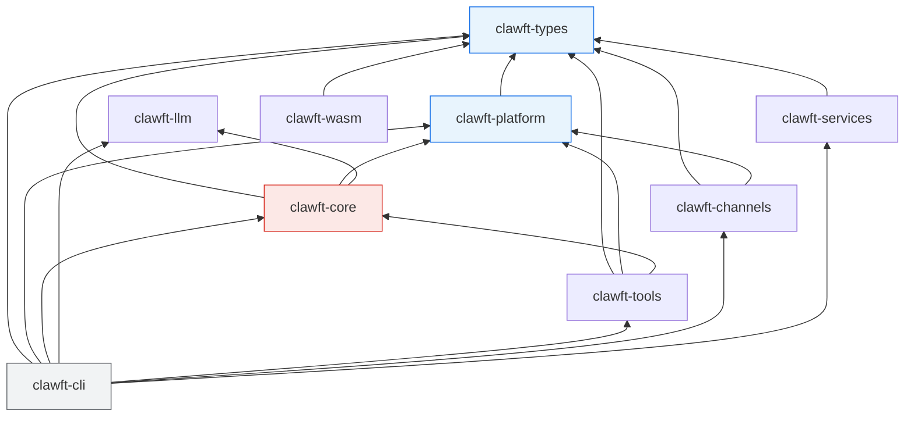
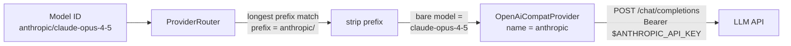
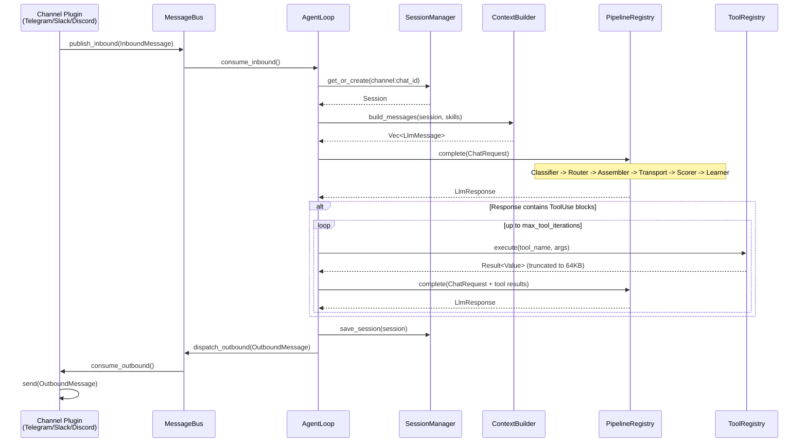
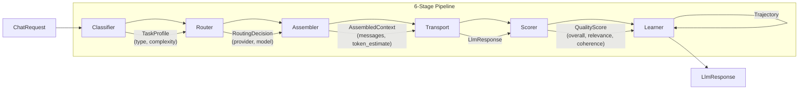
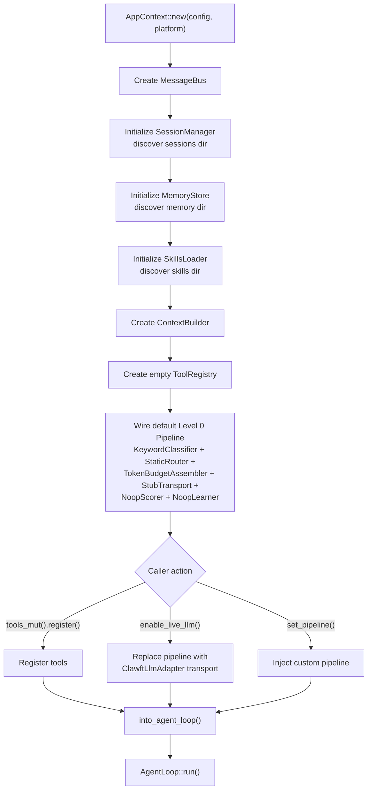

# clawft Architecture Overview

clawft is a Rust AI assistant framework designed around a modular, platform-abstracted pipeline architecture. It processes messages from chat channels (Telegram, Slack, Discord) through a 6-stage LLM pipeline with tool execution, session persistence, and long-term memory. The binary is named `weft`.

The workspace contains 9 crates organized in a strict dependency hierarchy that enforces separation of concerns: shared types at the bottom, platform abstraction above them, then core engine logic, with tools, channels, services, and the CLI at the top. A WASM crate provides a browser-compatible entrypoint using only the types layer.

---

## Crate Dependency Graph



`clawft-llm` has no internal dependencies -- it is a standalone LLM provider abstraction depending only on `async-trait`, `reqwest`, and `serde`.

---

## Crate Reference

### clawft-types

Foundation crate with zero internal dependencies. All other crates depend on it.

**Purpose:** Canonical type definitions shared across the entire framework.

**Key types:**
- `ClawftError` / `ChannelError` -- error enums used framework-wide
- `Config` -- root configuration schema (deserialized from JSON)
- `AgentsConfig` / `AgentDefaults` -- agent parameters (model, max_tokens, temperature, memory_window, max_tool_iterations)
- `InboundMessage` / `OutboundMessage` -- message events flowing through the bus
- `LlmResponse` / `ContentBlock` / `StopReason` / `Usage` -- LLM response types
- `Session` -- conversation session state with JSONL-backed persistence
- `CronJob` -- scheduled job definitions

**Dependencies:** serde, chrono, thiserror, serde_json

---

### clawft-platform

Platform abstraction layer enabling portability across native and WASM targets.

**Purpose:** Define traits for all platform-dependent operations so the core engine is platform-agnostic.

**Key types and traits:**
- `Platform` trait -- bundles `fs()`, `env()`, `http()`, and `process()` accessors
- `NativePlatform` -- production implementation using reqwest, tokio::fs, std::env, tokio::process
- `HttpClient` trait / `NativeHttpClient` -- async HTTP with `request()` and convenience `get()`/`post()` methods
- `FileSystem` trait / `NativeFileSystem` -- async file I/O (`read_to_string`, `write_string`, `append_string`, `exists`, `list_dir`, `create_dir_all`, `remove_file`, `home_dir`)
- `Environment` trait / `NativeEnvironment` -- env var access (`get_var`, `set_var`, `remove_var`)
- `ProcessSpawner` trait / `NativeProcessSpawner` -- child process execution (returns `Option` from `Platform::process()` since WASM lacks process spawning)
- `ConfigLoader` -- config file discovery chain: `CLAWFT_CONFIG` env var, then `~/.clawft/config.json`, then `~/.nanobot/config.json` (legacy fallback), with camelCase-to-snake_case key normalization

**Dependencies:** clawft-types, async-trait, reqwest, tokio, dirs

---

### clawft-llm

Standalone LLM provider abstraction with no internal crate dependencies.

**Purpose:** Unified interface for calling LLM APIs through OpenAI-compatible endpoints.

**Key types and traits:**
- `Provider` trait -- defines `complete(ChatRequest) -> ChatResponse`
- `OpenAiCompatProvider` -- implementation for any OpenAI-compatible HTTP API
- `ProviderRouter` -- routes model identifiers (e.g., `"openai/gpt-4o"`, `"anthropic/claude-opus-4-5"`) to the correct provider instance
- `ProviderConfig` -- connection configuration (base URL, API key, headers)
- `ChatRequest` / `ChatMessage` / `ChatResponse` / `ToolCall` / `Usage` -- request/response types

**Dependencies:** async-trait, reqwest, serde, serde_json

---

## Provider Architecture

The `clawft-llm` crate implements a prefix-based routing system that maps model identifiers to LLM API endpoints.

### ProviderRouter

`ProviderRouter` resolves model names like `"anthropic/claude-opus-4-5"` to the correct provider and bare model name. Prefixes are matched longest-first (greedy), so `"openai/o1/"` matches before `"openai/"`. If no prefix matches, the request falls through to the default provider (the first registered).

### OpenAiCompatProvider

The sole `Provider` trait implementation. It wraps a `reqwest::Client` and targets any endpoint that accepts the OpenAI chat completion request format. API keys are resolved from environment variables at request time (or injected explicitly via `with_api_key()`). Error handling distinguishes rate-limiting (429), authentication failures (401/403), model-not-found (404), and generic request failures.

### Built-in Providers

9 providers ship out of the box, each configured with a base URL, API key environment variable, and model prefix:

| Provider | Prefix | Base URL | API Key Env |
|----------|--------|----------|-------------|
| openai | `openai/` | `api.openai.com/v1` | `OPENAI_API_KEY` |
| anthropic | `anthropic/` | `api.anthropic.com/v1` | `ANTHROPIC_API_KEY` |
| groq | `groq/` | `api.groq.com/openai/v1` | `GROQ_API_KEY` |
| deepseek | `deepseek/` | `api.deepseek.com/v1` | `DEEPSEEK_API_KEY` |
| mistral | `mistral/` | `api.mistral.ai/v1` | `MISTRAL_API_KEY` |
| together | `together/` | `api.together.xyz/v1` | `TOGETHER_API_KEY` |
| openrouter | `openrouter/` | `openrouter.ai/api/v1` | `OPENROUTER_API_KEY` |
| gemini | `gemini/` | `generativelanguage.googleapis.com/v1beta/openai` | `GOOGLE_GEMINI_API_KEY` |
| xai | `xai/` | `api.x.ai/v1` | `XAI_API_KEY` |

Users can override base URLs, API keys, and headers per provider through the application configuration file.

### ClawftLlmAdapter

The pipeline system defines its own `LlmProvider` trait (operating on `serde_json::Value`), while `clawft-llm` uses typed `ChatRequest`/`ChatResponse`. The `ClawftLlmAdapter` bridges the two: it converts inbound `Value` messages to `ChatMessage`, forwards the call to the underlying `clawft_llm::Provider`, then serializes the `ChatResponse` back to `Value` for the pipeline's `OpenAiCompatTransport` to parse.

The factory function `create_adapter_from_config(config)` resolves the right built-in provider from the model prefix in the agent config, applies any user overrides, and returns the adapter wrapped in `Arc<dyn LlmProvider>`.

### Routing Flow



---

### clawft-core

Central engine crate containing the agent loop, message bus, pipeline system, session management, and security primitives.

**Purpose:** Orchestrate message processing from ingestion through LLM invocation to response dispatch.

**Modules:**

#### bus -- MessageBus

Thread-safe message router using tokio unbounded MPSC channels.

- `MessageBus` -- owns inbound and outbound channel pairs
- `publish_inbound()` / `consume_inbound()` -- channel-to-agent direction
- `dispatch_outbound()` / `consume_outbound()` -- agent-to-channel direction
- `inbound_sender()` / `outbound_sender()` -- cloneable handles for multi-producer use
- Send + Sync via `Arc<Mutex<UnboundedReceiver>>`

#### pipeline -- 6-Stage Pipeline

Pluggable processing pipeline with trait-based stage abstraction. Each stage can be implemented at different capability levels (Level 0 = basic, Level 1 = adaptive, Level 2 = neural).

**Stage traits:**
1. `TaskClassifier` -- classify incoming requests by type and complexity
2. `ModelRouter` -- select provider/model for the classified task
3. `ContextAssembler` -- assemble system prompt, memory, skills, and history within token budget
4. `LlmTransport` -- execute the LLM HTTP call
5. `QualityScorer` -- score response quality (relevance, coherence)
6. `LearningBackend` -- record interaction trajectories for future learning

**Supporting types:** `Pipeline` (bundles all 6 stages), `PipelineRegistry` (maps `TaskType` to specialized pipelines with a default fallback), `TaskType` enum (Chat, CodeGeneration, CodeReview, Research, Creative, Analysis, ToolUse, Unknown), `TaskProfile`, `RoutingDecision`, `QualityScore`, `AssembledContext`, `TransportRequest`, `Trajectory`, `LearningSignal`

**Default implementations:** `KeywordClassifier`, `StaticRouter`, `TokenBudgetAssembler`, `OpenAiCompatTransport` (stub or live via `ClawftLlmAdapter`), `NoopScorer`, `NoopLearner`

#### agent -- AgentLoop

Core message processing loop.

- `AgentLoop` -- consumes from MessageBus, builds context, invokes pipeline, executes tool calls, dispatches responses
- `ContextBuilder` -- assembles LLM messages in order: system prompt, skill prompts, long-term memory, conversation history (truncated to `memory_window`)
- `MemoryStore` -- manages `MEMORY.md` (long-term facts) and `HISTORY.md` (session summaries) with paragraph-based search
- `SkillsLoader` -- discovers and loads skill definitions and prompts from the skills directory

#### session -- SessionManager

Conversation persistence with write-through caching.

- Sessions keyed by `"{channel}:{chat_id}"`
- JSONL file format: metadata header line + one line per conversation turn
- In-memory `HashMap` cache with disk fallback on cache miss
- Directory discovery: `~/.clawft/workspace/sessions/` with `~/.nanobot/workspace/sessions/` fallback

#### security -- Security Primitives

Input validation and output sanitization.

- `validate_session_id()` -- rejects empty, overlong (>256 bytes), path-traversal (`..`), directory-separator, null-byte, and control-character identifiers
- `sanitize_content()` -- strips null bytes, DEL, and ASCII control chars (preserves `\n`, `\r`, `\t`, emoji, CJK, RTL)
- `truncate_result()` -- caps tool output JSON at 64KB with type-aware truncation (strings get suffix, arrays keep leading elements with sentinel, objects get raw-JSON wrapping)

#### bootstrap -- AppContext

Dependency wiring and initialization.

- `AppContext::new(config, platform)` -- creates MessageBus, SessionManager, MemoryStore, SkillsLoader, ContextBuilder, ToolRegistry, and default pipeline
- `into_agent_loop()` -- consumes context and produces a ready-to-run `AgentLoop`
- `enable_live_llm()` -- replaces stub pipeline with real LLM-backed transport via `ClawftLlmAdapter`
- `set_pipeline()` -- inject custom pipeline configurations

**Optional feature:** `vector-memory` -- enables `embeddings`, `vector_store`, `intelligent_router`, and `session_indexer` modules for semantic memory search

**Dependencies:** clawft-types, clawft-platform, clawft-llm, async-trait, tokio, serde_json, chrono, tracing

---

### clawft-tools

Built-in tool implementations and bulk registration.

**Purpose:** Provide the file, shell, memory, web, and agent tools that the LLM invokes during conversations.

**Key types:**
- `Tool` trait (defined in clawft-core) -- `name()`, `description()`, `parameters()` (JSON Schema), `execute(args) -> Result<Value, ToolError>`
- `ToolRegistry` (defined in clawft-core) -- registration, lookup by name, schema export, and dispatch
- `ToolError` -- NotFound, InvalidArgs, ExecutionFailed, PermissionDenied, FileNotFound, InvalidPath, Timeout

**Built-in tools:**
| Tool | Module | Description |
|------|--------|-------------|
| `read_file` | `file_tools` | Read file contents (workspace-sandboxed) |
| `write_file` | `file_tools` | Write file contents (workspace-sandboxed) |
| `edit_file` | `file_tools` | Apply edits to existing files (workspace-sandboxed) |
| `list_directory` | `file_tools` | List directory contents (workspace-sandboxed) |
| `exec_shell` | `shell_tool` | Execute shell commands (workspace CWD) |
| `memory_read` | `memory_tool` | Read from long-term memory |
| `memory_write` | `memory_tool` | Write to long-term memory |
| `web_search` | `web_search` | Search the web |
| `web_fetch` | `web_fetch` | Fetch raw content from URLs (with SSRF protection and body size limits) |
| `message` | `message_tool` | Send messages to chat channels |
| `spawn` | `spawn_tool` | Spawn sub-agent processes |

`register_all(registry, platform, workspace_dir)` registers all tools with workspace path containment enforced for file operations.

**Dependencies:** clawft-types, clawft-platform, clawft-core, async-trait, serde_json

---

### clawft-channels

Plugin-based chat channel system.

**Purpose:** Provide a trait-driven architecture for bidirectional communication with chat platforms.

**Key traits:**
- `Channel` -- implemented by each plugin: `name()`, `metadata()`, `status()`, `is_allowed(sender_id)`, `start(host, cancel)`, `send(msg) -> MessageId`
- `ChannelHost` -- host-side interface consumed by plugins: `deliver_inbound()`, `register_command()`, `publish_inbound()`
- `ChannelFactory` -- creates `Channel` instances from JSON config sections

**Key types:**
- `PluginHost` -- manages the full lifecycle: factory registration, channel initialization from config, start/stop via `CancellationToken` + `JoinHandle`, outbound message routing
- `ChannelMetadata` -- capabilities (name, display_name, supports_threads, supports_media)
- `ChannelStatus` -- Stopped, Starting, Running, Error(String), Stopping
- `MessageId` -- opaque identifier returned by `send()`

**Built-in channels:**
- `telegram` -- Telegram Bot API (HTTP long polling)
- `slack` -- Slack Socket Mode (WebSocket)
- `discord` -- Discord Gateway (WebSocket)

**Dependencies:** clawft-types, clawft-platform, async-trait, tokio, tokio-util (CancellationToken), tokio-tungstenite (WebSocket)

---

### clawft-services

Background services that generate inbound events.

**Purpose:** Provide scheduled jobs, health monitoring, and external tool server integration.

**Modules:**
- `CronService` -- JSONL-backed scheduled job execution using cron expressions. Jobs fire as `InboundMessage` events on the bus.
- `HeartbeatService` -- periodic health check messages at configurable intervals.
- `mcp` -- Dual-mode MCP (Model Context Protocol) subsystem. In server mode (`weft mcp-server`), `McpServerShell` exposes built-in tools to an LLM host via JSON-RPC over stdio. In client mode (`tools.mcp_servers` config), `McpClient` connects to external MCP servers. Both modes use the pluggable `ToolProvider` trait. See [Pluggable MCP Architecture](#pluggable-mcp-architecture-phase-3h) below.

**Key types:** `ToolProvider` trait, `McpServerShell`, `CompositeToolProvider`, `McpClient`, `McpTransport` trait, `StdioTransport`, `HttpTransport`, `ToolDefinition`

**Dependencies:** clawft-types, async-trait, serde, cron, tokio

---

### Pluggable MCP Architecture (Phase 3H)

The MCP subsystem in `clawft-services/src/mcp/` uses a pluggable provider model that unifies built-in tools, in-process vector tools, external MCP servers, and LLM delegation behind a single trait.

**Core Trait:**

```rust
pub trait ToolProvider: Send + Sync {
    fn namespace(&self) -> &str;
    fn list_tools(&self) -> Vec<ToolDefinition>;
    async fn call_tool(&self, name: &str, args: serde_json::Value) -> Result<CallToolResult>;
}
```

**Key Types** (all in `clawft-services/src/mcp/`):

| File | Type | Purpose |
|------|------|---------|
| `provider.rs` | `ToolProvider` trait, `BuiltinToolProvider` | Core abstraction + built-in tool adapter |
| `server.rs` | `McpServerShell` | Generic MCP server: JSON-RPC dispatch, stdio framing, `tools/list` + `tools/call` |
| `middleware.rs` | `SecurityGuard`, `PermissionFilter`, `ResultGuard`, `AuditLog` | Request/response pipeline |
| `composite.rs` | `CompositeToolProvider` | Multi-provider aggregation with `{server}__{tool}` namespace routing |

**Concrete Providers:**

| Provider | Source | Purpose |
|----------|--------|---------|
| `BuiltinToolProvider` | `provider.rs` | Wraps `ToolRegistry` (read_file, write_file, etc.) |
| `RvfToolProvider` | `clawft-rvf-mcp` | 11 RVF vector tools (in-process) |
| `ProxyToolProvider` | `McpClient` | Wraps `McpClient` for external MCP servers |
| `DelegationToolProvider` | delegation module | Claude bridge for tool delegation |

**Two Operating Modes:**

1. **Server mode** (`weft mcp-server`): `McpServerShell` wraps a `CompositeToolProvider` and exposes aggregated tools to an LLM host over newline-delimited JSON-RPC stdio.
2. **Client mode** (`tools.mcp_servers` config): `McpClient` connects to external MCP servers. Each external server is wrapped in a `ProxyToolProvider` and registered with the `CompositeToolProvider`.

**Namespace routing:** `CompositeToolProvider` maps tool names using the `{server}__{tool}` convention (double underscore), matching the namespace pattern used by Claude Desktop and other MCP hosts.

**Middleware pipeline:** All tool calls pass through `SecurityGuard` (input validation), `PermissionFilter` (access control), and on response through `ResultGuard` (output sanitization) and `AuditLog` (execution logging).

**Protocol:** MCP 2025-06-18 stdio transport uses newline-delimited JSON (not HTTP Content-Length framing).

---

### clawft-cli

The `weft` binary. Depends on all other crates.

**Purpose:** Command-line interface for running the assistant, managing sessions, and interacting with channels.

**Binary name:** `weft`

**Key modules:**
- `commands` -- clap-derived CLI command tree
- `markdown` -- terminal-friendly markdown rendering (pulldown-cmark to styled output)

**Dependencies:** all workspace crates, clap, tokio, tracing-subscriber, pulldown-cmark, comfy-table

**Feature flags:** `vector-memory` -- enables semantic search capabilities in clawft-core

---

### clawft-wasm

Browser/WASM entrypoint. Depends only on clawft-types.

**Purpose:** Provide a WASM-compatible surface for clawft types and (future) a platform implementation using browser APIs.

**Status:** Phase 3A stub. The `Platform` trait is designed for this target -- `process()` returns `None`, HTTP uses fetch API, filesystem uses WASI or in-memory backends.

**Dependencies:** clawft-types

---

## Message Flow



---

## Pipeline Stages



The `PipelineRegistry` maps `TaskType` variants to specialized `Pipeline` instances. Unregistered task types fall back to the default pipeline. The registry's `complete()` method orchestrates the full flow and feeds the `Trajectory` (request + routing + response + quality score) back into the `LearningBackend`.

---

## Pipeline Stage Details

Each of the 6 stages is defined by a trait in `clawft-core::pipeline::traits`. The current implementation ships Level 0 (baseline) implementations for all stages, with higher levels planned.

### Stage Traits and Current Implementations

| # | Stage | Trait | Level 0 Implementation | Purpose |
|---|-------|-------|----------------------|---------|
| 1 | Classifier | `TaskClassifier` | `KeywordClassifier` | Scans message content for keywords to assign a `TaskType` (Chat, CodeGeneration, CodeReview, Research, Creative, Analysis, ToolUse, Unknown) and a complexity score (0.0--1.0). |
| 2 | Router | `ModelRouter` | `StaticRouter` | Returns the model and provider from the agent config. Does not adapt. `update()` is a no-op. |
| 3 | Assembler | `ContextAssembler` | `TokenBudgetAssembler` | Estimates token count (chars/4 heuristic) and truncates conversation history to fit within `max_context_tokens`. Preserves the system prompt and most recent messages, dropping older messages from the middle when the budget is exceeded. |
| 4 | Transport | `LlmTransport` | `OpenAiCompatTransport` | Delegates to an `LlmProvider` (either a stub that returns canned responses, or a live `ClawftLlmAdapter`). Parses OpenAI-format JSON responses into `LlmResponse`. |
| 5 | Scorer | `QualityScorer` | `NoopScorer` | Returns perfect scores (1.0) for all dimensions. See [Scoring and Learning](#scoring-and-learning) for planned upgrades. |
| 6 | Learner | `LearningBackend` | `NoopLearner` | Discards all trajectories and learning signals. See [Scoring and Learning](#scoring-and-learning) for planned upgrades. |

### PipelineRegistry

`PipelineRegistry` maps `TaskType` variants to specialized `Pipeline` instances. Each `Pipeline` bundles one implementation of each of the 6 stage traits. Unregistered task types fall back to the default pipeline.

The registry's `complete()` method orchestrates execution across all stages in sequence:

1. Classify the request to obtain a `TaskProfile`.
2. Route the profile to get a `RoutingDecision` (provider + model).
3. Assemble the context within token budget.
4. Execute the LLM transport call.
5. Score the response quality.
6. Record the full `Trajectory` (request + routing + response + score) in the learning backend.

### Swapping Stub for Live LLM

During bootstrap, the default pipeline uses a stub transport that returns empty responses. Calling `AppContext::enable_live_llm()` replaces the entire pipeline with one wired through `ClawftLlmAdapter`:

```
StubTransport  -->  enable_live_llm()  -->  OpenAiCompatTransport(ClawftLlmAdapter(OpenAiCompatProvider))
```

The `build_live_pipeline(config)` factory constructs the full Level 0 pipeline with real HTTP transport. Custom pipelines can be injected via `AppContext::set_pipeline()`.

---

## Tool Call Loop

The `AgentLoop` implements an iterative tool execution cycle that allows the LLM to invoke registered tools and incorporate their results.

### Execution Flow

1. The pipeline returns an `LlmResponse`.
2. The agent checks for `ContentBlock::ToolUse` blocks in the response.
3. If tool calls are present:
   - Each tool is executed via `ToolRegistry::execute(name, args)`.
   - Tool results are truncated to 64KB via `truncate_result()` (type-aware: strings get a suffix, arrays keep leading elements, objects get a wrapper).
   - Results are appended to the message list as `role: "tool"` messages with the corresponding `tool_call_id`.
   - The pipeline is re-invoked with the extended message list.
4. This loop continues until the LLM returns a response without tool calls, or the iteration limit (`max_tool_iterations`, default 10) is reached.
5. Exceeding the limit produces a `ClawftError::Provider` error.

For the full tool call protocol and message format, see [guides/tool-calls.md](../guides/tool-calls.md).

---

## Scoring and Learning

Stages 5 and 6 of the pipeline provide hooks for response quality assessment and continuous improvement. The current Level 0 implementations are stubs; real scoring and learning will be introduced progressively.

### Current State (Level 0)

- **`NoopScorer`** -- returns perfect scores (overall: 1.0, relevance: 1.0, coherence: 1.0) for every response regardless of content. No quality signal is produced.
- **`NoopLearner`** -- silently discards all `Trajectory` records and `LearningSignal` inputs. No adaptation occurs.

### Planned Upgrades

| Level | Scorer | Learner | Description |
|-------|--------|---------|-------------|
| 0 | `NoopScorer` | `NoopLearner` | Baseline. No scoring or learning. |
| 1 | Heuristic scorer | EMA statistics | Score by response length, format compliance, tool success rate. Track exponential moving averages of quality per task type. |
| 2 | `ruvllm::QualityScoringEngine` | Trajectory store | ML-based quality assessment using the ruvllm scoring engine. Trajectories persisted for offline analysis. |
| 3 | Neural quality model | `sona::SonaEngine` | Neural scoring with the sona adaptive learning engine. Online fine-tuning from trajectory data. |
| 4 | Ensemble scorer | Federated learning | Multiple scoring models with consensus. Cross-session learning. |
| 5 | Self-improving scorer | Autonomous curriculum | Scorer improves its own model from accumulated trajectories. Learner generates synthetic training data. |

### Integration Points

The `QualityScorer` trait receives both the original `ChatRequest` and the `LlmResponse`, enabling scoring based on relevance to the input. The `LearningBackend` receives the full `Trajectory` (request + routing decision + response + quality score), providing all the context needed for model adaptation.

`LearningSignal` carries explicit user feedback (`feedback_type` + `value`) that can be injected via future feedback APIs.

---

## Vector Memory and RVF

The optional `vector-memory` feature flag enables semantic search over conversation history and long-term memory using vector embeddings.

### Current Architecture (Level 0)

**Embedder: `HashEmbedder`** -- A SimHash-based local embedder that produces deterministic, fixed-dimension (default 384) embedding vectors. For each word, it hashes with `DefaultHasher`, spreads bits across the vector dimensions, then normalizes to unit length (L2 norm). Case-insensitive. Requires no API calls, no model files, and no network access.

**Store: `VectorStore`** -- An in-memory store holding `VectorEntry` records (id, text, embedding, tags, metadata, timestamp). Search is brute-force cosine similarity over all entries, returning top-k results sorted by descending score. Suitable for small to medium datasets (up to tens of thousands of entries).

**Supporting modules (behind `vector-memory` feature):**
- `embeddings` -- `Embedder` trait with `embed()`, `embed_batch()`, and `dimension()` methods
- `vector_store` -- `VectorStore` with `add()`, `search()`, `remove()`, `len()`
- `intelligent_router` -- Semantic routing using embedding similarity
- `session_indexer` -- Automatic indexing of conversation turns into the vector store

### Planned RVF Integration

The current brute-force search will be replaced by RVF (Rust Vector Framework) for production-scale semantic memory:

| Component | Current (Level 0) | Planned (RVF) |
|-----------|-------------------|---------------|
| Embedder | `HashEmbedder` (SimHash, local) | Neural embeddings via API or local model |
| Index | Brute-force linear scan | HNSW (Hierarchical Navigable Small World) |
| Storage | In-memory `Vec<VectorEntry>` | Persistent, memory-mapped |
| Scale | Thousands of entries | Millions of entries |
| Filtering | None (post-search tag check) | Pre-filter by tags/metadata |

For RVF integration details, see [guides/rvf.md](../guides/rvf.md).

---

## Channel Plugin Lifecycle

```mermaid
stateDiagram-v2
    [*] --> Registered: register_factory()
    Registered --> Initialized: init_channel(config)
    Initialized --> Starting: start_channel()
    Starting --> Running: Channel::start(host, cancel)
    Running --> Stopping: cancel.cancel()
    Stopping --> Stopped: task completes
    Stopped --> [*]
    Running --> Error: runtime error
    Error --> Stopped: task completes
```

Each channel runs in its own tokio task. The `PluginHost` holds a `CancellationToken` per channel for graceful shutdown. Inbound messages are delivered to the agent pipeline via `ChannelHost::deliver_inbound()`, which publishes to the `MessageBus`. Outbound messages are routed to the correct channel by `PluginHost::send_to_channel()` using the `OutboundMessage.channel` field.

---

## Bootstrap Sequence



---

## Security Boundaries

### Input Validation
- **Session IDs** -- validated via `validate_session_id()` before any filesystem operation. Rejects path traversal (`..`), directory separators (`/`, `\`), null bytes, control characters, empty strings, and IDs exceeding 256 bytes.
- **Message content** -- sanitized via `sanitize_content()` to strip null bytes, DEL (0x7F), and ASCII control characters (0x00-0x1F except newline, carriage return, and tab). Preserves all valid UTF-8 including emoji, CJK, and RTL text.
- **Config keys** -- normalized from camelCase to snake_case via `normalize_keys()` during config loading.

### Output Containment
- **Tool results** -- truncated to 64KB via `truncate_result()` before being appended to the LLM context. Truncation is type-aware: strings receive a suffix, arrays keep leading elements plus a sentinel object, objects are wrapped in a `_truncated_json` envelope.
- **Tool iterations** -- capped at `max_tool_iterations` (configurable, default 10). Exceeding the limit produces a `ClawftError::Provider` error rather than an infinite loop.

### Filesystem Sandboxing
- All file tools (`read_file`, `write_file`, `edit_file`, `list_directory`) receive a `workspace_dir` at registration time and validate that resolved paths remain within it.
- `exec_shell` uses the workspace directory as its working directory.
- Session files are written to a dedicated sessions directory with sanitized filenames (colons replaced with underscores).

### Platform Isolation
- The `Platform` trait decouples the core engine from the operating system. WASM builds can provide sandboxed implementations of HTTP, filesystem, and environment without any `unsafe` code or direct system calls in the core.
- `ProcessSpawner` is gated behind `Option` -- WASM platforms return `None`, preventing process spawning entirely.

---

## Configuration Discovery

The framework uses a cascading discovery chain for configuration:

1. `CLAWFT_CONFIG` environment variable (absolute path to JSON file)
2. `~/.clawft/config.json`
3. `~/.nanobot/config.json` (legacy fallback)
4. If none found, empty defaults are used

The same fallback pattern applies to workspace directories:
- Sessions: `~/.clawft/workspace/sessions/` then `~/.nanobot/workspace/sessions/`
- Memory: `~/.clawft/workspace/memory/` then `~/.nanobot/workspace/memory/`
- Skills: `~/.clawft/workspace/skills/`

---

## Build Configuration

- Rust edition: 2024
- Minimum Rust version: 1.93
- License: MIT OR Apache-2.0
- Release profile: `opt-level = "z"`, LTO, stripped symbols, single codegen unit, abort on panic
- WASM release profile: inherits release with `opt-level = "z"`
