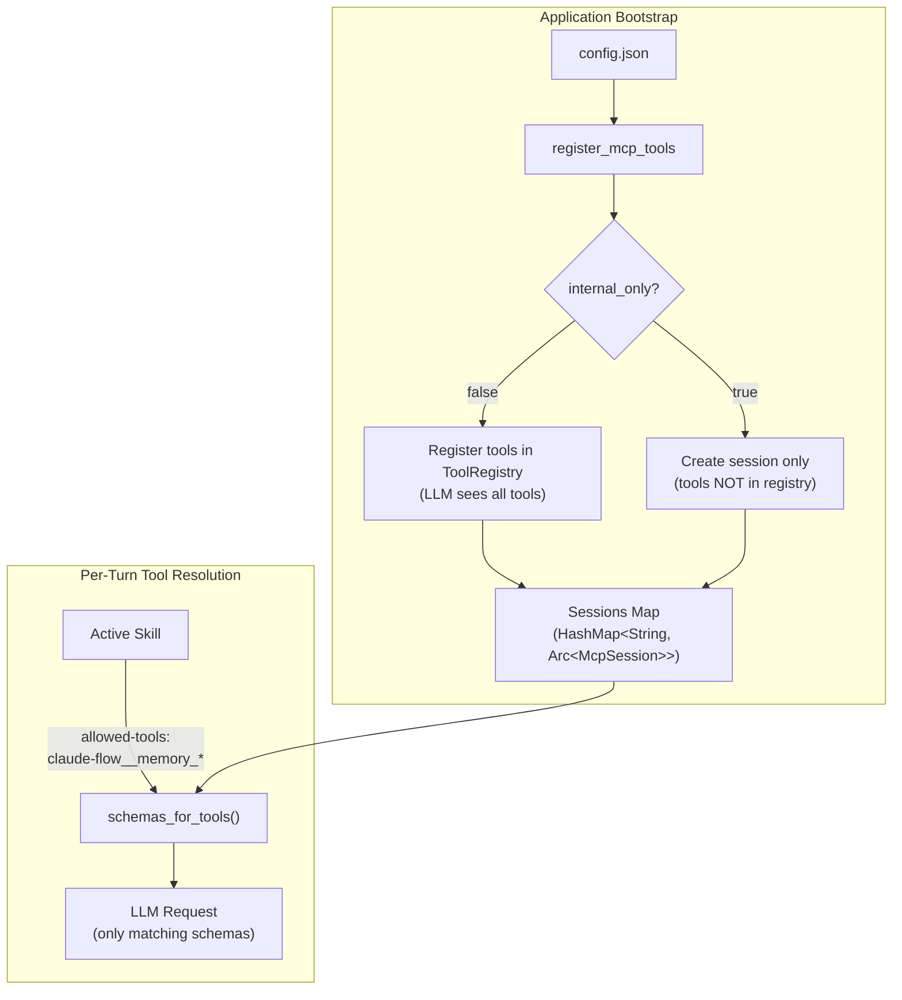
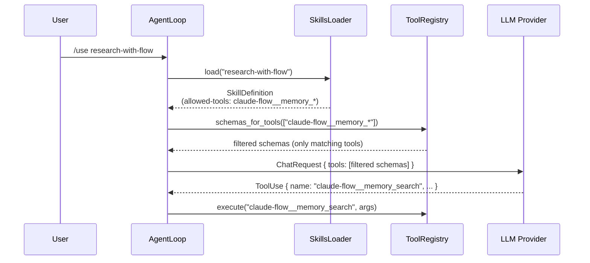
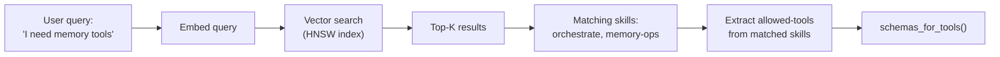
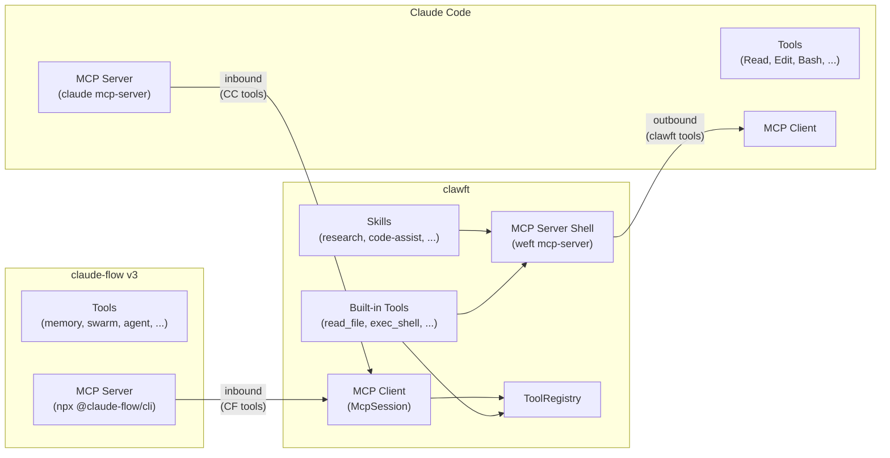

# MCP Integration Guide

This guide covers clawft's MCP (Model Context Protocol) integration posture:
how external AI systems are connected, how tool visibility is controlled
through skills, and how clawft acts as both an MCP server and client.

---

## 1. Overview

clawft uses an **MCP/A2A (Agent-to-Agent) posture** for integrating with
external AI systems. Rather than spawning subprocesses (the previous
`FlowDelegator` model that invoked `claude --print`), external systems like
Claude Code and claude-flow v3 are connected as MCP servers over stdio or
HTTP transport.

### Why the shift

The subprocess delegation model had several limitations:

- **Context bloat**: Spawning a subprocess per delegation lost all shared
  context between the parent and child.
- **Tool duplication**: Tools had to be re-registered in each subprocess,
  and the child's tool set could not be dynamically scoped.
- **Tight coupling**: The `FlowDelegator` was tightly coupled to the
  `claude` binary's CLI interface and output format.
- **Scalability**: Each delegation spawned a new OS process, consuming
  memory and startup time.

The MCP-first model solves these by establishing persistent sessions with
external systems. Sessions are created once and reused across requests.
Tools are discovered at connection time via `tools/list` and can be
selectively exposed per-turn through the skill system.

### Key design decisions

| Decision | Rationale |
|----------|-----------|
| MCP servers default to `internal_only: true` | Prevents hundreds of external tools from flooding the LLM's context window |
| Skills act as the discovery mechanism | Each skill declares which tools it needs, enabling precise per-turn scoping |
| Tool names are namespaced as `{server}__{tool}` | Avoids collisions when multiple servers expose tools with the same base name |
| Sessions are persistent | Avoids repeated handshake overhead; enables stateful server interactions |

---

## 2. Architecture

### Internal vs External MCP Servers

clawft distinguishes between two categories of MCP server:

**External servers** (`internal_only: false`) have their tools automatically
registered in the main `ToolRegistry` at startup. The LLM sees these tools
in every request. Use this for servers with a small, well-defined tool set
that the agent always needs.

**Internal servers** (`internal_only: true`, the default) have their sessions
created and maintained, but their tools are NOT registered in the
`ToolRegistry`. The tools remain available for programmatic access through
the `McpSession` handle, and can be selectively surfaced to the LLM via
skill-based tool scoping.



### Session Management

Every configured MCP server gets a session regardless of `internal_only`.
The `register_mcp_tools()` function returns a map of all sessions:

```rust
pub async fn register_mcp_tools(
    config: &Config,
    registry: &mut ToolRegistry,
) -> HashMap<String, Arc<McpSession>> {
    // For each server:
    //   1. Create transport (stdio or HTTP)
    //   2. Perform MCP initialize handshake
    //   3. If internal_only: skip tool registration
    //   4. If !internal_only: list tools and register in registry
    //   5. Store session in map
}
```

Sessions support both stdio transport (for local processes like `claude` or
`npx`) and HTTP transport (for remote servers). The transport is chosen
based on which config fields are populated:

| Config fields | Transport |
|---------------|-----------|
| `command` is non-empty | Stdio (spawns child process) |
| `url` is non-empty, `command` is empty | HTTP |
| Both empty | Skipped with warning |

---

## 3. Configuration

MCP servers are configured in the `tools.mcpServers` (or `tools.mcp_servers`)
section of `config.json`. Both `camelCase` and `snake_case` field names are
accepted.

### MCPServerConfig fields

| Field | Type | Default | Description |
|-------|------|---------|-------------|
| `command` | string | `""` | Command to spawn for stdio transport |
| `args` | string[] | `[]` | Arguments for the command |
| `env` | object | `{}` | Extra environment variables |
| `url` | string | `""` | HTTP endpoint URL |
| `internalOnly` | boolean | `true` | If true, session is created but tools are NOT registered |

### Example: Minimal configuration

```json
{
  "tools": {
    "mcpServers": {
      "claude-code": {
        "command": "claude",
        "args": ["mcp", "serve"],
        "env": { "CLAUDECODE": "" },
        "internalOnly": true
      },
      "claude-flow": {
        "command": "npx",
        "args": ["-y", "@claude-flow/cli@latest", "mcp", "start"],
        "internalOnly": true
      },
      "my-custom-server": {
        "command": "npx",
        "args": ["-y", "my-mcp-server"],
        "internalOnly": false
      }
    }
  }
}
```

In this configuration:

- `claude-code` and `claude-flow` are internal -- their sessions exist but
  their tools do not appear in the LLM's tool list by default. Skills
  selectively surface them.
- `my-custom-server` is external -- all tools from this server are
  registered in the `ToolRegistry` and visible to the LLM on every turn.

### The `internalOnly` default

The `internalOnly` field defaults to `true`. This is deliberate:
infrastructure servers like claude-flow expose 200+ tools. Registering all
of them in the `ToolRegistry` would bloat every LLM request with tool
schemas the model will never use on that turn. The default protects against
this.

To make a server's tools always visible, explicitly set `"internalOnly": false`.

### HTTP transport

For remote MCP servers that expose an HTTP endpoint:

```json
{
  "tools": {
    "mcpServers": {
      "remote-tools": {
        "url": "http://localhost:3000/mcp",
        "internalOnly": false
      }
    }
  }
}
```

### Passing environment variables

Use the `env` field to inject credentials or configuration into the
server's child process:

```json
{
  "tools": {
    "mcpServers": {
      "authenticated-server": {
        "command": "npx",
        "args": ["-y", "@example/mcp-server"],
        "env": {
          "API_KEY": "sk-..."
        },
        "internalOnly": false
      }
    }
  }
}
```

---

## 4. Skill-Based Tool Discovery

Skills are the primary mechanism for scoping which tools the LLM sees on a
given turn. This is the bridge between `internal_only` MCP servers and the
LLM's tool-use capability.

### How it works

1. A skill declares `allowed-tools` in its YAML frontmatter.
2. When the skill is activated, `allowed-tools` patterns are passed to
   `ToolRegistry::schemas_for_tools()`.
3. `schemas_for_tools()` filters the full registry to only tools whose
   names match the glob patterns.
4. Only the matching tool schemas are sent to the LLM in the `tools`
   field of the `ChatRequest`.



### The `schemas_for_tools()` method

This method on `ToolRegistry` accepts a slice of glob patterns and returns
only the tool schemas that match:

```rust
pub fn schemas_for_tools(&self, allowed: &[String]) -> Vec<serde_json::Value> {
    self.tools
        .iter()
        .filter(|(name, _)| matches_any_pattern(name, allowed))
        .map(|(name, tool)| /* build schema */)
        .collect()
}
```

The glob matcher supports `*` (zero or more characters) and `?` (exactly
one character). Common patterns:

| Pattern | Matches |
|---------|---------|
| `claude-flow__memory_*` | `claude-flow__memory_store`, `claude-flow__memory_search`, etc. |
| `claude-flow__swarm_*` | `claude-flow__swarm_init`, `claude-flow__swarm_status`, etc. |
| `claude-code__*` | All tools from the claude-code server |
| `read_file` | Exact match only |
| `*` | All tools (equivalent to no filtering) |

### Skill definition example

A skill that uses claude-flow's memory and swarm tools:

```markdown
---
name: orchestrate
description: Multi-agent orchestration via claude-flow
version: 1.0.0
variables:
  - task
allowed-tools:
  - claude-flow__memory_*
  - claude-flow__swarm_*
  - claude-flow__task_*
  - read_file
  - write_file
user-invocable: true
argument-hint: Orchestration task description
---

You are an orchestration agent. Use claude-flow's swarm and memory tools
to coordinate multi-agent task execution for: {{task}}
```

When this skill is active, the LLM only sees schemas for tools matching
those five patterns. All other tools (including hundreds of other
claude-flow tools) are hidden.

### Empty `allowed-tools`

When a skill omits `allowed-tools` or provides an empty list, **all**
registered tools are sent to the LLM. The filtering only activates when
at least one pattern is declared.

### Tool intersection with agents

When both an agent and a skill declare `allowed_tools`, the effective tool
list is their **intersection** (SEC-SKILL-03). This provides defense in
depth: the agent constrains the maximum tool set, and the skill further
narrows it per-turn.

---

## 5. Vector-Stored Metadata

Skill definitions and tool metadata can be stored in vector memory for
semantic discovery. This enables natural-language queries like "find tools
for memory management" to surface relevant skills and tools without
requiring exact name matches.

### Storage model

Each skill and tool can be represented as a vector embedding alongside its
metadata:

```
Vector Store Entry:
  - embedding: [0.12, -0.34, ...]  (from skill description + instructions)
  - metadata: {
      name: "orchestrate",
      type: "skill",
      description: "Multi-agent orchestration via claude-flow",
      allowed_tools: ["claude-flow__memory_*", "claude-flow__swarm_*"],
      variables: ["task"]
    }
```

### Discovery flow



When the `vector-memory` feature flag is enabled, the skill loader can
index skill metadata into the vector store at load time. Subsequent
queries use HNSW-accelerated nearest-neighbor search to find relevant
skills without string matching.

### Indexing tool metadata

MCP tool definitions can also be indexed:

```
Vector Store Entry:
  - embedding: [0.56, 0.11, ...]  (from tool name + description)
  - metadata: {
      name: "claude-flow__memory_search",
      type: "mcp_tool",
      server: "claude-flow",
      description: "Search memory by semantic query",
      input_schema: { ... }
    }
```

This enables the agent to discover tools from internal MCP servers even
when those tools are not registered in the `ToolRegistry`. The agent can
find the tool via vector search, then use the corresponding skill to
activate it.

---

## 6. Configuring Claude Code

Claude Code can be connected as an internal MCP server, giving clawft
access to Claude Code's tool set (Read, Write, Bash, Grep, etc.) through
skill-scoped activation.

### Step 1: Add Claude Code as an MCP server

```json
{
  "tools": {
    "mcpServers": {
      "claude-code": {
        "command": "claude",
        "args": ["mcp", "serve"],
        "env": { "CLAUDECODE": "" },
        "internalOnly": true
      }
    }
  }
}
```

This spawns `claude mcp serve` as a child process using stdio transport.
The `internalOnly: true` setting means Claude Code's tools are available
via the session but not automatically registered in the `ToolRegistry`.

### Step 2: Create skills for Claude Code tools

Create a skill that exposes specific Claude Code capabilities:

`.clawft/skills/code-assist/SKILL.md`:

```markdown
---
name: code-assist
description: Code editing via Claude Code tools
version: 1.0.0
variables:
  - task
allowed-tools:
  - claude-code__Read
  - claude-code__Edit
  - claude-code__Bash
  - claude-code__Grep
  - claude-code__Glob
user-invocable: true
argument-hint: Code task to accomplish
---

You have access to Claude Code's file and shell tools. Use them to
accomplish the following task: {{task}}

Prefer Edit over Write for modifying existing files. Use Grep and Glob
for searching. Use Bash for build and test commands.
```

### Step 3: Activate the skill

```
> /use code-assist
Activated skill: code-assist

> Refactor the authentication module to use JWT tokens
[agent uses claude-code__Read, claude-code__Edit, etc.]
```

### Tool naming

Claude Code tools are namespaced as `claude-code__{tool_name}`. The tool
names match Claude Code's MCP tool names:

| Namespaced name | Claude Code tool |
|-----------------|------------------|
| `claude-code__Read` | File reading |
| `claude-code__Edit` | File editing |
| `claude-code__Write` | File writing |
| `claude-code__Bash` | Shell execution |
| `claude-code__Grep` | Content search |
| `claude-code__Glob` | File pattern matching |
| `claude-code__WebFetch` | URL content fetching |

---

## 7. Configuring claude-flow v3

claude-flow v3 provides swarm coordination, memory management, agent
lifecycle, and many other tools. Due to its large tool surface (200+
tools), it should always be configured as `internal_only`.

### Step 1: Add claude-flow as an MCP server

```json
{
  "tools": {
    "mcpServers": {
      "claude-flow": {
        "command": "npx",
        "args": ["-y", "@claude-flow/cli@latest", "mcp", "start"],
        "internalOnly": true
      }
    }
  }
}
```

### Step 2: Create targeted skills

**Memory operations skill:**

`.clawft/skills/flow-memory/SKILL.md`:

```markdown
---
name: flow-memory
description: Memory storage and retrieval via claude-flow
version: 1.0.0
variables:
  - operation
allowed-tools:
  - claude-flow__memory_*
user-invocable: true
argument-hint: Memory operation (store, search, retrieve)
---

You have access to claude-flow's memory tools. Use them to
{{operation}}.

Available operations:
- Store: memory_store with key, value, namespace, tags
- Search: memory_search with query, namespace, limit
- Retrieve: memory_retrieve with key, namespace
- List: memory_list with namespace, limit
- Delete: memory_delete with key, namespace
```

**Swarm coordination skill:**

`.clawft/skills/flow-swarm/SKILL.md`:

```markdown
---
name: flow-swarm
description: Multi-agent swarm coordination via claude-flow
version: 1.0.0
variables:
  - task
allowed-tools:
  - claude-flow__swarm_*
  - claude-flow__agent_*
  - claude-flow__task_*
  - claude-flow__coordination_*
user-invocable: true
argument-hint: Swarm task to coordinate
---

You are a swarm coordinator. Use claude-flow's swarm and agent tools to
set up and manage multi-agent execution for: {{task}}

Steps:
1. Initialize a swarm with appropriate topology
2. Spawn agents with specialized roles
3. Create and assign tasks
4. Monitor execution via coordination tools
```

### Tool categories in claude-flow

claude-flow groups its 200+ tools into namespaces. Common prefixes for
skill `allowed-tools` patterns:

| Pattern | Tool category |
|---------|---------------|
| `claude-flow__memory_*` | Memory store, search, retrieve, list, delete, migrate |
| `claude-flow__swarm_*` | Swarm init, status, health, shutdown |
| `claude-flow__agent_*` | Agent spawn, list, status, terminate, update |
| `claude-flow__task_*` | Task create, list, status, update, complete, cancel |
| `claude-flow__coordination_*` | Consensus, load balance, metrics, sync |
| `claude-flow__workflow_*` | Workflow create, execute, pause, resume |
| `claude-flow__session_*` | Session save, restore, list, delete |
| `claude-flow__hooks_*` | Hook system, intelligence, workers |
| `claude-flow__system_*` | System health, info, metrics, status |
| `claude-flow__hive-mind_*` | Byzantine fault-tolerant consensus |

---

## 8. Bidirectional Bridge

clawft operates as both an MCP **server** (exposing its tools to external
systems) and an MCP **client** (consuming tools from external systems).
This creates a bidirectional bridge.

### Outbound: clawft as MCP server

The `weft mcp-server` command exposes clawft's tools over stdio using
`McpServerShell`:

```bash
weft mcp-server
```

This serves:

- **Built-in tools** via `BuiltinToolProvider` (read_file, write_file,
  exec_shell, web_search, etc.)
- **Loaded skills** via `SkillToolProvider` (each skill becomes an
  invocable MCP tool)

External systems register clawft as an MCP server:

```bash
# In Claude Code
claude mcp add clawft -- weft mcp-server
```

Once registered, Claude Code can invoke clawft tools as
`clawft__read_file`, `clawft__web_search`, etc.

### Inbound: clawft as MCP client

clawft consumes external MCP servers as described in sections 6 and 7.
The `register_mcp_tools()` function creates sessions and optionally
registers tools.

### The bidirectional topology



Both directions can run simultaneously. clawft exposes its tools to Claude
Code while consuming Claude Code's tools and claude-flow's tools.

### The CompositeToolProvider

When serving tools via `weft mcp-server`, the `McpServerShell` uses a
`CompositeToolProvider` that aggregates multiple tool sources:

1. **BuiltinToolProvider** -- wraps the `ToolRegistry` (built-in tools)
2. **SkillToolProvider** -- wraps loaded skills as invocable tools

Each provider has a namespace. Tool names are prefixed in MCP responses:
`builtin__read_file`, `skill__research`, etc. The composite routes
incoming `tools/call` requests by splitting the name on the first `__`
separator.

### Middleware pipeline

All MCP calls (both inbound and outbound) pass through a middleware
pipeline:

| Middleware | Purpose |
|------------|---------|
| `SecurityGuard` | Input validation, command policy, URL safety |
| `PermissionFilter` | Access control based on caller permissions |
| `ResultGuard` | Output sanitization, result size limits |
| `AuditLog` | Call recording for debugging and compliance |

---

## 9. Security

### `internal_only` prevents accidental tool exposure

The most important security control is the `internal_only` default. When
set to `true` (the default), an MCP server's tools are not registered in
the `ToolRegistry`. This means:

- The LLM cannot see or invoke these tools unless a skill explicitly
  includes them via `allowed-tools`.
- A misconfigured or compromised MCP server cannot inject tools into the
  agent's tool set.
- The LLM's context window is not wasted on schemas for unused tools.

### Permission enforcement

Tool execution is gated by the permission system (see the
[Routing Guide](routing.md) for details). When `permissions` are provided
to `ToolRegistry::execute()`, the following checks run in order:

1. **Denylist** -- If the tool name matches a denylist pattern, deny
   (overrides everything).
2. **Allowlist** -- If the tool name does not match an allowlist pattern,
   deny.
3. **Metadata level** -- If the tool requires a minimum permission level
   and the user's level is insufficient, deny.
4. **Custom permissions** -- If the tool requires specific custom
   permission keys and the user lacks them, deny.

### MCP tool namespacing

Tools from MCP servers are namespaced as `{server}__{tool}`. This prevents
a malicious MCP server from registering a tool named `exec_shell` that
shadows the built-in `exec_shell` tool. The namespace prefix makes every
MCP tool name unique.

### Minimal environment for stdio transport

When spawning MCP servers via stdio transport, the child process receives
a controlled environment. The `env` field in the config allows passing
specific variables, but parent environment variables are not automatically
inherited beyond what the transport layer provides.

### Skill-level tool scoping

Skills provide a second layer of access control beyond `internal_only`.
Even when tools are registered in the `ToolRegistry`, a skill's
`allowed-tools` restricts which schemas are sent to the LLM on that turn.
Combined with agent-level `allowed_tools` (intersection semantics per
SEC-SKILL-03), this creates a layered defense:

```
Layer 1: internal_only       (server level)  -- hide by default
Layer 2: ToolRegistry        (global level)  -- only registered tools exist
Layer 3: Agent allowed_tools (agent level)   -- agent-wide maximum
Layer 4: Skill allowed-tools (per-turn)      -- narrowest scope
Layer 5: Permission checks   (per-call)      -- denylist, allowlist, level, custom
```

### Hot-reload safety

The `McpServerManager` supports hot-reload when configuration changes.
Removed servers enter a `Draining` state for up to 30 seconds, allowing
in-flight tool calls to complete before the server is disconnected. This
prevents interrupted tool executions from leaving the agent in an
inconsistent state.

---

## Source Files

| File | Description |
|------|-------------|
| `clawft-types/src/config/mod.rs` | `MCPServerConfig` with `internal_only` field |
| `clawft-cli/src/mcp_tools.rs` | `register_mcp_tools()`, `McpToolWrapper`, `create_mcp_client()` |
| `clawft-cli/src/commands/mcp_server.rs` | `weft mcp-server` command with `CompositeToolProvider` wiring |
| `clawft-core/src/tools/registry.rs` | `ToolRegistry`, `schemas_for_tools()`, glob matching, permission checks |
| `clawft-core/src/agent/loop_core.rs` | `AgentLoop` with skill-based tool filtering in `process_message()` |
| `clawft-services/src/mcp/provider.rs` | `ToolProvider` trait, `BuiltinToolProvider`, `SkillToolProvider` |
| `clawft-services/src/mcp/composite.rs` | `CompositeToolProvider` with namespace-based routing |
| `clawft-services/src/mcp/server.rs` | `McpServerShell` (JSON-RPC over stdio) |
| `clawft-services/src/mcp/discovery.rs` | `McpServerManager` with hot-reload |
| `clawft-services/src/delegation/mod.rs` | `DelegationEngine` (MCP-first, Flow target falls back to Claude) |
