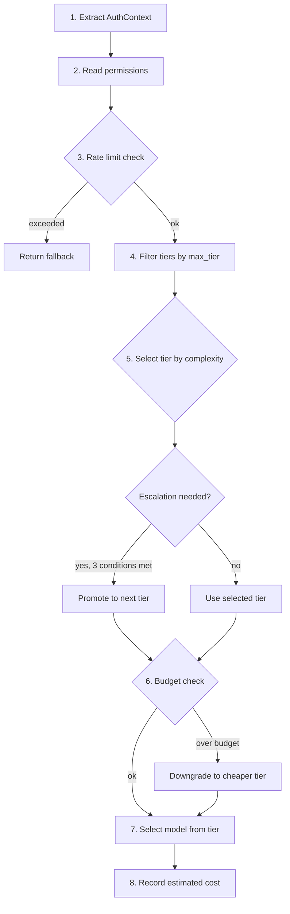

# Routing and Pipeline Guide

This guide covers the 6-stage processing pipeline, how requests are classified
and routed to LLM providers, how context assembly and quality scoring work,
and the planned upgrades at each intelligence level.

---

## 1. Overview

Every incoming message passes through a **6-stage pipeline** before a response
is produced. Each stage is defined as a trait object held in an `Arc<dyn T>`,
making stages independently replaceable at compile time (via feature flags) or
at runtime (via `set_pipeline()`).

A `PipelineRegistry` maps `TaskType` variants to specialized `Pipeline`
instances. When no specialized pipeline is registered for a task type, the
registry falls back to the default pipeline. The registry's `complete()` method
orchestrates the full flow and feeds the resulting `Trajectory` back into the
`LearningBackend`.

The current Level 0 implementation ships with simple, zero-dependency defaults
for every stage. Higher-level implementations are activated by feature flags
(`vector-memory`, and planned flags for `ruvllm`, `tiny-dancer`, `sona`,
`attention`, `temporal-tensor`, `graph`, and `domain-expansion`).

---

## 2. Pipeline Architecture


The `Pipeline` struct bundles all six stages:

```rust
pub struct Pipeline {
    pub classifier: Arc<dyn TaskClassifier>,
    pub router:     Arc<dyn ModelRouter>,
    pub assembler:  Arc<dyn ContextAssembler>,
    pub transport:  Arc<dyn LlmTransport>,
    pub scorer:     Arc<dyn QualityScorer>,
    pub learner:    Arc<dyn LearningBackend>,
}
```

And `PipelineRegistry` maps task types to pipelines:

```rust
pub struct PipelineRegistry {
    pipelines: HashMap<TaskType, Pipeline>,
    default: Pipeline,
}
```

Calling `registry.complete(request)` runs all six stages in sequence and
returns the `LlmResponse`.

---

## 3. Stage-by-Stage Breakdown

### Stage 1: Classifier (`TaskClassifier`)

The classifier examines the incoming `ChatRequest` and produces a `TaskProfile`
containing a detected `TaskType` and an estimated complexity score.

**Trait:**

```rust
pub trait TaskClassifier: Send + Sync {
    fn classify(&self, request: &ChatRequest) -> TaskProfile;
}
```

**Supporting types:**

```rust
pub struct TaskProfile {
    pub task_type:  TaskType,
    pub complexity: f32,       // 0.0..1.0
    pub keywords:   Vec<String>,
}

pub enum TaskType {
    Chat, CodeGeneration, CodeReview, Research,
    Creative, Analysis, ToolUse, Unknown,
}
```

**Current implementation: `KeywordClassifier`**

The Level 0 classifier scans the last user message (ignoring system messages)
for keyword patterns using case-insensitive substring matching. Patterns are
checked in priority order -- the first matching group determines the task type:

| Priority | Keywords | Task Type |
|----------|----------|-----------|
| 1 | code, function, implement, debug, fix, program, script, compile, refactor, class, struct, module | `CodeGeneration` |
| 2 | review, check, audit, lint, inspect | `CodeReview` |
| 3 | search, find, research, look up, lookup, discover | `Research` |
| 4 | write, story, poem, creative, compose, draft, narrative | `Creative` |
| 5 | analyze, explain, summarize, compare, evaluate, assess | `Analysis` |
| 6 | use tool, run tool, execute, call function | `ToolUse` |

If no keywords match, the task defaults to `Chat`.

**Complexity heuristic:** `matched_keywords.len() / word_count`, clamped to
the range [0.1, 0.9]. More keyword hits relative to message length produce a
higher complexity estimate.

**Planned upgrades:**

- Level 1 (`ruvllm`): 7-factor complexity scoring with HNSW-accelerated
  embedding comparison.
- Level 2 (`tiny-dancer`): Sub-millisecond neural classification.

---

### Stage 2: Router (`ModelRouter`)

The router selects a provider and model for the classified task.

**Trait:**

```rust
#[async_trait]
pub trait ModelRouter: Send + Sync {
    async fn route(&self, request: &ChatRequest, profile: &TaskProfile) -> RoutingDecision;
    fn update(&self, decision: &RoutingDecision, outcome: &ResponseOutcome);
}
```

**Supporting types:**

```rust
pub struct RoutingDecision {
    pub provider: String,   // e.g. "openai", "anthropic"
    pub model:    String,   // e.g. "gpt-4o", "claude-opus-4-5"
    pub reason:   String,
}

pub struct ResponseOutcome {
    pub success:    bool,
    pub quality:    QualityScore,
    pub latency_ms: u64,
}
```

**Current implementation: `StaticRouter`**

The Level 0 router parses the `"provider/model"` string from
`config.agents.defaults.model` (e.g. `"anthropic/claude-opus-4-5"`) and always
returns that pair. If no slash is present, the provider defaults to `"openai"`.
The `update()` method is a no-op.

**Upgrade: `TieredRouter` (Level 1)** -- see Section 5a below.

**Planned upgrade: `IntelligentRouter` (Level 2)** -- see Section 5.

---

### Stage 3: Assembler (`ContextAssembler`)

The assembler takes the full conversation history and trims it to fit within a
token budget, producing an `AssembledContext` ready for transport.

**Trait:**

```rust
#[async_trait]
pub trait ContextAssembler: Send + Sync {
    async fn assemble(&self, request: &ChatRequest, profile: &TaskProfile) -> AssembledContext;
}
```

**Supporting types:**

```rust
pub struct AssembledContext {
    pub messages:       Vec<LlmMessage>,
    pub token_estimate: usize,
    pub truncated:      bool,
}
```

**Current implementation: `TokenBudgetAssembler`**

Token estimation uses a `content.len() / 4 + 4` heuristic (4 tokens of
overhead per message for role and structure).

Truncation strategy:

1. Always keep the first message (typically the system prompt).
2. Walk backwards from the most recent message, adding messages until the
   budget is exhausted.
3. Middle messages are dropped.
4. A single message that exceeds the entire budget is included anyway.

The `profile` parameter is ignored at Level 0.

**Planned upgrades:**

- Level 1: Task-aware budget allocation (more tokens for code, fewer for chat).
- Level 2: Semantic compression of older messages before truncation.

---

### Stage 4: Transport (`LlmTransport`)

The transport sends the assembled request to an LLM provider and returns
the response.

**Trait:**

```rust
#[async_trait]
pub trait LlmTransport: Send + Sync {
    async fn complete(&self, request: &TransportRequest) -> Result<LlmResponse>;
}
```

**Supporting types:**

```rust
pub struct TransportRequest {
    pub provider:    String,
    pub model:       String,
    pub messages:    Vec<LlmMessage>,
    pub tools:       Vec<serde_json::Value>,
    pub max_tokens:  Option<i32>,
    pub temperature: Option<f64>,
}
```

**Current implementation: `OpenAiCompatTransport`**

Operates in two modes:

- **Stub mode** (`OpenAiCompatTransport::new()`): Returns a
  `ClawftError::Provider` error on every call. Used during development or when
  no provider is configured.
- **Provider mode** (`OpenAiCompatTransport::with_provider(provider)`): Wraps
  an `Arc<dyn LlmProvider>` and makes real HTTP calls.

The `enable_live_llm()` method on `AppContext` replaces the stub transport
with a live `ClawftLlmAdapter` backed by a `clawft_llm::Provider`. The adapter
converts between the pipeline's `TransportRequest` format and `clawft-llm`'s
typed `ChatRequest`/`ChatResponse`, routing through
`OpenAiCompatProvider` to the configured API endpoint.

The response parser handles both text completions and tool calls, extracting
content blocks, stop reason, and usage statistics from the OpenAI-format JSON.

---

### Stage 5: Scorer (`QualityScorer`)

The scorer assesses the quality of the response.

**Trait:**

```rust
pub trait QualityScorer: Send + Sync {
    fn score(&self, request: &ChatRequest, response: &LlmResponse) -> QualityScore;
}
```

**Supporting types:**

```rust
pub struct QualityScore {
    pub overall:   f32,    // 0.0..1.0
    pub relevance: f32,    // 0.0..1.0
    pub coherence: f32,    // 0.0..1.0
}
```

**Current implementation: `NoopScorer`**

Returns 1.0 for all three dimensions on every call. Input and response content
are completely ignored.

**Planned upgrades:**

- Level 1 (`ruvllm`): 5-dimension scoring -- accuracy, relevance, completeness,
  coherence, and safety.
- Level 2 (`tiny-dancer`): Neural quality model with confidence estimation.

---

### Stage 6: Learner (`LearningBackend`)

The learner records complete interaction trajectories for future improvement.

**Trait:**

```rust
pub trait LearningBackend: Send + Sync {
    fn record(&self, trajectory: &Trajectory);
    fn adapt(&self, signal: &LearningSignal);
}
```

**Supporting types:**

```rust
pub struct Trajectory {
    pub request:  ChatRequest,
    pub routing:  RoutingDecision,
    pub response: LlmResponse,
    pub quality:  QualityScore,
}

pub struct LearningSignal {
    pub feedback_type: String,   // e.g. "thumbs_up", "thumbs_down", "correction"
    pub value:         f32,      // -1.0..1.0
}
```

**Current implementation: `NoopLearner`**

Both `record()` and `adapt()` silently discard all data.

**Planned upgrades (`sona`):**

- Micro-LoRA: Per-request gradient-free adaptation.
- Base-LoRA: Hourly aggregated parameter updates.
- EWC++: Weekly elastic weight consolidation to prevent catastrophic forgetting.
- ReasoningBank: Persistent store of successful reasoning traces for retrieval.

---

## 4. Message Flow


When `PipelineRegistry::complete()` runs, it:

1. Classifies the request using the **default** pipeline's classifier.
2. Looks up the specialized pipeline for that `TaskType` (falls back to
   default if none is registered).
3. Runs stages 2-6 using the selected pipeline.
4. Calls `router.update()` with the outcome after the response is scored.

---

## 5a. TieredRouter and Permission-Based Routing (Level 1)

The `TieredRouter` replaces the `StaticRouter` when `routing.mode` is set to
`"tiered"` in the configuration. It selects models based on task complexity,
user permissions, and cost budgets.

Source: `crates/clawft-core/src/pipeline/tiered_router.rs`,
`crates/clawft-core/src/pipeline/permissions.rs`

### How It Works

When a `ChatRequest` enters the pipeline, the `TieredRouter` executes an
8-step routing algorithm:



### AuthContext and Permission Resolution

Every request carries an `AuthContext` (sender_id, channel, permissions).
The `AgentLoop` creates this from the inbound message:

- **CLI channel** -> `admin` (Level 2, full access)
- **All other channels** -> `zero_trust` (Level 0, free tier only)

Permissions are resolved through a 5-layer merge (lowest to highest priority):

| Priority | Layer | Source |
|----------|-------|--------|
| 1 (lowest) | Built-in defaults | `zero_trust_defaults()`, `user_defaults()`, `admin_defaults()` |
| 2 | Global config | `routing.permissions.zero_trust`, `.user`, `.admin` |
| 3 | Workspace config | Project-local `.clawft/config.json` routing section |
| 4 | Per-user override | `routing.permissions.users.{sender_id}` |
| 5 (highest) | Per-channel override | `routing.permissions.channels.{channel}` |

Each layer can override any dimension independently. For example, a per-user
override can set `"level": 2` without specifying `max_tier` -- the `max_tier`
is inherited from the admin defaults.

### Granting Permissions

**Grant a specific user admin access:**
```json
{
  "routing": {
    "permissions": {
      "users": {
        "alice_telegram_123": { "level": 2 }
      }
    }
  }
}
```

**Grant an entire channel higher access:**
```json
{
  "routing": {
    "permissions": {
      "channels": {
        "telegram": { "level": 1 },
        "slack": { "level": 1 }
      }
    }
  }
}
```

**Grant a user access to specific tools only:**
```json
{
  "routing": {
    "permissions": {
      "users": {
        "bob_discord_456": {
          "level": 1,
          "tool_access": ["read_file", "list_dir", "web_search"],
          "cost_budget_daily_usd": 2.00
        }
      }
    }
  }
}
```

### Permission Levels

| Level | Name | Default `max_tier` | Tool Access | Rate Limit | Budget |
|-------|------|-------------------|-------------|------------|--------|
| 0 | `zero_trust` | `free` | None | 10/min | $0.10/day |
| 1 | `user` | `standard` | 7 safe tools | 60/min | $5.00/day |
| 2 | `admin` | `elite` | All (`*`) | Unlimited | Unlimited |

### 16 Permission Dimensions

Each dimension is independently configurable per level, user, or channel:

| Dimension | Type | Description |
|-----------|------|-------------|
| `level` | integer | Permission level (0, 1, 2) |
| `max_tier` | string | Maximum model tier accessible |
| `model_access` | string[] | Model allowlist (globs: `"anthropic/*"`) |
| `model_denylist` | string[] | Model denylist |
| `tool_access` | string[] | Tool allowlist (`["*"]` = all) |
| `tool_denylist` | string[] | Tool denylist |
| `max_context_tokens` | integer | Max input tokens |
| `max_output_tokens` | integer | Max output tokens |
| `rate_limit` | integer | Requests per window (0 = unlimited) |
| `streaming_allowed` | boolean | SSE streaming allowed |
| `escalation_allowed` | boolean | Complexity escalation allowed |
| `escalation_threshold` | float | Escalation trigger point (0.0-1.0) |
| `model_override` | boolean | User can override model selection |
| `cost_budget_daily_usd` | float | Daily budget (0.0 = unlimited) |
| `cost_budget_monthly_usd` | float | Monthly budget (0.0 = unlimited) |
| `custom_permissions` | object | Plugin-defined extensions |

### Tier Selection

The router selects the highest-quality tier the user can afford:

1. Filter tiers where the user's `max_tier` ordinal >= tier ordinal.
2. From allowed tiers, find those whose `complexity_range` contains the task
   complexity.
3. Pick the tier with the highest cost (best quality).
4. If no tier matches and escalation is enabled (3 conditions: user allows it,
   config enables it, complexity > threshold), promote to the next tier above
   `max_tier`.

### Model Selection Strategies

Within a chosen tier, the model is selected by one of four strategies:

| Strategy | Behavior |
|----------|----------|
| `preference_order` | First model in the tier's `models` list (default) |
| `round_robin` | Atomic counter rotates through models across requests |
| `lowest_cost` | First model (tiers sorted by cost) |
| `random` | Hash-based deterministic selection |

### Cost Tracking

The `CostTracker` maintains per-user daily and monthly spend:

- `reserve_budget()` atomically checks and reserves cost before routing
  (prevents TOCTOU races)
- `reconcile_actual()` adjusts spend after the LLM response (actual vs.
  estimated)
- Zero budget (0.0) means unlimited
- Spend resets at `reset_hour_utc` daily
- Persistence via atomic JSON file with 0600 permissions

When a user exceeds their budget, the router downgrades to a cheaper tier.
If all tiers are exhausted, the `fallback_model` is used (if permitted by
the user's `max_tier`).

### Rate Limiting

The `RateLimiter` enforces per-user request limits:

- Two-stage check: global counter (AtomicU64) first, then per-user sliding
  window
- LRU eviction when tracking > 10,000 users
- When rate limited, the router returns the fallback model (if permitted)

### Workspace Ceiling Enforcement

When a workspace config overrides routing permissions, the
`PermissionResolver` enforces ceilings:

- Workspace cannot grant a level above `max_grantable_level` (default: 1)
- Workspace cannot enable escalation if global disables it
- Workspace cannot increase rate limits beyond global
- Workspace cannot increase cost budgets beyond global
- Workspace cannot grant wildcard tool access if global doesn't

This prevents a malicious `.clawft/config.json` from escalating privileges.

### Configuration

See the [Configuration Reference](../reference/config.md#routing) for the
full JSON schema, defaults, and examples.

### Security: AuthContext Injection Prevention

The `auth_context` field on `ChatRequest` is annotated with
`#[serde(skip_deserializing)]`. This means:

- The field is populated server-side by the `AgentLoop`, not from user input
- JSON payloads sent through the gateway API cannot inject an `auth_context`
- Even if a user includes `"auth_context": {"level": 2}` in their request
  JSON, it is silently dropped during deserialization

### Source Files

| File | Description |
|------|-------------|
| `clawft-types/src/routing.rs` | Config types: `RoutingConfig`, `UserPermissions`, `AuthContext`, etc. |
| `clawft-core/src/pipeline/tiered_router.rs` | `TieredRouter` implementing `ModelRouter` trait |
| `clawft-core/src/pipeline/permissions.rs` | `PermissionResolver` with 5-layer merge |
| `clawft-core/src/pipeline/cost_tracker.rs` | `CostTracker` with atomic budget reservation |
| `clawft-core/src/pipeline/rate_limiter.rs` | `RateLimiter` with sliding window |
| `clawft-core/src/routing_validation.rs` | Config validation (17+ rules) |
| `clawft-core/src/tools/registry.rs` | Tool permission enforcement |

---

## 5. IntelligentRouter and 3-Tier Routing

The `IntelligentRouter` is gated behind the `vector-memory` feature flag and
implements 3-tier routing per ADR-026. It replaces the `StaticRouter` when
the feature is enabled.

### Routing Algorithm

The router evaluates three rules in order, taking the first match:

1. **Agent Booster tag check**: If `RoutingContext.tags` contains
   `"AGENT_BOOSTER_AVAILABLE"`, route to Tier 1 immediately.
2. **Policy cache lookup**: Embed the prompt and search the vector store for
   cached routing decisions. If the best match has a similarity score above
   0.85, use the cached tier.
3. **Complexity scoring**: Compute a heuristic complexity score and route
   based on threshold:
   - complexity < 0.30 -> Tier 2
   - complexity >= 0.30 -> Tier 3

### Tier Definitions

| Tier | Model | Latency | Cost | Use Cases |
|------|-------|---------|------|-----------|
| 1 | Agent Booster (WASM) | <1ms | $0 | Simple transforms: var to const, add types, format code. Skip the LLM entirely. |
| 2 | Haiku-class | ~500ms | Low | Simple tasks, short answers, low complexity (<30%) |
| 3 | Sonnet/Opus | 2-5s | Higher | Complex reasoning, architecture, security analysis (>30%) |

### Complexity Scoring

The `compute_complexity()` function applies four heuristics:

| Factor | Calculation | Max Contribution |
|--------|-------------|------------------|
| Word count | `words / 1000` | 0.3 |
| Code fences | Contains ` ``` ` | +0.2 |
| Reasoning keywords | Contains "analyze", "design", "architect", "explain", or "compare" | +0.1 |
| Multi-step indicators | Contains "first", "then", "finally", or "step 1" | +0.2 |

The result is clamped to [0.0, 1.0].

### Policy Learning

Successful routing decisions are stored as vector embeddings in the policy
store. On future requests:

1. The prompt is embedded.
2. The policy store is searched for the 5 nearest neighbors.
3. If the best match has a similarity score above 0.85, the cached tier is
   reused (cache hit).
4. Failed routing decisions (where `success == false`) are not cached.

### Router Types and Methods

```rust
pub struct IntelligentRouter {
    policy_store: VectorStore,
    embedder: Box<dyn Embedder>,
    cost_records: Vec<CostRecord>,
}

impl IntelligentRouter {
    pub async fn new(embedder: Box<dyn Embedder>) -> Self;
    pub async fn route_request(&self, prompt: &str, context: &RoutingContext)
        -> Result<RoutingDecision, RoutingError>;
    pub async fn record_cost(&mut self, model: &str, tokens: u64, cost: f32, latency_ms: u64);
    pub async fn update_policy(&mut self, pattern: &str, tier: u8, success: bool);
    pub fn get_model_stats(&self, model: &str) -> ModelStats;
}
```

---

## 6. Progressive Intelligence Levels

Intelligence capabilities are gated behind feature flags that can be enabled
independently. Each level builds on the one below.

| Level | Feature Flags | Routing | Memory | Scoring | Learning |
|-------|---------------|---------|--------|---------|----------|
| 0 | none (default) | Static routing (always same model) | Substring memory search | NoopScorer (always 1.0) | NoopLearner (discard all) |
| 1 | `ruvllm` | 7-factor complexity, HNSW routing cache (150x faster lookup) | HNSW-indexed vector memory | 5-dimension quality scoring | EMA statistics |
| 2 | + `tiny-dancer` | Sub-ms neural routing, CircuitBreaker, uncertainty estimation | Neural-compressed memory | Neural quality model | Gradient-free adaptation |
| 3 | + `sona` | Per-request adaptation | Semantic memory consolidation | Context-aware scoring | Micro-LoRA per-request, Base-LoRA hourly, EWC++ weekly, ReasoningBank |
| 4 | + `attention` + `temporal-tensor` | Flash attention, MoE routing | Temporal-aware memory with attention | Auto-tiered quantization scoring | Mixture-of-experts learning |
| 5 | + `graph` + `domain-expansion` | Property graph routing | Multi-hop graph memory | Cross-domain scoring | Cross-domain transfer learning |

At Level 0, the only optional feature flag is `vector-memory`, which enables
the `IntelligentRouter`, `VectorStore`, and `SessionIndexer` modules.

---

## 7. Scoring and Learning

### Current State (Level 0)

- **Scoring**: `NoopScorer` returns `QualityScore { overall: 1.0, relevance: 1.0, coherence: 1.0 }` for every response. No analysis is performed.
- **Learning**: `NoopLearner` discards all `Trajectory` records and `LearningSignal` feedback. No state is persisted.

### Feedback Loop

Even at Level 0, the pipeline feeds the `Trajectory` back into the router via
`router.update()`. The `StaticRouter` ignores this call, but the
`IntelligentRouter` uses it to update its policy store (caching successful
routing decisions as vector embeddings for future reuse).

### Planned Scoring (Level 1+, `ruvllm`)

The `ruvllm` feature flag will introduce 5-dimension quality scoring:

| Dimension | Description |
|-----------|-------------|
| Accuracy | Factual correctness of the response |
| Relevance | How well the response addresses the original request |
| Completeness | Whether all aspects of the request were addressed |
| Coherence | Logical flow and readability |
| Safety | Absence of harmful, biased, or inappropriate content |

### Planned Learning (Level 3+, `sona`)

The `sona` feature flag will introduce four learning mechanisms:

| Mechanism | Frequency | Description |
|-----------|-----------|-------------|
| Micro-LoRA | Per-request | Gradient-free parameter perturbation for immediate adaptation |
| Base-LoRA | Hourly | Aggregated low-rank updates from accumulated trajectories |
| EWC++ | Weekly | Elastic weight consolidation to prevent catastrophic forgetting |
| ReasoningBank | Continuous | Persistent store of successful reasoning traces, queried for similar future requests |

---

## 8. Where Data Lives

### Current Storage

| Data | Location | Format | Persistence |
|------|----------|--------|-------------|
| Configuration | `~/.clawft/config.json` | JSON | Disk |
| Session history | `~/.clawft/workspace/sessions/` | JSONL (metadata header + one line per turn) | Disk |
| Long-term memory | `~/.clawft/workspace/memory/MEMORY.md` | Markdown (paragraph-based search) | Disk |
| Session summaries | `~/.clawft/workspace/memory/HISTORY.md` | Markdown | Disk |
| Cost records | In-memory `Vec<CostRecord>` | Struct | Per-session only |
| Routing policies | In-memory `VectorStore` (when `vector-memory` enabled) | Vector embeddings | Per-session only |

### Planned Storage

| Data | Planned Location | Format |
|------|-----------------|--------|
| Routing policies | `~/.clawft/routing/policies.rvf` | RVF (self-contained vector file) |
| Vector memory | `~/.clawft/workspace/memory/memory.rvf` | RVF |
| Quality scores | `~/.clawft/workspace/analytics/scores.jsonl` | JSONL |
| Learning trajectories | `~/.clawft/workspace/analytics/trajectories.jsonl` | JSONL |

### Backup

Currently, the only persistent pipeline-related data is session JSONL files in
`~/.clawft/workspace/sessions/`. These are plain text and can be copied
directly for backup.

Once `.rvf` files are implemented, they will be self-contained binary files
that can be copied for backup without any export step.

---

## 9. Configuration

### Model Routing

The model to use is configured in `agents.defaults.model` using
`"provider/model"` syntax:

```json
{
  "agents": {
    "defaults": {
      "model": "anthropic/claude-opus-4-5"
    }
  }
}
```

The `StaticRouter` splits this string at the first `/` to determine the
provider and model. If no slash is present, the provider defaults to `"openai"`.

Provider credentials are resolved from the `providers` config section or from
environment variables (e.g. `ANTHROPIC_API_KEY`, `OPENAI_API_KEY`).

See the [Configuration Guide](configuration.md) for the full provider list and
environment variable reference.

### Token Budget

The context assembler's token budget is derived from `agents.defaults.max_tokens`:

```json
{
  "agents": {
    "defaults": {
      "max_tokens": 8192
    }
  }
}
```

### Viewing Routing Decisions

- `weft status --detailed` shows the current routing configuration (provider,
  model, pipeline level).
- The `--verbose` flag (or `RUST_LOG=debug`) logs routing decisions at the
  debug level, including the reason field from `RoutingDecision`.
- When using the `IntelligentRouter`, `get_model_stats()` returns per-model
  analytics (total calls, total cost, average latency).

### Enabling the IntelligentRouter

Build with the `vector-memory` feature flag:

```sh
cargo build --release --features vector-memory
```

Or install with:

```sh
cargo install clawft-cli --features vector-memory
```

The `IntelligentRouter` activates automatically when `vector-memory` is
enabled. No additional configuration is required -- it uses the same
`agents.defaults.model` as the Tier 3 fallback.

---

## 10. Phase 3 TODO: Unimplemented Features

The following features are designed but not yet implemented. They are tracked
here as stubs for future development.

### Adaptive Classifier

- [ ] 7-factor complexity scoring (word count, vocabulary diversity, syntactic
  depth, domain specificity, ambiguity, code density, reasoning chain length)
- [ ] HNSW-indexed prompt embeddings for classification by similarity
- [ ] Confidence estimation with fallback to higher tier on low confidence

### Neural Router

- [ ] Sub-millisecond neural routing via `tiny-dancer` WASM inference
- [ ] CircuitBreaker pattern: automatic tier demotion when a provider is slow
  or erroring
- [ ] Uncertainty estimation: route to higher tier when the router is unsure

### Quality Scoring

- [ ] 5-dimension scoring (accuracy, relevance, completeness, coherence, safety)
- [ ] Heuristic baselines: response length, format compliance, tool call
  success rate
- [ ] Neural quality model with calibrated confidence scores

### Learning Backend

- [ ] Trajectory persistence to disk (JSONL or RVF format)
- [ ] Micro-LoRA per-request adaptation
- [ ] Base-LoRA hourly batch updates
- [ ] EWC++ weekly consolidation
- [ ] ReasoningBank with semantic retrieval

### Routing Policy Persistence

- [ ] Save routing policies to `~/.clawft/routing/policies.rvf`
- [ ] Load policies on startup for warm-start routing
- [ ] Policy expiration and garbage collection

### Cost Analytics

- [ ] Persist cost records across sessions
- [ ] Per-tier cost breakdown in `weft status`
- [ ] Budget alerts when cost exceeds configurable thresholds
- [ ] Cost-aware routing: prefer cheaper tiers when quality is sufficient

---

## Source Files

### Pipeline Stages
- `clawft-core/src/pipeline/traits.rs` -- Trait definitions, `ChatRequest`, `RoutingDecision`, `PipelineRegistry`
- `clawft-core/src/pipeline/classifier.rs` -- `KeywordClassifier`
- `clawft-core/src/pipeline/router.rs` -- `StaticRouter` (Level 0)
- `clawft-core/src/pipeline/assembler.rs` -- `TokenBudgetAssembler`
- `clawft-core/src/pipeline/transport.rs` -- `OpenAiCompatTransport` and `LlmProvider`
- `clawft-core/src/pipeline/scorer.rs` -- `NoopScorer`
- `clawft-core/src/pipeline/learner.rs` -- `NoopLearner`
- `clawft-core/src/pipeline/llm_adapter.rs` -- `ClawftLlmAdapter` and `build_live_pipeline`

### Tiered Router (Level 1)
- `clawft-types/src/routing.rs` -- Config types: `RoutingConfig`, `UserPermissions`, `AuthContext`
- `clawft-core/src/pipeline/tiered_router.rs` -- `TieredRouter` (8-step algorithm, 49 tests)
- `clawft-core/src/pipeline/permissions.rs` -- `PermissionResolver` (5-layer merge, 31 tests)
- `clawft-core/src/pipeline/cost_tracker.rs` -- `CostTracker` (atomic budgets, 27 tests)
- `clawft-core/src/pipeline/rate_limiter.rs` -- `RateLimiter` (sliding window, 21 tests)
- `clawft-core/src/routing_validation.rs` -- Config validation (17+ rules, 45 tests)
- `clawft-core/src/tools/registry.rs` -- Permission-gated tool execution
- `clawft-core/src/agent/loop_core.rs` -- AuthContext creation from inbound messages

### Intelligent Router (Level 2, behind `vector-memory`)
- `clawft-core/src/intelligent_router.rs` -- `IntelligentRouter`
