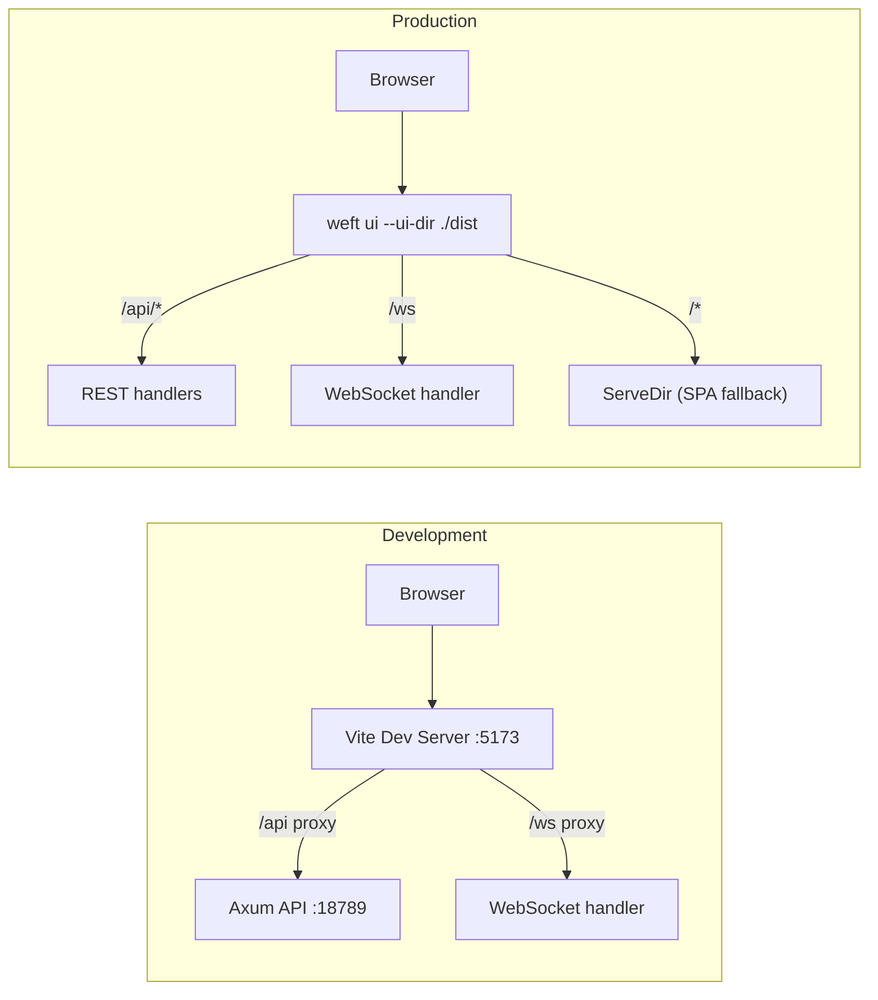
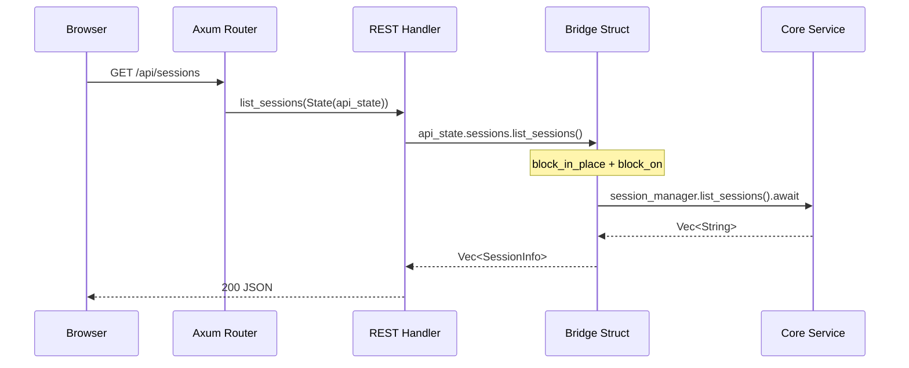
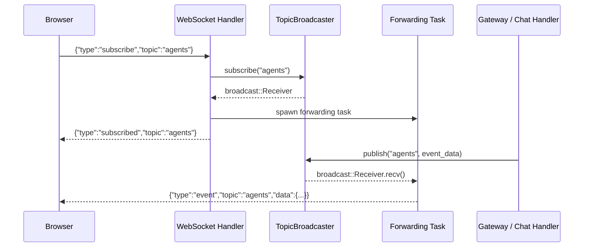
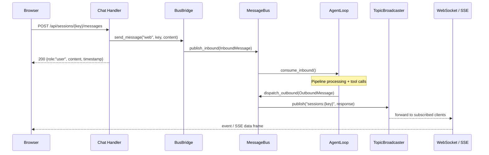
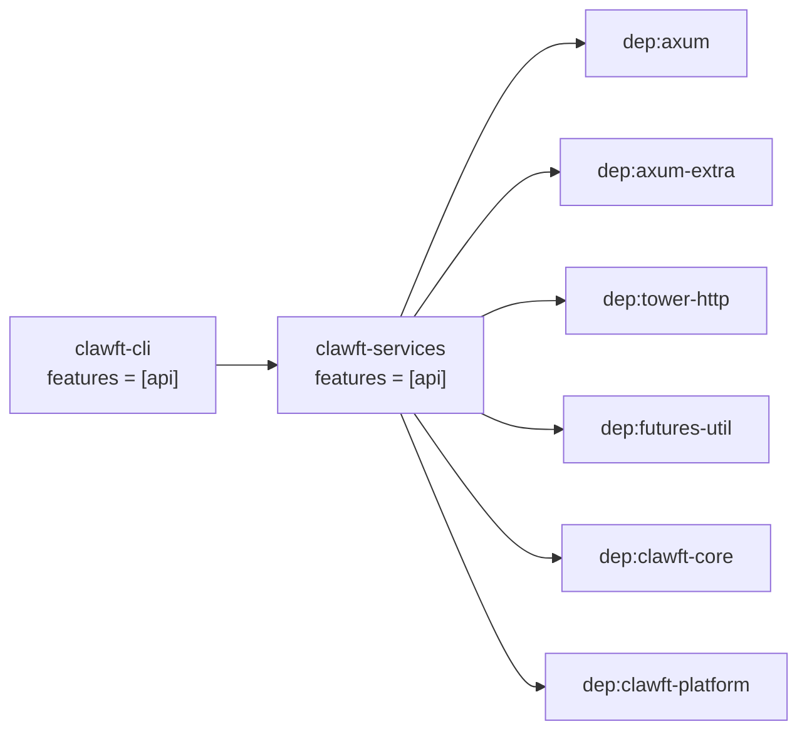
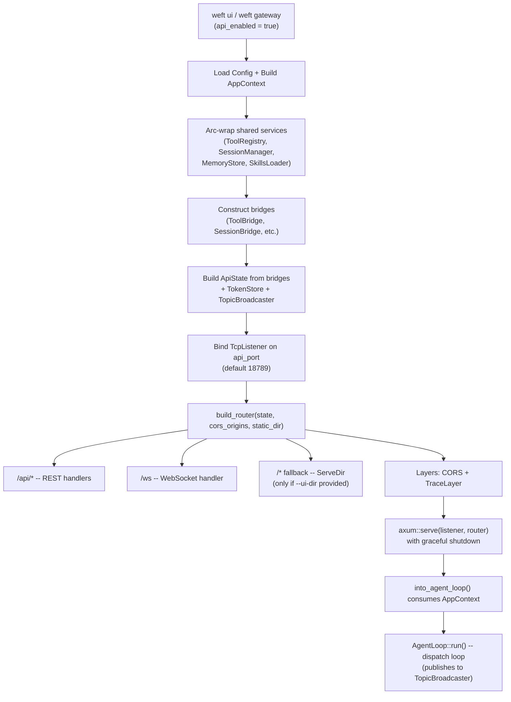
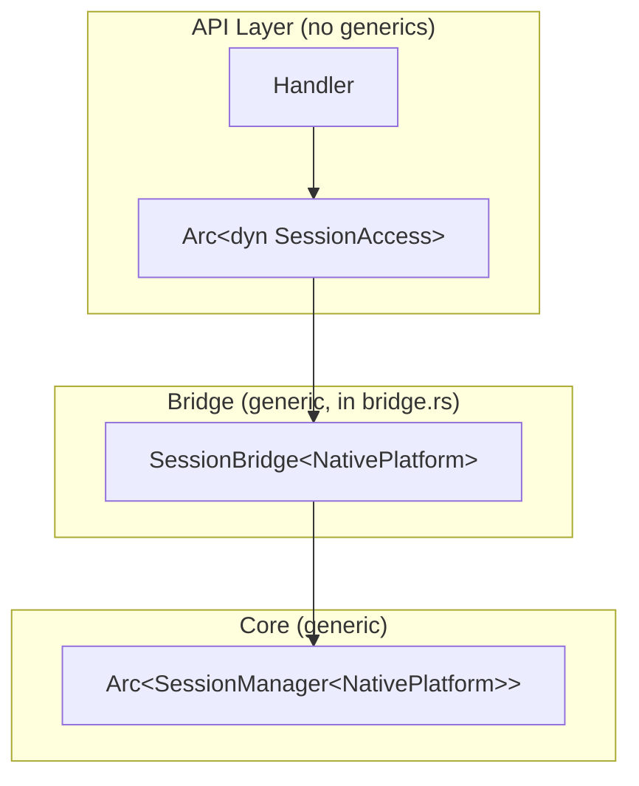

# API Layer Architecture

> Axum-based REST + WebSocket backend for the ClawFT dashboard.

The API layer lives in `crates/clawft-services/src/api/` and provides HTTP endpoints, WebSocket pub/sub, and SSE streaming for the React frontend. It uses a trait-object bridge pattern to decouple the API handlers from the core engine's `Platform` generic.

---

## Overview



In development, the Vite dev server proxies `/api` and `/ws` requests to the Axum backend on port 18789. In production, a single `weft ui --ui-dir` process serves both the API and the built frontend via `tower_http::services::ServeDir`.

---

## Module Structure

```
crates/clawft-services/src/api/
├── mod.rs            # ApiState struct, 8 access traits, ToolInfo/SessionInfo/etc. types,
│                     #   build_router(), serve()
├── bridge.rs         # Bridge implementations (ToolBridge, SessionBridge, AgentBridge,
│                     #   BusBridge, SkillBridge, MemoryBridge, ConfigBridge, ChannelBridge)
├── broadcaster.rs    # TopicBroadcaster -- topic-keyed broadcast channels for real-time events
├── handlers.rs       # Core REST handlers: agents, sessions, tools, health
├── ws.rs             # WebSocket topic pub/sub handler with per-subscription forwarding tasks
├── chat.rs           # Chat routes: send message, create session, export, SSE streaming
├── auth.rs           # TokenStore + Bearer token auth middleware (disabled by default)
├── skills.rs         # Skills CRUD routes (list, install, uninstall, registry search)
├── memory_api.rs     # Memory CRUD + search routes
├── config_api.rs     # Configuration get/put routes
├── cron_api.rs       # Cron job routes (stub handlers, types defined)
├── channels_api.rs   # Channel status listing route
├── delegation.rs     # Delegation monitoring: active tasks, rules, history
├── monitoring.rs     # Token usage + cost breakdown routes
└── voice_api.rs      # Voice settings routes (stub handlers, types defined)
```

---

## ApiState Composition

`ApiState` is the shared state passed to every Axum handler via `State<ApiState>`. It holds 10 fields, each behind an `Arc<dyn Trait>` to erase the `Platform` generic.

| Field | Type | Access Trait | Bridge Struct | Source |
|-------|------|-------------|---------------|--------|
| `tools` | `Arc<dyn ToolRegistryAccess>` | `ToolRegistryAccess` | `ToolBridge` | `ToolRegistry` |
| `sessions` | `Arc<dyn SessionAccess>` | `SessionAccess` | `SessionBridge<P>` | `SessionManager<P>` |
| `agents` | `Arc<dyn AgentAccess>` | `AgentAccess` | `AgentBridge` | Agent definition snapshot |
| `bus` | `Arc<dyn BusAccess>` | `BusAccess` | `BusBridge` | `MessageBus` |
| `auth` | `Arc<TokenStore>` | (concrete) | -- | In-memory token store |
| `skills` | `Arc<dyn SkillAccess>` | `SkillAccess` | `SkillBridge<P>` | `SkillsLoader<P>` |
| `memory` | `Arc<dyn MemoryAccess>` | `MemoryAccess` | `MemoryBridge<P>` | `MemoryStore<P>` |
| `config` | `Arc<dyn ConfigAccess>` | `ConfigAccess` | `ConfigBridge` | `Config` snapshot |
| `channels` | `Arc<dyn ChannelAccess>` | `ChannelAccess` | `ChannelBridge` | `ChannelsConfig` snapshot |
| `broadcaster` | `Arc<TopicBroadcaster>` | (concrete) | -- | Topic broadcast channels |

Each access trait is defined in `mod.rs` with sync methods (`fn`, not `async fn`). Bridge structs in `bridge.rs` implement these traits by wrapping `Arc`-references to core services. The `Platform` generic is confined to `bridge.rs` and erased at the `Arc<dyn Trait>` boundary.

---

## Data Flow

### REST Request



### WebSocket Subscribe



Each WebSocket subscription spawns a dedicated tokio task that reads from the `broadcast::Receiver` and writes events to the client's socket. The socket sender is wrapped in `Arc<Mutex<_>>` so multiple forwarding tasks can write concurrently. Slow consumers that fall behind the 256-message channel capacity have lagged messages silently skipped.

### Chat Message Flow



The chat handler returns the user message immediately. The agent response arrives asynchronously via the `TopicBroadcaster`, delivered to the client through either WebSocket events or the SSE stream at `GET /api/sessions/{key}/stream`.

---

## Feature Flag Architecture

The API is gated behind a feature flag chain that keeps HTTP dependencies optional.



| Dependency | Why optional |
|-----------|-------------|
| `axum`, `axum-extra` | HTTP framework -- only needed when serving the API |
| `tower-http` | CORS middleware, static file serving, tracing layer |
| `futures-util` | `unfold` for SSE stream conversion |
| `clawft-core` | Bridge structs import `ToolRegistry`, `SessionManager`, `MessageBus`, `MemoryStore`, `SkillsLoader` |
| `clawft-platform` | Bridge structs use the `Platform` trait bound |

Without the `api` feature, `clawft-services` depends only on `clawft-types` for its MCP, cron, and delegation modules. The `api/` module directory is conditionally compiled.

---

## Startup Sequence



### Step-by-step

1. **CLI entry**: `weft ui` or `weft gateway` with `config.gateway.api_enabled = true`.
2. **AppContext setup**: Config is loaded and all core services are initialized.
3. **Arc-wrapping**: `ToolRegistry`, `SessionManager`, `MemoryStore`, and `SkillsLoader` are wrapped in `Arc<>` for shared ownership.
4. **Bridge construction**: Bridge structs are created from `Arc::clone()` references, erasing the `Platform` generic.
5. **ApiState assembly**: The 10-field `ApiState` is built from bridge instances plus a `TokenStore` and `TopicBroadcaster`.
6. **TCP bind**: A `TcpListener` is bound on the configured `api_port` (default 18789).
7. **Router build**: `build_router()` assembles the Axum router with API routes, WebSocket endpoint, optional SPA fallback, CORS layer, and tracing layer.
8. **Server spawn**: The Axum server is spawned as a tokio task with graceful shutdown support.
9. **Agent loop start**: `into_agent_loop()` consumes the remaining `AppContext`. The gateway dispatch loop publishes events to the `TopicBroadcaster` which forwards them to WebSocket/SSE clients.

---

## Bridge Pattern Detail

The bridge pattern erases the `<P: Platform>` generic at the API boundary.



Bridge structs that wrap async services (`SessionBridge`, `SkillBridge`, `MemoryBridge`) use the `block_in_place` pattern for async-to-sync bridging:

```rust
fn list_sessions(&self) -> Vec<SessionInfo> {
    let mgr = self.manager.clone();
    tokio::task::block_in_place(|| {
        tokio::runtime::Handle::current().block_on(async {
            mgr.list_sessions().await
            // ... map to SessionInfo
        })
    })
}
```

Bridge structs that hold static snapshots (`AgentBridge`, `ConfigBridge`, `ChannelBridge`) simply return clones from their pre-built data.

---

## Authentication

`auth.rs` provides:

- **`TokenStore`**: In-memory `HashSet<String>` behind a `RwLock`. Tokens are prefixed with `clawft_` and generated via `uuid::Uuid::new_v4()`.
- **`auth_middleware`**: Axum middleware that extracts the `Authorization: Bearer <token>` header and validates against the `TokenStore`. Returns 401 if missing or invalid.

The middleware is defined but **not wired** into the router. To enable it, wrap the `/api` route nest with `axum::middleware::from_fn_with_state()`.

---

## Real-Time Events

### WebSocket Protocol

Clients connect to `/ws` and exchange JSON messages:

| Direction | Type | Example |
|-----------|------|---------|
| Client -> Server | subscribe | `{"type":"subscribe","topic":"agents"}` |
| Client -> Server | unsubscribe | `{"type":"unsubscribe","topic":"agents"}` |
| Client -> Server | ping | `{"type":"ping"}` |
| Server -> Client | connected | `{"type":"connected","message":"ClawFT WebSocket connected"}` |
| Server -> Client | subscribed | `{"type":"subscribed","topic":"agents"}` |
| Server -> Client | unsubscribed | `{"type":"unsubscribed","topic":"agents"}` |
| Server -> Client | event | `{"type":"event","topic":"agents","data":{...}}` |
| Server -> Client | pong | `{"type":"pong"}` |

### SSE Streaming

The endpoint `GET /api/sessions/{key}/stream` returns a Server-Sent Events stream for a specific chat session. Internally, it subscribes to the `sessions:{key}` topic on the `TopicBroadcaster` and uses `futures_util::stream::unfold` to convert the `broadcast::Receiver` into an SSE-compatible `Stream`.

### TopicBroadcaster

`TopicBroadcaster` manages a `HashMap<String, broadcast::Sender<String>>` behind `Arc<RwLock<_>>`. Key behaviors:

- Topics are created lazily on first `subscribe()` or `get_or_create()` call
- Each channel has capacity 256
- Publishing to a topic with no subscribers silently drops the message
- `Lagged` errors (slow consumer) are silently skipped by both WebSocket and SSE consumers
- Channel closure terminates subscriber streams
